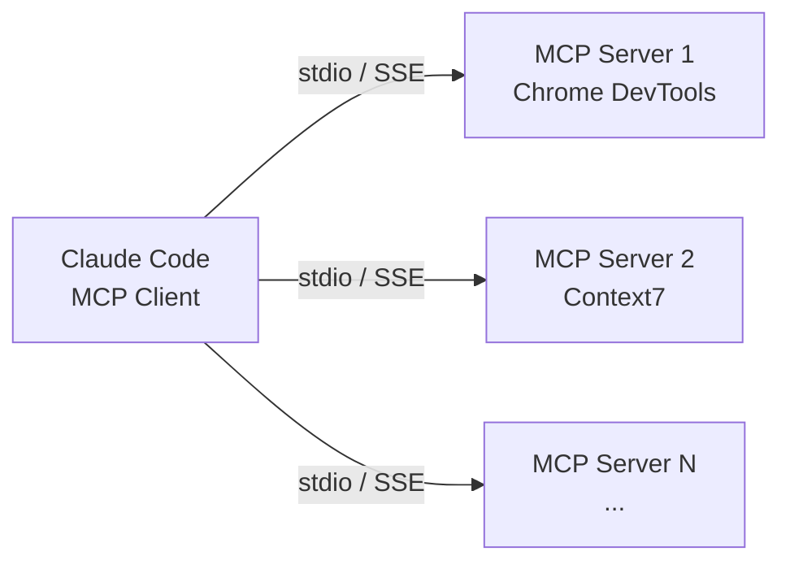

# MCP 集成

Model Context Protocol（MCP）是一个开放协议，用于标准化应用程序向 LLM 提供上下文的方式。Claude Code 原生支持 MCP，可以通过 MCP 服务器扩展其能力，让 Claude 能够访问外部工具、数据源和服务。

## MCP 架构

MCP 采用客户端-服务器架构：



- **MCP Client**：Claude Code 内置，负责发现和调用 MCP 服务器提供的工具
- **MCP Server**：独立进程，暴露工具（Tools）、资源（Resources）和提示词模板（Prompts）

> [!NOTE]
> Claude Code 与 MCP Server 之间的通信支持两种传输协议：
> - **stdio**：标准输入输出，MCP Server 作为子进程运行，通过 stdin/stdout 通信，适用于本地工具
> - **SSE**（Server-Sent Events）：基于 HTTP 的单向流式通信，MCP Server 作为独立服务运行，Claude Code 通过 HTTP 连接，适用于远程或共享服务

## 配置方式

### 项目级配置

在项目根目录创建 `.mcp.json` 文件：

```json
{
    "mcpServers": {
        "context7": {
            "command": "npx",
            "args": ["-y", "@anthropic-ai/mcp-context7"]
        },
        "chrome-devtools": {
            "command": "npx",
            "args": ["-y", "@anthropic-ai/mcp-chrome-devtools"]
        }
    }
}
```

### 用户级配置

在 `~/.claude/settings.json` 中配置，对所有项目生效：

```json
{
    "mcpServers": {
        "context7": {
            "command": "npx",
            "args": ["-y", "@anthropic-ai/mcp-context7"]
        }
    }
}
```

> [!NOTE]
> Claude Code 会自动发现并利用已配置的 MCP 服务器提供的工具，无需额外设置。

## 常用 MCP 服务器

| 服务器 | 功能 |
|--------|------|
| Context7 | 编程库文档查询 |
| Chrome DevTools | 浏览器自动化 |
| Filesystem | 文件系统访问 |
| Git | Git 操作 |
| Puppeteer | 无头浏览器 |

## 创建自定义 MCP 服务器

你可以创建自己的 MCP 服务器来扩展 Claude Code 的能力。

```python
import asyncio
import mcp.types as types
from mcp.server import Server
from mcp.server.stdio import stdio_server

app = Server("my-server")

@app.list_tools()
async def list_tools() -> list[types.Tool]:
    return [
        types.Tool(
            name="greet",
            description="向用户打招呼",
            inputSchema={
                "type": "object",
                "properties": {
                    "name": {"type": "string", "description": "用户名"}
                },
                "required": ["name"]
            }
        )
    ]

@app.call_tool()
async def call_tool(name: str, arguments: dict) -> list[types.TextContent]:
    if name == "greet":
        return [types.TextContent(type="text", text=f"你好，{arguments['name']}！")]
    raise ValueError(f"未知工具：{name}")

async def main():
    async with stdio_server() as streams:
        await app.run(
            streams[0], streams[1],
            app.create_initialization_options()
        )

if __name__ == "__main__":
    asyncio.run(main)
```

配置后在 `.mcp.json` 中添加：

```json
{
    "mcpServers": {
        "my-server": {
            "command": "python",
            "args": ["my_server.py"]
        }
    }
}
```

## 调试与排查

- 运行 `/mcp` 命令可以查看当前已配置的 MCP 服务器及其状态
- 服务器启动失败时，Claude Code 会在对话中显示错误信息
- 检查服务器依赖是否已安装（如 `npm install` 或 `pip install`）
- stdio 类型的服务器会在 Claude Code 退出时自动终止
