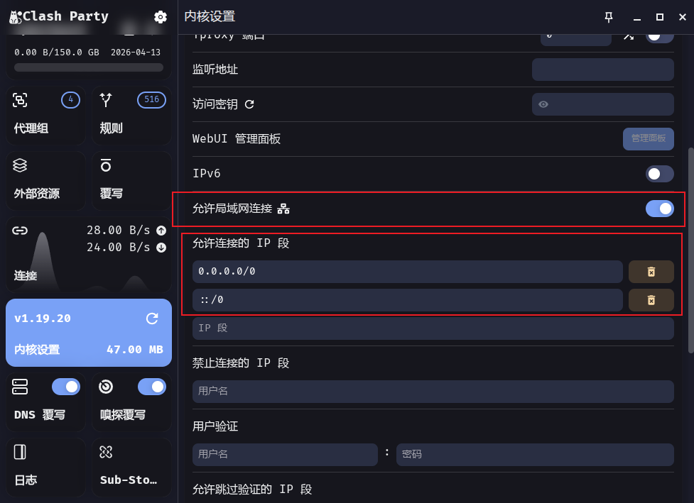
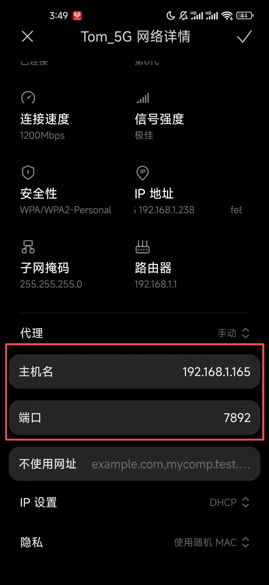

# Clash Party

## 工作模式

Clash Party 的工作模式本质上对应 mihomo 的 `mode` 配置项，一共有三种：`rule`、`global`、`direct`。

### Rule（规则模式）

这是默认模式（`mode: rule`）。

流量会按规则集逐条匹配（如 `DOMAIN`、`GEOIP`、`RULE-SET`、`MATCH`），命中后再交给对应策略组或节点处理。

特点：

- 支持“分流”：不同网站/应用走不同出口。
- 可同时实现代理、直连、拦截（`REJECT`）等策略。
- 灵活度最高，但依赖规则质量与维护。

> [!TIP]
> 如果没有匹配的规则集默认走代理

### Global（全局代理模式）

全局代理模式下，所有流量都会交给 `GLOBAL` 策略组，不再按规则逐条分流。

特点：

- 行为简单直接：除了本机不经代理的流量外，其余请求统一走你在 `GLOBAL` 里选中的节点/策略。
- 便于排查“到底是不是规则问题”。
- 失去精细化分流能力。

### Direct（全局直连模式）

全局直连模式下，所有流量都直接连接目标，不通过代理节点，也不按代理规则分流。

特点：

- 路径最短，额外代理开销最低。
- 无法访问必须经代理才能访问的目标。
- 可快速判断问题是“代理链路”还是“本地网络/目标站点”导致。

### 三种模式对比

| 模式     | 流量决策方式                    | 是否使用规则分流 | 是否经过代理                     |
| -------- | ------------------------------- | ---------------- | -------------------------------- |
| `rule`   | 按规则逐条匹配后选择策略组/节点 | 是               | 按规则决定（可能代理/直连/拦截） |
| `global` | 全部流量交给 `GLOBAL` 策略组    | 否               | 是（统一走 `GLOBAL` 选中的出口） |
| `direct` | 全部流量直接连接目标            | 否               | 否                               |

## 代理模式

Clash Party 常见的两种代理接管方式是“系统代理”和“虚拟网卡（TUN）”，两者的核心区别是流量接管层级不同。

### 系统代理

系统代理是把操作系统的 HTTP/HTTPS/SOCKS 代理设置指向 Clash Party 的本地端口（如 `7890`、`7891`）。

特点：

- 接管成本低，开关简单。
- 主要对“遵循系统代理设置”的应用生效（例如大多数浏览器）。
- 对不走系统代理的应用、部分游戏或底层网络流量覆盖不完整。

### 虚拟网卡（TUN）

虚拟网卡模式会创建一个 TUN 网卡，在网络层接管流量并转发到 Clash 内核处理。

特点：

- 覆盖范围更广，很多不支持系统代理的应用也能被接管。
- 分流一致性更好，适合“一套规则覆盖全局流量”。
- 对系统权限和兼容性要求更高，通常需要管理员权限并正确配置路由/防火墙。

## 内核配置

Clash Party 的“内核配置”本质上是对 mihomo 配置文件的管理。常见可分为以下几类：

### 局域网连接

Clash Party 支持局域网连接，允许同一局域网内的其他设备通过 Clash Party 的代理服务访问网络。

配置步骤:

- 在 Clash Party 的设置中启用“允许局域网连接”选项, 并配置连接白名单。
  

> [!TIP] 
> 这里的两个默认配置`0.0.0.0/0`和`::/0`分别表示允许所有 IPv4 和 IPv6 地址连接，实际使用中可以根据需要调整为更严格的白名单配置。

- 确保防火墙允许 Clash Party 的监听端口（如 `7890`）的入站连接。

- 在其他设备上设置代理服务器，指向 Clash Party 运行的主机 IP 地址和端口, 这里以手机的 Wi-Fi 代理设置为例：
  

> [!TIP]
> 其中主机名配置的IP地址和端口需要与使用 Clash Party 的设备的网络IP和监听端口一致.