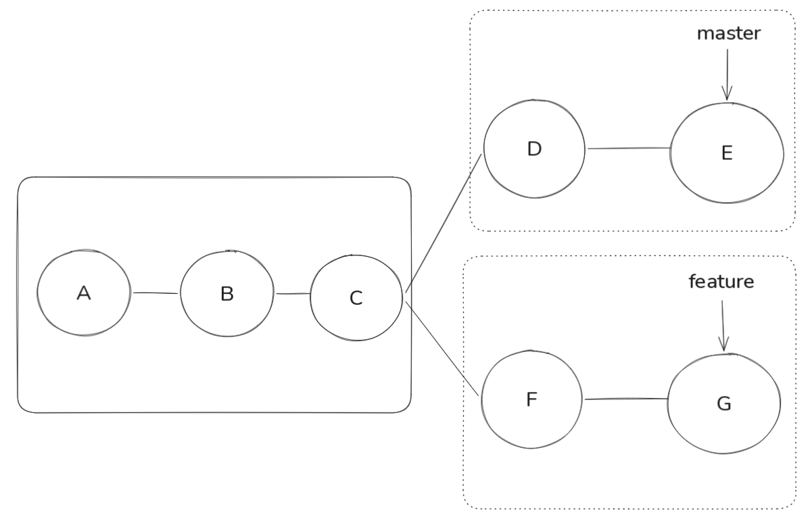
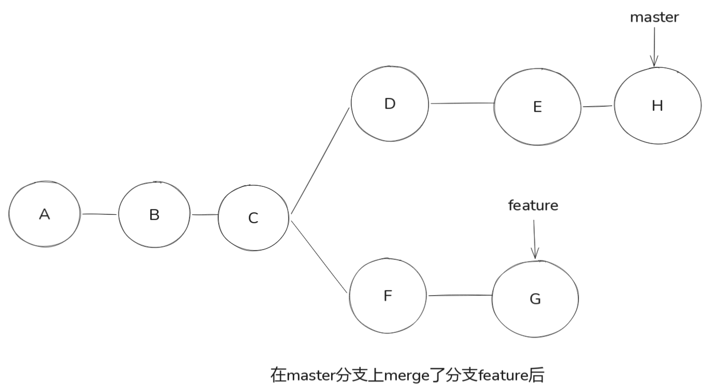

# Git 分支

## 查看分支

```bash
git branch

# 查看本地和远程分支
git branch -a

# 该命令结果可能如下
# * main
#   remotes/origin/HEAD -> origin/main
#   remotes/origin/main
#   remotes/origin/feature

# * 表示当前所在分支
# remotes/origin/HEAD -> origin/main 表示远程仓库的默认分支是 main
# remotes/origin/feature 表示远程仓库的 feature 分支
```

## 重命名分支

```bash
# 不提供old-branch-name参数时，默认重命名当前分支
git branch -m [<old-branch-name>] <new-branch-name>
```

## 创建分支

```bash
git branch <branch-name>
```

## 拉取远程分支

```bash
# 从远程仓库拉取最新内容到.git工作目录之中, 不影响工作区
# 执行完这个命令后配合 git merge 将分支与远程分支同步(如果有更新的话)
git fetch <remote-repo-name> <branch-name>
# 示例
git fetch origin main
```

## 合并分支

```bash
# 将指定的本地分支合并到当前所处分支
git merge <branch-name> # branch-name 表示指定分支名称

# 如果需要合并的是远程分支
git merge <remote-repo-name>/<branch-name>
```


图中一共两个分支: master和feature. 其中**实线框**表示分支的公共节点, **虚线框**表示分支的独有节点. 当我们在master分支上执行`git merge feature`命令时, git会将feature分支上的独有节点合并到master分支的**新节点**上.




其中**节点H**是合并分支feature后自动创建的一个新节点, 该节点包含了feature分支上的独有节点E和F的内容. 


> [!NOTE]
> 节点H不总是创建的, 如果main没有自己的独有节点, 那么合并后main分支会直接指向feature分支的最后一个节点, 这时就不会创建新的节点H了.


## 拉取并合并分支

```bash
# 拉取远程分支合并合并到当前分支, git pull` ≈ `git fetch` + `git merge <remote-repo-name>/<branch-name>`
git pull <remote-repo-name> <branch-name>

# 当设置了上游分支后，可以省略远程仓库和分支名称
git pull
```

## 切换分支

```bash
# 切换到指定分支(分支必须存在)
git checkout <branch-name>
# 切换到指定分支(分支必须不存在)
git checkout -b <branch-name>

# git 2.23 版本后推荐使用

# 切换到指定分支(分支必须存在)
git switch <branch-name>
# 切换到指定分支(分支必须不存在)
git switch -c <branch-name>
```

## 删除分支

```bash
# 删除分支
git branch -d <branch-name>
```