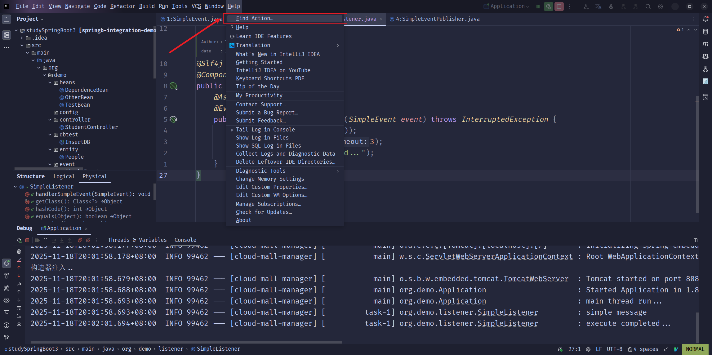
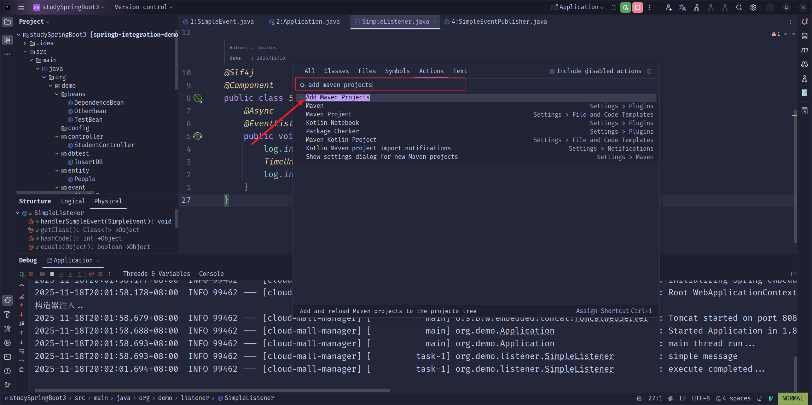
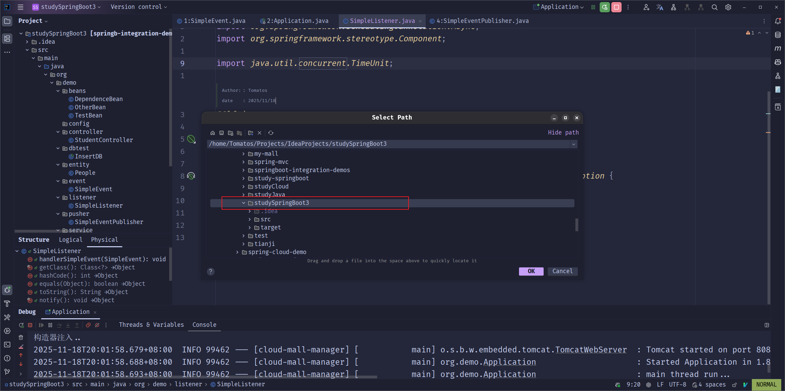

# IDEA

## 文件编码

在开发过程中, 如果文件编码不一致, 可能会导致中文乱码问题, 所以建议统一设置为 UTF-8.

1. 打开 File -> Settings -> Editor -> File Encodings, 按照下图进行设置:

> [!NOTE]
> 这里配置的编码方式是IDEA 用来读取和保存文件时采用的字符编码方式, 如果需要打开的文件本身并不是当前指定的UTF-8编码, 那么打开这个文件可能会出现乱码

## 配置 Web 项目

1. 打开 File -> Project Structure -> Modules, 选择需要配置的模块, 添加 Web 框架

2. 配置 Web 框架相关信息:  

3. 配置 artifacts: 

选择前面配置的 Web 模块, 点击 OK

到这里, Web 项目就配置完成了

这里讲解一下最后一步的两个输出表示什么意思:
- compiled output: 编译输出的目录, 也就是 Java编译源代码文件后得到的.class 文件存放的目录
- facet resources: 这个目录下存放的是 Web 项目相关的资源文件, 例如 web.xml, jsp 文件等

参考下面运行项目后的输出:

## 配置 Tomcat

> [!NOTE]
> 在开始配置 Tomcat 之前, 请确保下载了 [Tomcat](https://tomcat.apache.org/download-10.cgi), 并保证需要在 Tomcat 运行的 项目是 Web 项目

1. 打开 File -> Settings -> Build, Execution, Deployment -> Application Servers, 添加一个 Tomcat 服务器:

2. 打开 Run -> Edit Configurations, 添加一个 Tomcat Server -> Local(如果是远程Tomcat Server选择Remote), 按照下图进行配置:

填写 Tomcat 相关配置信息:

配置一个工件:

> [!TIP]
> 如果Application context设置为/app, 那么所有的请求地址公共前缀为:`http://localhost:8080/app`

## 配置本地Mavne

IDEA 中内置了 Maven, 但是有时候我们需要使用自己本地的 Maven 可以按照如下步骤进行配置:

1. 打开 File -> Settings
2. 选择 Build, Execution, Deployment -> Build Tools -> Maven
3. 修改图示中的 Maven配置:

4. 上面的设置仅对当前项目生效, 如果需要之后创建的新项目都生效, 还需要在新创项目设置中在按照上面的步骤进行配置一遍

## 查看栈帧

DEBUG 模式下，可以查看每个线程的栈帧信息，帮助调试程序. 信息展示如图:

## 配置Java程序启动参数

1. 打开 Run -> Edit Configurations

2. 按照下图操作:

## 将项目识别为 Maven 项目

1. 找到顶部菜单的 Help -> Find Action

2. 在弹出的弹窗中输入 "Add as Maven Project"

3. 选择对应的项目目录

