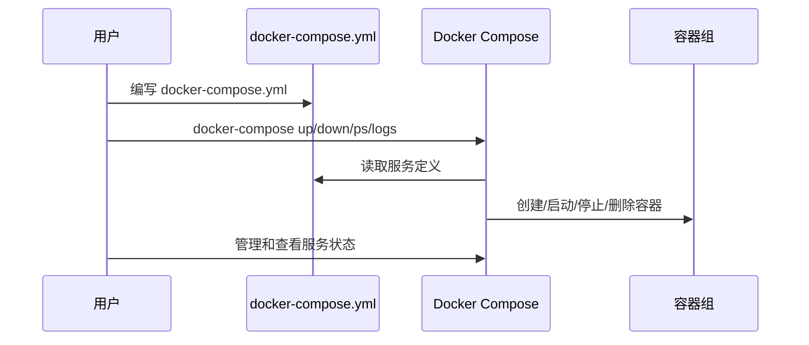

# Docker Compose

Docker Compose 是一个用于定义和运行多容器 Docker 应用程序的工具。通过一个 `docker-compose.yml` 文件，可以轻松管理应用程序的服务、网络和存储。

## 安装

Docker Compose V2 已集成在 Docker CLI 中，安装 Docker Desktop 或 Docker Engine 后即可使用 `docker compose` 命令。

使用以下命令检查 Docker Compose 是否安装成功：

```bash
# 新版本命令
docker compose version

# 旧版本命令
docker-compose version
# or
docker-compose --version
```

## 工作流程

Docker Compose 的工作流程包括以下几个步骤：
1. 新建名为 `docker-compose.yml` 的文件，并在文件中定义多个容器的配置(网络、端口映射和数据卷等)
2. 在 `docker-compose.yml` 文件所在目录下，执行 `docker-compose up -d` 命令启动配置中定义的所有服务(容器)。
3. 通过 `docker-compose ps` 查看服务状态，`docker-compose logs` 查看日志。
4. 需要停止并移除服务时，执行 `docker-compose down`。



## 配置编写

以下是一个常用的 `docker-compose.yml` 配置示例，包含一个基于 Nginx 的 Web 服务和一个 MySQL 数据库服务：

```yaml
# Docker Compose V2 起不再需要显示指定版本
# version: '3.8'                

# 定义全局数据卷
# 这里定义了一个名为 db-data 的数据卷
volumes:                      # 数据卷定义区块
  db-data:                    # 卷名
# 定义全局网络
# 这里定义了一个名为 app-network 的桥接网络
networks:                     # 网络定义区块
  app-network:                # 网络名
    driver: bridge            # 网络驱动类型

services:                     # 服务定义区块
  # 定义web服务
  web:                        # Web 服务
    image: nginx:latest       # 使用的镜像
    ports:                    # 端口映射，格式：主机端口:容器端口
      - '8080:80'
    volumes:                  # 挂载本地目录到容器目录，格式：主机路径:容器路径
      - ./html:/usr/share/nginx/html
    networks:                 # 指定加入的网络
      - app-network
  # 定义数据服务
  db:                         # 数据库服务
    image: mysql:5.7
    environment:              # 环境变量配置，键值对形式
      MYSQL_ROOT_PASSWORD: rootpassword
      MYSQL_DATABASE: mydatabase
      MYSQL_USER: user
      MYSQL_PASSWORD: userpassword
    volumes:                  # 数据卷挂载，格式：卷名:容器路径
      - db-data:/var/lib/mysql
    networks:
      - app-network
```

字段参考表：

| 字段         | 作用说明                                   |
| ------------ | ------------------------------------------ |
| version      | 指定 Compose 文件的版本, `Docker Compose V2` 起不再需要显示指定                    |
| services     | 服务集合，每个服务都是services下的一个区块      |
| image        | 指定服务使用的镜像                         |
| ports        | 主机端口与容器端口映射                     |
| volumes      | 挂载主机目录或数据卷到容器                 |
| environment  | 设置环境变量，键值对形式                   |
| networks     | 指定服务加入的网络                         |
| volumes(根)  | 定义全局数据卷，供服务挂载                 |
| networks(根) | 定义全局网络，供服务加入                   |
| driver       | 指定网络模式                  |

> [!NOTE]
> - 默认情况下，Docker Compose 使用 `docker-compose.yml` 作为配置文件的名称。如果需要使用其他名称，可以通过 `-f` 参数指定文件路径。  
> - 使用 `-f` 参数时，可以指定多个 Compose 文件，Docker Compose 会按顺序合并这些文件。
