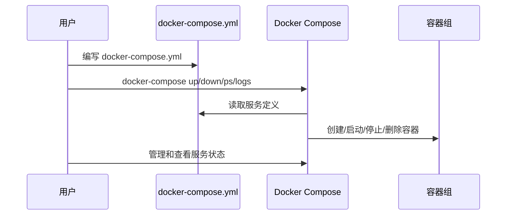

# Docker Compose

Docker Compose 是一个用于定义和运行多容器 Docker 应用程序的工具。通过一个 `docker-compose.yml` 文件，可以轻松管理应用程序的服务、网络和存储。

常见命令参考：

| 命令 | 说明 |
| --- | --- |
| `docker compose up -d` | 后台启动并创建服务（首次会自动创建网络和卷） |
| `docker compose up --build` | 启动前强制重新构建镜像 |
| `docker compose down` | 停止并移除容器、默认网络（保留命名卷） |
| `docker compose ps` | 查看当前项目下各服务运行状态 |
| `docker compose logs -f` | 持续跟踪并查看服务日志 |
| `docker compose restart` | 重启已运行的服务 |
| `docker compose exec <service> sh` | 进入指定服务容器执行命令 |
| `docker compose pull` | 拉取配置中定义服务的最新镜像 |

## 安装

Docker Compose V2 已集成在 Docker CLI 中，安装 Docker Desktop 或 Docker Engine 后即可使用 `docker compose` 命令。

使用以下命令检查 Docker Compose 是否安装成功：

```bash
# 新版本命令
docker compose version

# 旧版本命令
docker-compose version
# or
docker-compose --version
```

## 工作流程

Docker Compose 的工作流程包括以下几个步骤：
1. 新建名为 `docker-compose.yml` 的文件，并在文件中定义多个容器的配置(网络、端口映射和数据卷等)
2. 在 `docker-compose.yml` 文件所在目录下，执行 `docker-compose up -d` 命令启动配置中定义的所有服务(容器)。
3. 通过 `docker-compose ps` 查看服务状态，`docker-compose logs` 查看日志。
4. 需要停止并移除服务时，执行 `docker-compose down`。


```mermaid
sequenceDiagram
    participant User as 用户
    participant ComposeFile as docker-compose.yml
    participant ComposeEngine as Docker Compose
    participant Containers as 容器组

    User->>ComposeFile: 编写 docker-compose.yml
    User->>ComposeEngine: docker-compose up/down/ps/logs
    ComposeEngine->>ComposeFile: 读取服务定义
    ComposeEngine->>Containers: 创建/启动/停止/删除容器
    User->>ComposeEngine: 管理和查看服务状态
```

## 配置编写

以下是一个常用的 `docker-compose.yml` 配置示例，包含一个基于 Nginx 的 Web 服务和一个 MySQL 数据库服务：

```yaml
# Docker Compose V2 起不再需要显示指定版本
# version: 'xxxxxx'                

# 定义全局数据卷
# 这里定义了一个名为 db-data 的数据卷
volumes:                      # 数据卷定义区块
  db-data:                    # 卷名
# 定义全局网络
# 这里定义了一个名为 app-network 的桥接网络
networks:                     # 网络定义区块
  app-network:                # 网络名
    driver: bridge            # 网络驱动类型

# 这里的services 区块定义了两个服务：web 和 db
services:                     
  web:                        
    image: nginx:latest       # 服务对应的镜像
    ports:                    # 配置容器端口与主机端口的映射
      - '8080:80'             # 主机端口:容器端口
    volumes:                  # 配置容器目录与主机目录的映射
      - ./html:/usr/share/nginx/html # 主机路径:容器路径
    networks:                 # 加入指定的网络
      - app-network           # app-network 是全局网络中定义的其中一个网络的网络名
  db:                        
    # 自定义容器名称
    container_name: my-mysql-db

    image: mysql:5.7          
    depends_on:               # depends_on下指定的服务启动完成之后，才开始启动当前服务
      - web
    environment:              # 环境变量配置，键值对形式
      MYSQL_ROOT_PASSWORD: rootpassword
      MYSQL_DATABASE: mydatabase
      MYSQL_USER: user
      MYSQL_PASSWORD: userpassword
    volumes:                  
      - db-data:/var/lib/mysql #  db-data → /var/lib/docker/volumes/db-data/_data (主机实际目录）
    networks:
      - app-network 
```

> [!TIP]
> 使用卷积名作为主机目录时，Docker Compose 会自动在 Docker 的默认卷存储位置（`/var/lib/docker/volumes/`）下创建一个目录来存储数据。卷名与实际存储路径的映射关系如下：
- 卷名 → `/var/lib/docker/volumes/<卷名>/_data`
- 例如，`db-data` 卷会映射到 `/var/lib/docker/volumes/db-data/_data` 目录。

字段参考表：

| 字段         | 作用说明                                   |
| ------------ | ------------------------------------------ |
| version      | 指定 Compose 文件的版本, `Docker Compose V2` 起不再需要显示指定                    |
| services     | 服务集合，每个服务都是services下的一个区块      |
| image        | 指定服务使用的镜像                         |
| ports        | 主机端口与容器端口映射                     |
| volumes      | 挂载主机目录或数据卷到容器                 |
| environment  | 设置环境变量，键值对形式                   |
| networks     | 指定服务加入的网络                         |
| volumes(根)  | 定义全局数据卷，供服务挂载                 |
| networks(根) | 定义全局网络，供服务加入                   |
| driver       | 指定网络模式                  |

> [!NOTE]
> - 默认情况下，Docker Compose 使用 `docker-compose.yml` 作为配置文件的名称。如果需要使用其他名称，可以通过 `-f` 参数指定文件路径。  
> - 使用 `-f` 参数时，可以指定多个 Compose 文件，Docker Compose 会按顺序合并这些文件。
