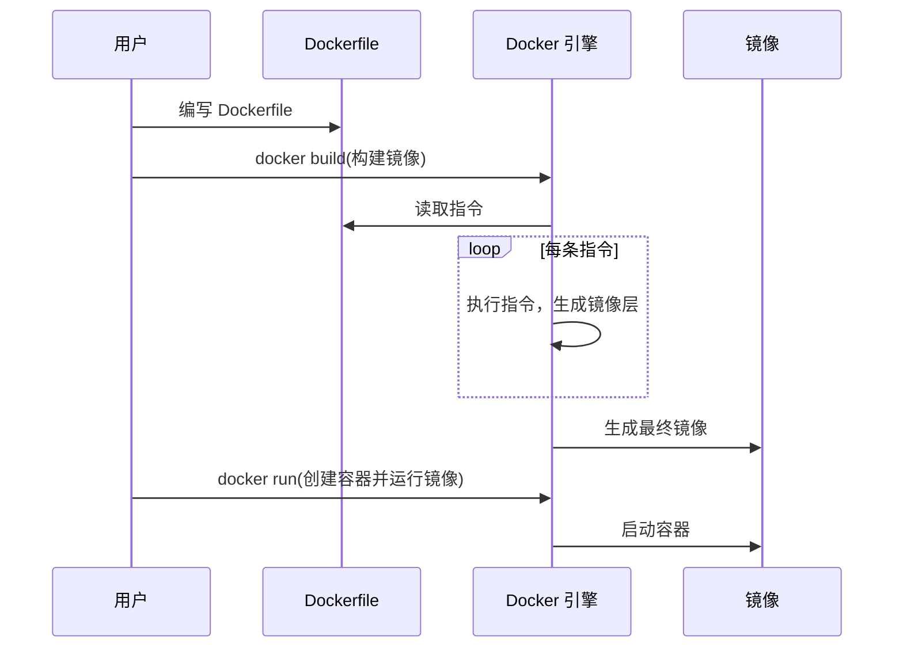

# Dockerfile

Dockerfile 是一个文本文件，其中包含了构建 Docker 镜像所需的所有命令和指令。通过 Dockerfile，用户可以自动化镜像的创建过程。

## 工作流程

Dockerfile 的工作流程包括以下几个步骤：
1. 新建名为 `Dockerfile` 的文件，并在其中编写定义镜像构建所需的各项指令。
2. 在 `Dockerfile` 文件所在目录下，执行 `docker build -t 镜像名:标签 .` 命令构建镜像。
3. 通过 `docker run` 命令创建容器并运行镜像。



## 编写 Dockerfile

一个基本的 Dockerfile 由多条指令组成，每条指令定义了镜像构建过程中的一个步骤。Dockerfile示例如下:

```dockerfile
# 1. 指定基础镜像，必须是第一条指令
# 语法：FROM <镜像名>:<标签>
FROM alpine:3.18

# 2. 添加作者和版本等元数据
# 语法：LABEL <key>=<value> ...
LABEL maintainer="yourname@example.com" version="1.0" description="示例 Dockerfile"

# 3. 设置环境变量
# 语法：ENV <key>=<value> [<key>=<value> ...]
ENV APP_HOME=/app APP_ENV=production

# 4. 设置工作目录
# 语法：WORKDIR <路径>
WORKDIR $APP_HOME

# 5. 复制本地文件到镜像
# 语法：COPY <源路径> <目标路径>
COPY . .

# 6. 通过 ADD 下载并解压归档文件
# 语法：ADD <源路径/URL> <目标路径>
ADD https://example.com/archive.tar.gz /tmp/

# 7. 安装依赖并清理临时文件
# 语法：RUN <命令>
RUN apk add --no-cache curl && \
    echo "App home is $APP_HOME" > info.txt && \
    rm -rf /var/cache/apk/*

# 8. 声明容器运行时监听的端口
# 语法：EXPOSE <端口> [<端口> ...]
EXPOSE 8080

# 9. 指定容器启动时默认执行的命令
# 语法：CMD ["可执行文件", "参数1", ...] 或 CMD <命令字符串>
CMD ["sh", "-c", "echo Hello from CMD, env: $APP_ENV && sleep 3600"]

# 10. 指定容器启动入口点（可选，通常与 CMD 配合使用）
# 语法：ENTRYPOINT ["可执行文件", "参数1", ...]
# ENTRYPOINT ["sh", "-c", "echo Entrypoint started; exec \"$@\"", "--"]
```

指令参考表:

| 指令             | 描述                                                                                                    |
| ---------------- | ------------------------------------------------------------------------------------------------------- |
| FROM             | 指定基础镜像，Dockerfile 必须以此开头。                                                                 |
| LABEL            | 添加作者、维护者等元数据。                                                                              |
| ENV              | 设置环境变量，可在后续指令和容器运行时使用，支持一次设置多个变量。运行容器时可用 `-e` 覆盖。             |
| WORKDIR          | 定义后续指令的工作目录，目录不存在会自动创建。运行容器时可用 `-w` 覆盖，仅影响当前容器。                  |
| RUN              | 构建镜像时执行命令，常用于安装依赖、初始化等。支持 shell 和 exec 格式，推荐合并命令减少层数并清理临时文件。|
| COPY / ADD       | 复制文件或目录到镜像中。`COPY` 仅做复制，推荐优先使用；`ADD` 还支持自动解压本地归档和从 URL 下载文件。    |
| EXPOSE           | 声明容器运行时监听的端口，仅声明不做端口映射，需配合 `-p` 或 `-P` 参数将端口映射到主机。                |
| CMD / ENTRYPOINT | 指定容器启动时执行的命令。`CMD` 可被覆盖，`ENTRYPOINT` 通常不可被覆盖（除非用 `--entrypoint`），两者可配合使用。|

> [!NOTE]
> - `FROM` 必须是 Dockerfile 的第一条指令。
> - `LABEL` 可用于添加作者、版本等元数据，便于镜像管理。
> - `ENV` 设置的环境变量可被后续指令和容器运行时引用，运行时用 `-e` 可覆盖。
> - `WORKDIR` 支持变量引用，设置后影响后续所有指令的工作目录。
> - `RUN` 推荐合并多条命令，减少镜像层数，并及时清理临时文件。
> - `COPY` 仅做复制，`ADD` 支持自动解压本地归档和 URL 下载，但 URL 下载不走缓存，可能影响构建速度。
> - `EXPOSE` 仅声明端口，不做实际映射，需用 `-p` 或 `-P` 参数实现主机端口映射。
> - `CMD` 支持 exec 和 shell 两种格式，exec 格式不会解析环境变量，shell 格式通过 `/bin/sh -c` 执行。`CMD` 可被 `docker run` 后的命令覆盖，`ENTRYPOINT` 定义主命令，适合不可覆盖的默认行为。

## 构建镜像

Docker 提供了 `docker build` 命令，用于根据 Dockerfile 构建镜像。

- 基本用法

```bash
# 使用 -t 参数为镜像指定名称和标签
docker build -t [镜像名称]:[标签] [Dockerfile路径]

# . 表示当前目录
# 示例：构建一个名为 my-app，标签为 latest 的镜像
docker build -t my-app:latest .

# 示例：指定 Dockerfile 的路径
docker build -t my-app:latest -f /path/to/Dockerfile .
```

> [!TIP]
> 构建上下文路径通常是 Dockerfile 所在的目录。

### 构建缓存  
Docker 在构建镜像时会利用分层缓存机制，加快构建速度。如果某一层未发生变化，Docker 会复用缓存。

```bash
# 禁用缓存
docker build --no-cache -t [镜像名称]:[标签] .
```

### 传递参数

可以通过 `--build-arg` 参数向 Dockerfile 中的 `ARG` 指令传递构建时参数：

```dockerfile
# Dockerfile 示例
ARG APP_VERSION
RUN echo "Building version $APP_VERSION"
```

```bash
# 构建镜像时传递参数
docker build --build-arg APP_VERSION=1.0.0 -t my-app:1.0.0 .
```

### 构建历史

使用 `docker history` 命令可以查看镜像的构建历史：

```bash
docker history [镜像ID或名称]
```
