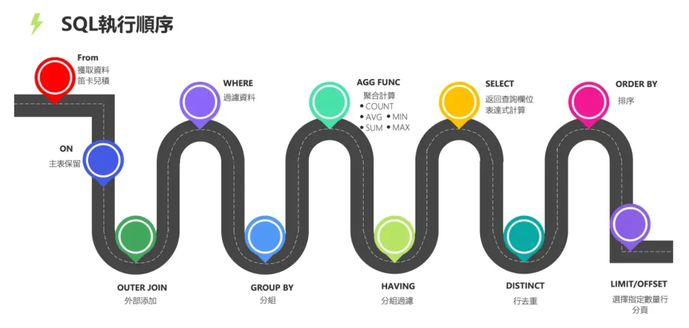

# MySql

## 基本术语

- **数据库（Database）**：逻辑上组织数据的集合，通常包含多个表、视图、存储过程等。
- **表（Table）**：由行（记录）和列（字段）组成的二维数据结构，是数据存储的基本单元。
- **行 / 记录（Row / Record）**：表中的一条数据实体，一行对应一个完整的对象实例。
- **列 / 字段（Column / Field）**：表的结构单元，定义了数据的名称和类型（如 INT、VARCHAR、DATE 等）。
- **主键（Primary Key）**：用于唯一标识表中每条记录的字段或字段组合，通常有索引且不允许重复或 NULL。
- **外键（Foreign Key）**：用于在表之间建立关联的字段，保证参照完整性（Referential Integrity）。
- **索引（Index）**：加速查询的数据结构（如 B-tree、Hash），常见类型有单列索引、组合索引、唯一索引、全文索引。
- **事务（Transaction）**：一组作为单一逻辑单元执行的 SQL 操作，满足 ACID（原子性、一致性、隔离性、持久性）特性。
- **提交 / 回滚（COMMIT / ROLLBACK）**：提交会持久化事务的变更；回滚会撤销自事务开始以来的所有变更。
- **锁（Locks）**：并发控制机制，常见有行锁（row lock）和表锁（table lock），锁粒度影响并发性能与争用。
- **隔离级别（Isolation Levels）**：定义事务之间可见彼此操作的程度，常见级别：READ UNCOMMITTED、READ COMMITTED、REPEATABLE READ（MySQL 默认）、SERIALIZABLE。
- **存储引擎（Storage Engine）**：MySQL 支持多种引擎（如 InnoDB、MyISAM），决定事务支持、锁机制、崩溃恢复等行为；InnoDB 支持事务与行锁。
- **约束（Constraints）**：用于限制列或表的数据完整性，包括 NOT NULL、UNIQUE、CHECK、PRIMARY KEY、FOREIGN KEY。
- **视图（View）**：基于 SELECT 语句的虚拟表，用于简化复杂查询或提供安全访问控制。
- **存储过程与触发器（Stored Procedures & Triggers）**：在数据库内部运行的可复用逻辑，触发器在特定数据变更事件发生时自动执行。

## SQL执行顺序

## 数据库范式

数据库设计中，范式（Normalization）是组织数据以减少冗余和依赖的过程。常见的范式包括：

### 1NF

1NF（第一范式）要求表中的每个字段都必须是原子性的，即每个字段只能包含单一可值，不能包含重复的组或数组。

***
**示例：违反 1NF**

| StudentID | Name | Courses |
|---|---|---|
| 1 | 张三 | Math, English, Physics |

**问题**：Courses 字段包含多个值，违反原子性

***

**符合 1NF**

| StudentID | Name | Course |
|---|---|---|
| 1 | 张三 | Math |
| 1 | 张三 | English |
| 1 | 张三 | Physics |

**解决**：每行只包含单一课程值，确保字段原子性

### 2NF

2NF（第二范式）在满足1NF的前提下，表中的每个非主键字段都必须完全依赖于主键，不能只依赖于主键的一部分（适用于复合主键的情况）。

***
**示例：违反 2NF**

| CourseID | StudentID | CourseName | StudentName |
|---|---|---|---|
| C1 | 1 | Math | 张三 |
| C1 | 2 | Math | 李四 |

**问题**：CourseName 只依赖于 CourseID，StudentName 只依赖于 StudentID，存在部分依赖

***
**符合 2NF**

| CourseID | StudentID |
|---|---|
| C1 | 1 |
| C1 | 2 |

| CourseID | CourseName |
|---|---|
| C1 | Math |

| StudentID | StudentName |
|---|---|
| 1 | 张三 |
| 2 | 李四 |

**解决**：分离表结构，使非主键字段完全依赖于整个主键

> [!TIP]
> 如果能够通过A确定B(A -> B), 那么B就函数依赖于A \
> 对于2NF来说非主属性必须完全函数依赖于主属性

### 3NF

3NF（第三范式）在满足2NF的前提下，表中的非主键字段不能传递依赖于主键。也就是说，非主键字段之间不能相互依赖。
***
**示例：违反 3NF**

| StudentID | Name | DepartmentID | DepartmentName |
|---|---|---|---|
| 1 | 张三 | D1 | Computer Science |
| 2 | 李四 | D1 | Computer Science |

**问题**：DepartmentName 依赖于 DepartmentID，而 DepartmentID 依赖于 StudentID，存在传递依赖

***

**符合 3NF**

| StudentID | Name | DepartmentID |
|---|---|---|
| 1 | 张三 | D1 |
| 2 | 李四 | D1 |

| DepartmentID | DepartmentName |
|---|---|
| D1 | Computer Science |

**解决**：将传递依赖的字段分离到独立表中，通过外键关联

### 反3NF
一些场景下，为了提高查询性能，可能会违反第三范式，允许数据冗余。这种设计称为反3NF（Denormalization）。

***
**示例：反3NF 设计**

| OrderID | CustomerID | CustomerName | CustomerEmail | ProductID | ProductName | Price | Quantity |
|---|---|---|---|---|---|---|---|
| O1 | C1 | 张三 | zhangsan@email.com | P1 | Laptop | 5000 | 1 |
| O1 | C1 | 张三 | zhangsan@email.com | P2 | Mouse | 100 | 2 |

**特点**：CustomerName、CustomerEmail、ProductName 和 Price 存在冗余，但避免了多次 JOIN 操作

***
**优缺点**

| 优点 | 缺点 |
|---|---|
| 减少 JOIN 操作，提高查询性能 | 数据冗余增加存储空间 |
| 简化复杂查询逻辑 | 更新时需同步多条记录，易产生数据不一致 |
| 降低数据库负载 | 维护成本增高 |

> 适用于读多写少的场景.

## 存储引擎

存储引擎描述了存储数据、建立索引、更新/查询数据等技术的实现方式。存储引擎是基于表的，而不是基于库的，所以存储引擎也可被称为表类型。

### InnoDB

InnoDB **支持事务处理**、**行级锁**和**外键约束**，适用于需要高并发和数据完整性的应用场景。

> [!TIP]
> 在MySQL 5.5 及更高版本中，InnoDB 是默认的存储引擎。在此之前默认的存储引擎是 MyISAM。

**索引创建机制**

对于存在主键的表，InnoDB 会将数据存储在主键索引的叶子节点中，形成聚集索引（Clustered Index）。如果没有定义主键，InnoDB 会选择第一个非空唯一索引作为聚集索引；如果没有这样的索引，InnoDB 会自动生成一个隐藏的聚集索引。

> [!TIP]
> 默认情况下，InnoDB 使用 B+ 树结构来实现索引，这种结构适用于范围查询和排序操作。

### MyISAM

MyISAM **不支持事务处理**和**行级锁**，**只支持表级锁**，适用于读多写少的应用场景，如数据仓库和日志系统。

> [!TIP]
> 可以使用 MongoDB 替换使用 MyISAM 存储引擎的存储方案，

### Memory

Memory 存储引擎将数据存储在内存中，提供非常快的访问速度，但数据在服务器重启后会丢失，适用于临时数据存储和高速缓存。

> [!TIP]
> 可以使用 Redis 替换使用 Memory 存储引擎的存储方案，

