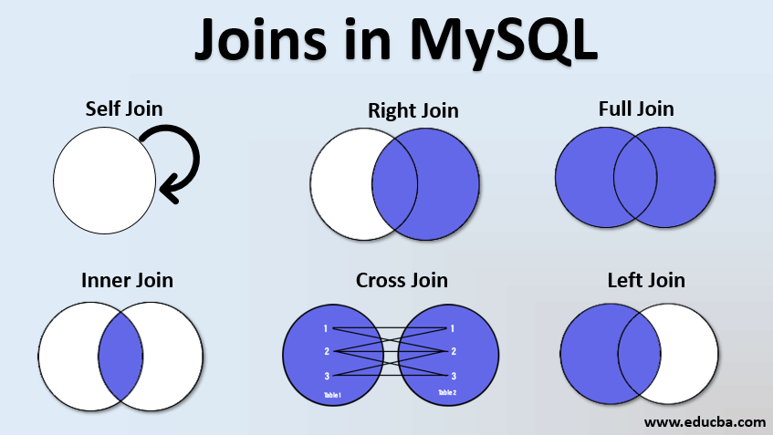

# SQL 操作

## 连接

在 SQL 中，连接（JOIN）用于根据两个或多个表之间的相关列，将它们的数据组合起来。常见的连接类型包括：



### 内连接（INNER JOIN）

只返回两个表中满足连接条件的记录。

```sql
SELECT *
FROM A
INNER JOIN B
ON A.id = B.a_id;
```

**示例：**

- 表 A:  

| id | name  |
|----|-------|
| 1  | Tom   |
| 2  | Jerry |

- 表 B:  

| a_id | score |
|------|-------|
| 1    | 90    |
| 3    | 80    |

执行内连接后结果为：

| id | name | a_id | score |
|----|------|------|-------|
| 1  | Tom  | 1    | 90    |


> [!NOTE]
> 使用 WHERE 子句也可以实现内连接, 但是推荐使用 JOIN 语法以提高可读性。

---

### 左连接（LEFT JOIN）

返回左表的所有记录，即使右表中没有匹配的记录，右表无匹配时结果为 NULL。

```sql
SELECT *
FROM A
LEFT JOIN B
ON A.id = B.a_id;
```

**示例：**
同上表，左连接结果为：

| id | name  | a_id | score |
|----|-------|------|-------|
| 1  | Tom   | 1    | 90    |
| 2  | Jerry | NULL | NULL  |

---

### 右连接（RIGHT JOIN）

返回右表的所有记录，即使左表中没有匹配的记录，左表无匹配时结果为 NULL。

```sql
SELECT *
FROM A
RIGHT JOIN B
ON A.id = B.a_id;
```

**示例：**
同上表，右连接结果为：

| id   | name | a_id | score |
|------|------|------|-------|
| 1    | Tom  | 1    | 90    |
| NULL | NULL | 3    | 80    |

---

### 全连接（FULL JOIN）

返回两个表中所有的记录，只要其中一个表有匹配就会显示，没有匹配的部分用 NULL 填充。MySQL 不直接支持 FULL JOIN，可以用 UNION 实现。

```sql
SELECT *
FROM A
LEFT JOIN B 
    ON A.id = B.a_id
UNION
SELECT *
FROM A
RIGHT JOIN B
    ON A.id = B.a_id;
```

**示例：**
同上表，全连接结果为：

| id   | name  | a_id | score |
|------|-------|------|-------|
| 1    | Tom   | 1    | 90    |
| 2    | Jerry | NULL | NULL  |
| NULL | NULL  | 3    | 80    |

---

### 交叉连接（CROSS JOIN）

返回两个表的笛卡尔积，即每个左表记录与右表每个记录组合。

```sql
SELECT *
FROM A
CROSS JOIN B;
```

**示例：**

同上表，交叉连接结果为：

| id | name  | a_id | score |
|----|-------|------|-------|
| 1  | Tom   | 1    | 90    |
| 1  | Tom   | 3    | 80    |
| 2  | Jerry | 1    | 90    |
| 2  | Jerry | 3    | 80    |


> [!TIP]
> `SELECT * FROM A CROSS JOIN B` 和 `SELECT * FROM A, B` 都可以实现两个表的笛卡尔积. 但为了语义和可读性, 推荐使用CROSS JOIN 语法.

---

### 自连接（SELF JOIN）

自连接是指同一个表在查询中进行连接，通常用于查找表中记录之间的关系（如树形结构、父子关系等）。

```sql
SELECT 
    a.id, 
    a.name,
    b.id AS parent_id, 
    b.name AS parent_name
FROM employee a
LEFT JOIN employee b
ON a.manager_id = b.id;
```

**示例：**

- employee 表：

| id | name   | manager_id |
|----|--------|------------|
| 1  | Alice  | NULL       |
| 2  | Bob    | 1          |
| 3  | Carol  | 1          |
| 4  | David  | 2          |

自连接结果为：

| id | name  | parent_id | parent_name |
|----|-------|-----------|-------------|
| 1  | Alice | NULL      | NULL        |
| 2  | Bob   | 1         | Alice       |
| 3  | Carol | 1         | Alice       |
| 4  | David | 2         | Bob         |

> [!TIP]
> 自连接时需要为同一张表起不同的别名，以区分不同角色。