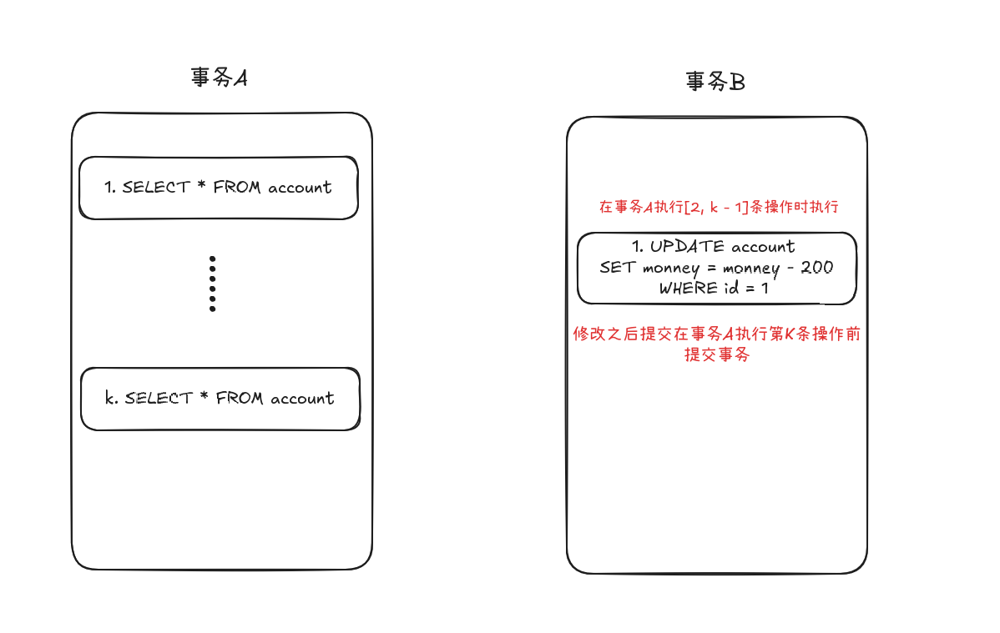
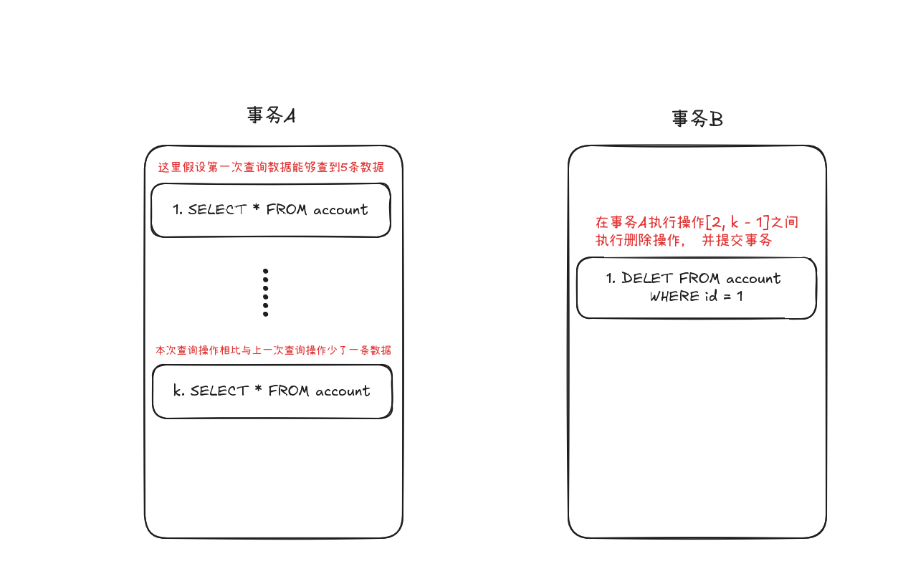

# 事务

事务是指一组操作集合，操作集合中的操作要么全部执行成功，要么全部不执行。事务具有四个特性，简称 ACID 特性：

- 原子性（Atomicity）：事务中的所有操作要么全部完成，要么全部不完成。
- 一致性（Consistency）：事务执行前后，数据库必须处于一致的状态。
- 隔离性（Isolation）：多个事务并发执行时，一个事务的执行不应影响其他事务的执行。
- 持久性（Durability）：一旦事务提交，对数据库的修改就是永久性的。

---

## 并发事务常见问题

### 脏读

脏读是指一个事务读取了另一个事务未提交的数据。如果后者事务回滚，前者读取的数据就变得无效。


在上图中，事务A读取了事务B未提交的money值，如果事务B回滚，事务A读取的数据就变得无效。

### 不可重复读

不可重复读是指在同一个事务中，两次读取同一数据时，数据发生了变化，导致两次读取结果不同。



在上图中，事务A两次读取到的money值不同，因为事务B在两次读取之间**修改了money值并提交了事务**。

### 幻读

幻读是指在一个事务中，两次执行相同的查询语句时，由于另一个事务插入了新的数据，导致第一次查询结果和第二次查询结果不一致。



> [!TIP]
> **幻读**：同一事务内，多次范围查询，结果集的“行数”发生变化  
> **不可重复读**：同一事务内，多次读取同一行数据，内容发生变化

---

## 事务隔离级别

MySQL 支持以下四种事务隔离级别（安全性从低到高，性能从高到低）：

| 隔离级别 | 脏读 | 不可重复读 | 幻读 | 说明 |
|---|---|---|---|---|
| 读未提交（Read Uncommitted） | ✗ | ✗ | ✗ | 最低级别，允许读取未提交数据 |
| 读已提交（Read Committed） | ✓ | ✗ | ✗ | 仅读取已提交数据，避免脏读 |
| 可重复读（Repeatable Read） | ✓ | ✓ | ✗ | **MySQL 默认级别**，避免脏读和不可重复读 |
| 串行化（Serializable） | ✓ | ✓ | ✓ | 最高级别，完全避免并发问题，性能较低 |

+ **读未提交（Read Uncommitted）**：最低的隔离级别，一个事务可以读取另一个事务未提交的数据，可能导致脏读。
+ **读已提交（Read Committed）**：一个事务只能读取另一个事务已提交的数据，避免脏读，但可能导致不可重复读。
+ **可重复读（Repeatable Read）**：一个事务在整个过程中多次读取同一数据，结果是一致的，避免不可重复读，但可能导致幻读。MySQL 默认隔离级别。
+ **串行化（Serializable）**：最高的隔离级别，事务按顺序执行，完全避免并发问题，但性能较低。

- **查看当前会话隔离级别：**
  ```sql
  SELECT @@tx_isolation;
  ```
- **修改当前会话隔离级别：**
  ```sql
  SET SESSION TRANSACTION ISOLATION LEVEL 隔离级别;
  ```
