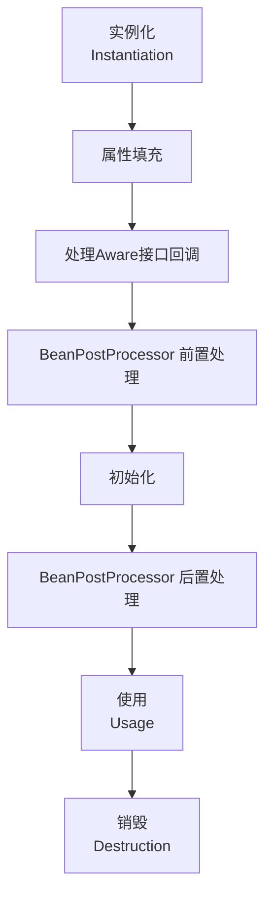
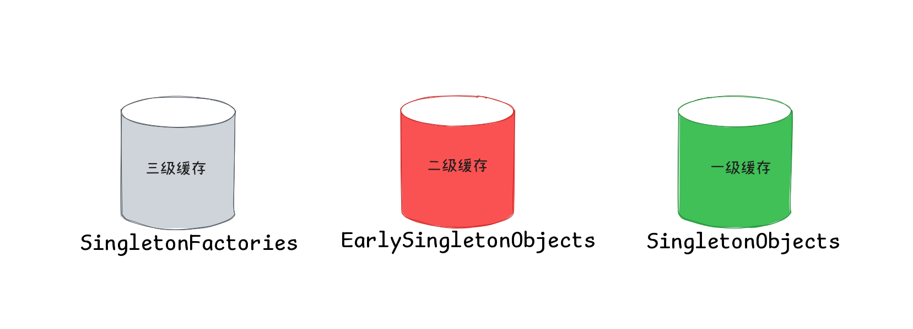
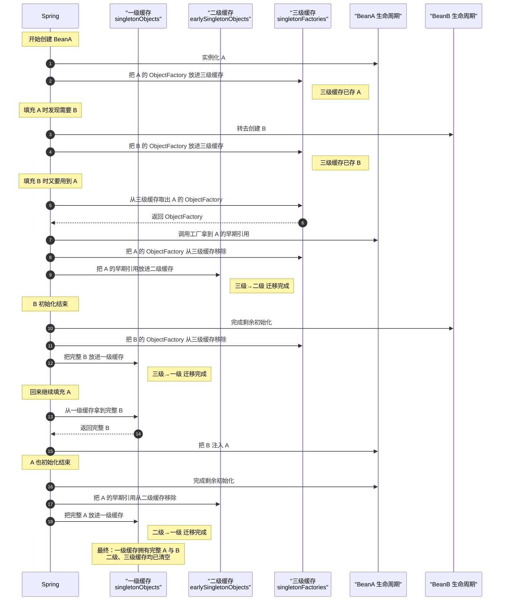

# Spring Bean

## 生命周期

Spring Bean 的生命周期包括以下阶段: 


### 扩展点

Spring 在Bean的生命周期中提供了多个扩展点，允许开发者在不同阶段插入自定义逻辑：

#### Aware接口回调

Spring 提供了一系列 Aware 接口，用于让 Bean 获得容器相关的资源或信息

```java
@Component
public class MyAwareBean implements BeanNameAware, ApplicationContextAware {
    private String beanName; // 自动注入当前 Bean 名称
    private ApplicationContext context; // 注入 ApplicationContext 容器

    @Override
    public void setBeanName(String name) {
        this.beanName = name;
        System.out.println("BeanNameAware: " + name);
    }

    @Override
    public void setApplicationContext(ApplicationContext applicationContext) {
        this.context = applicationContext;
        System.out.println("ApplicationContextAware: " + applicationContext);
    }
}
```

下面是 Aware 接口参考：

| 接口名                           | 作用说明                                      |
|----------------------------------|----------------------------------------------|
| `BeanNameAware`                  | 注入当前 Bean 的名称                         |
| `BeanFactoryAware`               | 注入 BeanFactory 实例                        |
| `ApplicationContextAware`        | 注入 ApplicationContext 容器                 |
| `EnvironmentAware`               | 注入 Environment 环境配置                    |
| `ResourceLoaderAware`            | 注入 ResourceLoader 资源加载器               |
| `ApplicationEventPublisherAware` | 注入 ApplicationEventPublisher 事件发布器    |
| `MessageSourceAware`             | 注入 MessageSource 国际化消息源              |
| `ServletContextAware`            | 注入 ServletContext（Web 应用环境下）        |
| `LoadTimeWeaverAware`            | 注入 LoadTimeWeaver 类加载时织入器           |
| `NotificationPublisherAware`     | 注入 NotificationPublisher（JMX 支持）       |
| `EmbeddedValueResolverAware`     | 注入 String 值解析器（如占位符解析）         |
| `ImportAware`                    | 注入 @Import 注解相关的元数据                |

#### 前置处理

实现 `BeanPostProcessor` 可以在 Bean 初始化前进行自定义处理：

```java
@Component
public class MyBeanPostProcessor implements BeanPostProcessor {
    @Override
    public Object postProcessBeforeInitialization(Object bean, String beanName) {
        System.out.println("Before Initialization: " + beanName);
        // 可以修改 bean 的属性
        return bean;
    }
}
```
#### 初始化

Bean 初始化阶段可以通过以下三种方式定义自己的扩展逻辑：

1. **@Bean 的 `init-method` 属性**

```java
@Bean(initMethod = "customInit")
public MyBean myBean() {
    return new MyBean();
}

public class MyBean {
    public void customInit() {
        System.out.println("Custom init-method called");
    }
}
```

2. **实现 `InitializingBean` 接口**

```java
@Component
public class MyInitializingBean implements InitializingBean {
    @Override
    public void afterPropertiesSet() {
        System.out.println("InitializingBean: afterPropertiesSet");
    }
}
```

3. **使用 `@PostConstruct` 注解**

```java
@Component
public class MyPostConstructBean {
    @PostConstruct
    public void init() {
        System.out.println("@PostConstruct: init");
    }
}
```

> [!NOTE]
> 如果多种方式混合使用, 三种方式之间的执行顺序为:  
> `@PreConstruct` > `InitializingBean.afterPropertiesSet()` > `@Bean(initMethod = "initMethod")`

#### 后置处理

`BeanPostProcessor` 的后置处理常用于生成代理对象或增强 Bean：

```java
@Component
public class MyBeanPostProcessor implements BeanPostProcessor {
    @Override
    public Object postProcessAfterInitialization(Object bean, String beanName) {
        System.out.println("After Initialization: " + beanName);
        // 可以返回代理对象
        return bean;
    }
}
```

#### 销毁

Bean 销毁阶段可以通过以下三种方式定义自己的扩展逻辑：

1. **@Bean 的 `destroy-method` 属性**

```java
@Bean(destroyMethod = "customDestroy")
public MyBean myBean() {
    return new MyBean();
}

public class MyBean {
    public void customDestroy() {
        System.out.println("Custom destroy-method called");
    }
}
```

2. **实现 `DisposableBean` 接口**

```java
@Component
public class MyDisposableBean implements DisposableBean {
    @Override
    public void destroy() {
        System.out.println("DisposableBean: destroy");
    }
}
```

3. **使用 `@PreDestroy` 注解**

```java
@Component
public class MyPreDestroyBean {
    @PreDestroy
    public void cleanup() {
        System.out.println("@PreDestroy: cleanup");
    }
}
```

> [!NOTE]
> 如果多种方式混合使用, 三种方式之间的执行顺序为:  
> `@PreDestroy` > `DisposableBean.destroy()` > `@Bean(destryMethod = "destroyMethod")`

## 作用域

Spring Bean 的作用域决定了 Bean 在容器中的创建和使用方式。Spring 支持多种作用域，每种作用域适用于不同的应用场景。常见作用域如下：

| 作用域        | 说明                                                                 | 使用场景                                              |
|--------------|---------------------------------------------------------------------|------------------------------------------------------|
| singleton    | 整个 Spring 容器中只创建一个 Bean 实例，所有请求都返回同一个对象。是默认作用域。 | 适用于无状态、线程安全的服务类、工具类等。             |
| prototype    | 每次获取 Bean 时都会创建一个新的实例。                               | 适用于有状态的 Bean 或需要频繁创建新对象的场景，如每次业务处理都需要一个新对象。 |
| request      | 每个 HTTP 请求都会创建一个新的 Bean 实例，仅在 Web 应用中有效。        | 适用于保存每个请求相关的数据，如表单对象、请求上下文等。 |
| session      | 每个 HTTP Session 会创建一个 Bean 实例，整个会话期间都使用同一个对象，仅在 Web 应用中有效。 | 适用于保存用户会话级别的数据，如购物车、用户登录信息等。 |
| application  | 整个 ServletContext 共享一个 Bean 实例，生命周期与 Web 应用一致，仅在 Web 应用中有效。 | 适用于保存应用级别的共享数据，如全局配置、统计信息等。   |
| websocket    | 每个 WebSocket 会话创建一个 Bean 实例，仅在使用 Spring WebSocket 时有效。 | 适用于需要在 WebSocket 连接期间保存状态的 Bean。        |

> [!TIP]
> 默认情况下，Spring Bean 的作用域是 `singleton`

可以通过以下方式定义 Bean 的作用域：

```java
@Component
@Scope("prototype")
public class MyPrototypeBean {
    // 每次获取都会创建新实例
}
```

或者在 XML 配置中：

```xml
<bean id="myBean" class="com.example.MyBean" scope="request"/>
```

## 三重缓冲机制

三重缓冲机制是 Spring 在 Bean 创建过程中用于解决循环依赖的问题。它通过 singletonObjects、earlySingletonObjects 和 singletonFactories 三个缓存层次，确保 Bean 能够被正确实例化和依赖注入。



### 工作流程

下面以 Bean A 依赖 Bean B，同时 Bean B 又依赖 Bean A 这个循环依赖的场景来讲解 Spring 怎么通过三重缓冲机制来解决这个问题:

1. Spring 创建 Bean A 的实例, 并将 BeanA 对应的 ObjectFactory 放入三级缓存中, 然后进行依赖注入

2. 依赖注入过程中发现 BeanA 依赖于 BeanB, 于是开始创建 BeanB 的实例

3. 在创建 BeanB 实例后(也会放入一个对应的 ObjectFactory 到三级缓存中), 依赖注入的过程中发现 BeanB 又依赖于 BeanA.

4. 此时 Spring 从三级缓存中获取 BeanA 的对应的 ObjectFactory, 并调用其工厂方法获取 BeanA 的早期引用(此时BeanA的Bean生命周期为"正在进行依赖注入阶段")注入到 BeanB

5. 将 BeanA 的早期引用放入二级缓存中(放入之前会先清理三级缓存中 BeanA 对应的 ObjectFactory)

6. BeanB 初始化完成后, Spring 将 BeanB 实例放入一级缓存(放入之前会先清理三级缓存 BeanB 对应的 ObjectFactory)

7. 回到 BeanA 的依赖注入过程, 此时 BeanA 依赖的 BeanB 已经创建完成并放入一级缓存中, 于是将其注入到 BeanA 中

8. 最后 BeanA 初始化完成后, 将其实例放到一级缓存中(放入之前会先清理二级缓存中 BeanA 的早期引用)



> [!NOTE]
> 使用二级缓存也能够解决循环依赖的问题, 但是无法区分Bean是实例化还是依赖注入阶段
