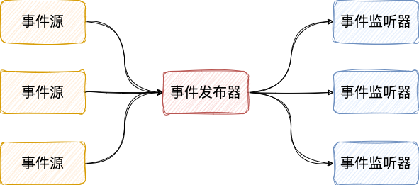

# Spring 事件驱动

事件驱动是一种编程范式，通过发布和监听事件来实现各组件之间的解耦。当某个事件发生时，系统会自动通知所有注册的监听器进行相应的处理。事件驱动主要涉及三个核心概念：

1. 事件源（Event Source）：事件发生的来源或触发点，通常是某个组件或对象。

2. 事件发布者（Event Publisher）：负责创建并发布事件的对象，将事件发送给所有注册的监听器。

3. 事件监听器（Event Listener）：负责接收并处理事件的对象，监听器会注册到事件发布者，当事件发生时会被通知并执行相应逻辑。



## 声明事件源

在 Spring 中，事件通常通过继承 `ApplicationEvent` 类来声明。例如：

```java
public class CustomEvent extends ApplicationEvent {
    private String message;

    public CustomEvent(Object source, String message) {
        super(source);
        this.message = message;
    }

    public String getMessage() {
        return message;
    }
}
```

## 监听器

### 创建事件监听器

可以通过实现 `ApplicationListener` 接口或使用 `@EventListener` 注解来声明监听器。例如：

```java
// 通过@EventListener注解的方式
@Component
public class CustomEventListener {
    @EventListener
    public void handleCustomEvent(CustomEvent event) {
        System.out.println("收到事件：" + event.getMessage());
    }
}

// 通过实现ApplicationListener接口的方式
@Component
public class CustomEventListenerImpl implements ApplicationListener<CustomEvent> {
    @Override
    public void onApplicationEvent(CustomEvent event) {
        System.out.println("收到事件：" + event.getMessage());
    }
}
```

> [!NOTE]
> 实现接口的方式一次仅能够创建一个事件监听器, 且入侵性较强, 推荐使用@EventListener注解的方式来创建事件监听器.

### 异步事件监听器

默认情况下不会单独创建一个线程去处理事件(处理事件时阻塞主线程), 如果需要异步的处理事件可以使用 `@Async` 注解将事件监听器方法标记为异步执行。

```java
@Async
@EventListener
public void handleAsyncEvent(CustomEvent event) {
    System.out.println("异步收到事件：" + event.getMessage());
}

// 需要在Spring Boot启动类上添加@EnableAsync注解以启用异步支持, 否则@Async注解不会生效.
@EnableAsync
@SpringBootApplication
public class Application {
    public static void main(String[] args) {
        ApplicationContext context = SpringApplication.run(Application.class, args);
    }
}
```

### 事务事件监听器

有时我们希望事件监听器在事务提交前、提交后、抛出异常和事务完成后(无论是否成功)才执行，这时可以使用 `@TransactionalEventListener` 注解。

```java
// phase 默认值为 TransactionPhase.AFTER_COMMIT
@TransactionalEventListener(phase = TransactionPhase.AFTER_COMMIT)
public void handleTransactionalEvent(CustomEvent event) {
    System.out.println("事务提交后收到事件：" + event.getMessage());
}

// 必须在事务方法中发布事件, 否则@TransactionalEventListener不会生效.
@Transactional
public void someTransactionalMethod() {
    // 业务逻辑
    // 发布事件
    publisher.publishEvent(new CustomEvent(this, "事务事件"));
}
```

## 发布事件

在需要发布事件的地方，可以注入 `ApplicationEventPublisher` 并调用其 `publishEvent` 方法：

```java
@Component
public class EventPublisherBean {
    @Autowired
    private ApplicationEventPublisher publisher;

    public void publish(String message) {
        publisher.publishEvent(new CustomEvent(this, message));
    }
}
```
