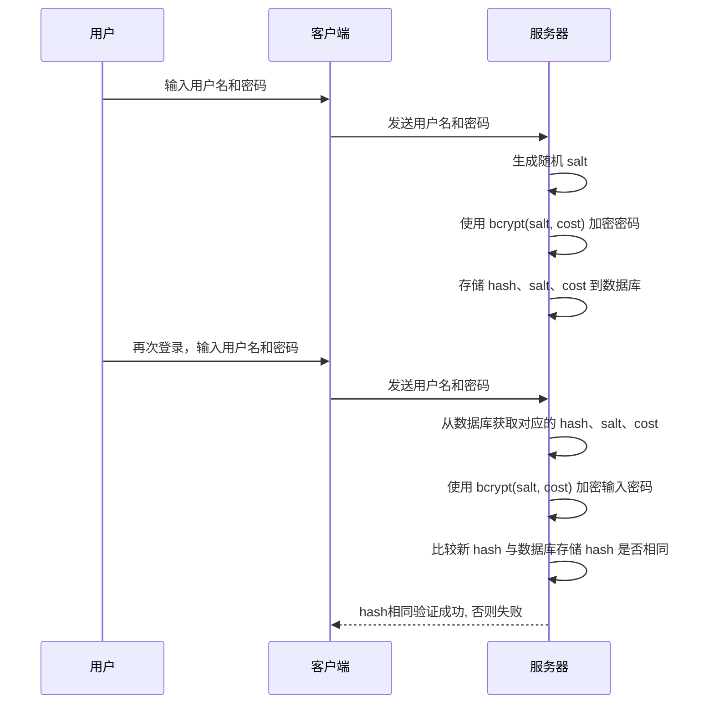

# 算法

## Hash算法

哈希算法（Hash Function）是一种将任意长度的输入（通常是字符串）转换为固定长度输出的函数。

哈希算法主要有以下特点: 

- **不可逆**：无法通过哈希值还原原始数据。
- **定长输出**：无论输入多长，输出长度固定。
- **雪崩效应**：输入微小变化，输出完全不同。

### Bcrypt

bcrypt 是一种基于 Blowfish 加密算法的哈希函数，常用于密码存储。它通过引入“加盐”（salt）和可配置的计算成本（cost factor），有效防止彩虹表攻击和暴力破解。

**特点：**
- 每次加密都会生成不同的哈希值（即使明文相同），因为每次都会生成新的 salt。
- 计算成本可调，随着硬件性能提升可以增加 cost，提升破解难度。

用于密码存储时, 工作流程如下:

hash、salt、cost 包含在bcrypt最终生成的字符串中, 其字符串结构如下图所示:

> [!NOTE]
> 既然数据库盐值泄露了, 攻击者仍然需要暴力破解密码(枚举明文逐一尝试).

> [!TIP]
> + 使用的salt和cost factor相同, 得到的hash必然相同
> + bcrypt 适合存储用户密码，不适合用于加密大量数据。
