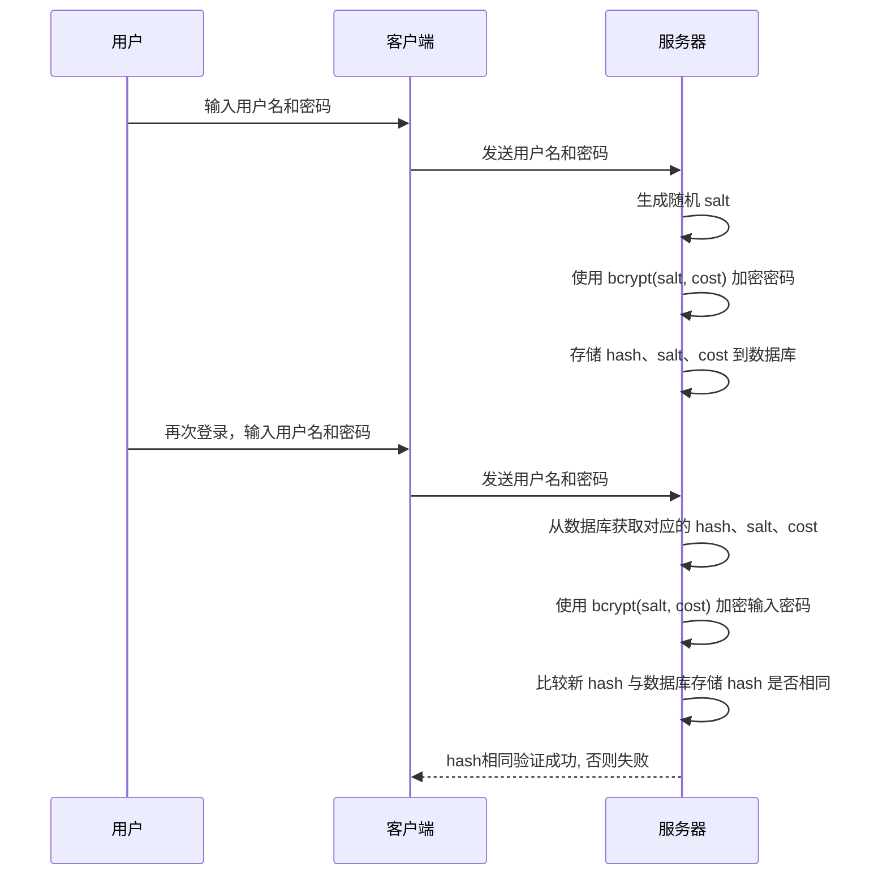
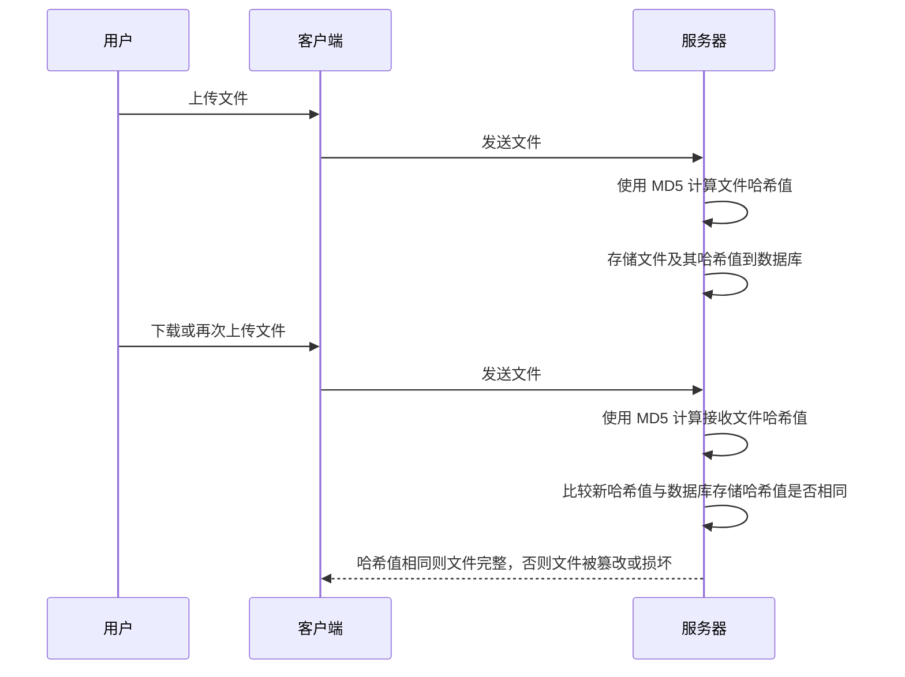
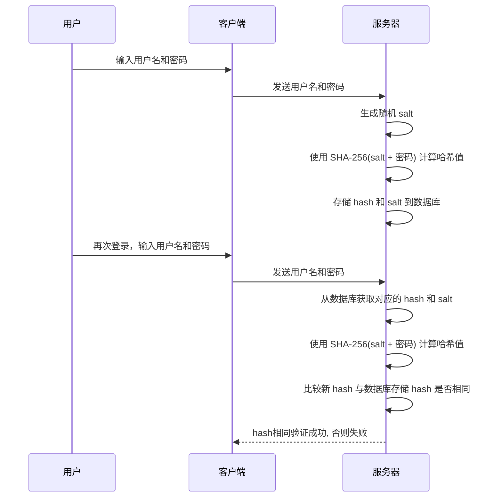

# 算法

## Hash算法

哈希算法（Hash Function）是一种将任意长度的输入（通常是字符串）转换为固定长度输出的函数。

哈希算法主要有以下特点: 

- **不可逆**：无法通过哈希值还原原始数据。
- **定长输出**：无论输入多长，输出长度固定。
- **雪崩效应**：输入微小变化，输出完全不同。

### Bcrypt

bcrypt 是一种基于 Blowfish 加密算法的哈希函数，常用于密码存储。它通过引入“加盐”（salt）和可配置的计算成本（cost factor），有效防止彩虹表攻击和暴力破解。

**特点：**
- 每次加密都会生成不同的哈希值（即使明文相同），因为每次都会生成新的 salt。
- 计算成本可调，随着硬件性能提升可以增加 cost，提升破解难度。

用于密码存储时, 工作流程如下:

hash、salt、cost 包含在bcrypt最终生成的字符串中, 其字符串结构如下图所示:

> [!NOTE]
> 既然数据库盐值泄露了, 攻击者仍然需要暴力破解密码(枚举明文逐一尝试).

> [!TIP]
> + 使用的salt和cost factor相同, 得到的hash必然相同
> + bcrypt 适合存储用户密码，不适合用于加密大量数据。

### MD5

MD5（Message-Digest Algorithm 5）是一种广泛使用的哈希算法. 它可以将任意长度的数据“压缩”成一个 128 位（16 字节）的哈希值，通常以 32 个十六进制字符表示。

**主要应用场景：**

- 文件完整性校验：常用于校验文件在传输或存储过程中是否被篡改。
- 唯一标识符生成：可用于生成短小的唯一标识。

**安全性问题：**

- MD5 存在Hash碰撞漏洞，即不同的输入可能产生相同的哈希值。
- 随着计算能力提升，MD5 已不再安全，容易被暴力破解和碰撞攻击。

> [!WARNING]
> MD5 不适合用于密码存储或数字签名等安全性要求高的场合。推荐使用更安全的哈希算法，如 SHA-256 或 Bcrypt。

用于文件完整性校验时, 工作流程如下:

### SHA-256

SHA（Secure Hash Algorithm，安全哈希算法）是目前应用最广泛的一类哈希算法家族。常见的有 SHA-1、SHA-256、SHA-512 等，其中 SHA-256 属于 SHA-2 家族，是现代密码学推荐的安全哈希算法之一。

**主要应用场景：**
- 密码存储：这个场景下需要配合加盐和多次迭代来确保密码安全。
- 数字签名与认证：如区块链、SSL证书等。
- 文件完整性校验：与 MD5 类似，但安全性更高。

**安全性说明：**
- SHA-256 也存在hash碰撞, 但碰撞概率极低，无法通过现有技术手段制造出两个不同输入但哈希值相同的数据。

> [!TIP]
> SHA-256 是目前主流系统和协议（如 HTTPS、区块链）推荐使用的哈希算法。实际密码存储时，建议配合加盐和多轮迭代，或结合 bcrypt、scrypt 等专用密码哈希算法。

用于密码存储时，流程如下：

> [!TIP] 
> 在密码存储的场景中, 需要额外存储 salt 值.
