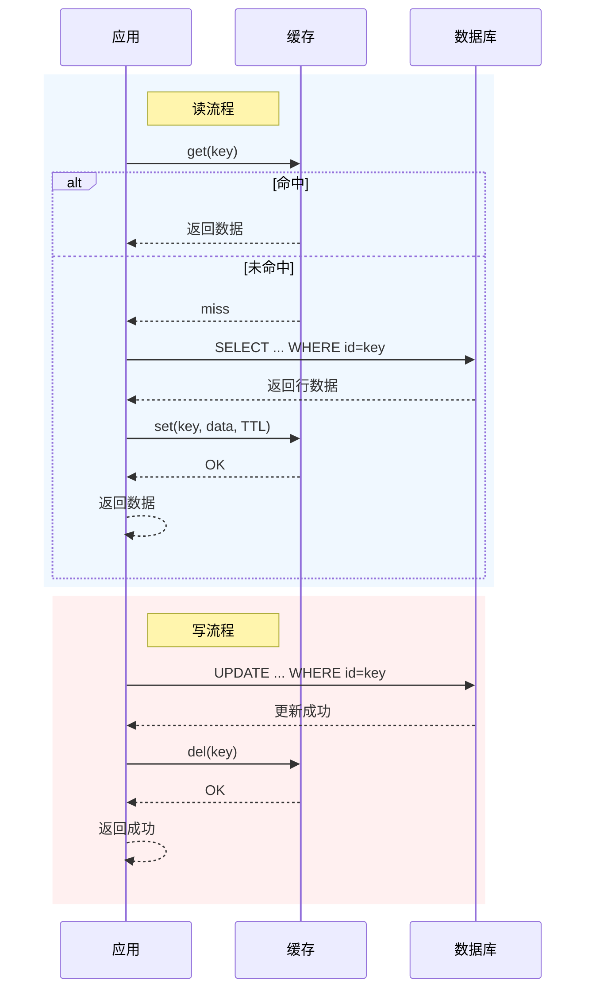
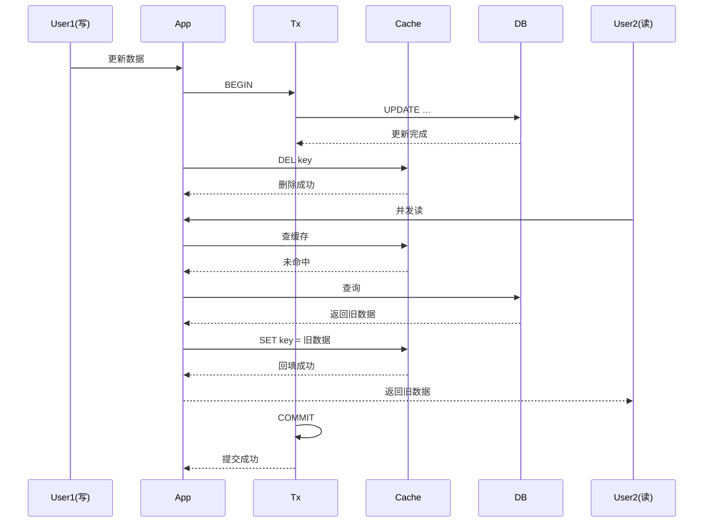

# 缓存

## 缓存模式

缓存模式（Cache Pattern），指的是在系统设计中，**缓存与后端数据源（如数据库）之间的数据读写策略和管理方式**。它决定了数据如何在缓存和数据库之间流转、同步，以及如何保证数据一致性和高性能

### 旁路缓存模式

旁路缓存模式（Cache Aside Pattern），是一种常见的缓存使用模式，在这种模式下，应用程序在访问数据时，首先尝试从缓存中读取数据；如果缓存未命中，则从数据库中读取数据，并将读取到的数据写入缓存，以便下次访问时可以直接从缓存中获取。

#### 工作流程

对于读操作:

1. 从缓存中查数据
2. 缓存命中直接返回数据; 缓存未命中查数据库, 并将新数据写入缓存

对于写操作:

1. 更新数据库
2. 删除缓存中的旧数据

> [!NOTE]
> 写操作不直接更新缓存, 因为在并发场景下, 多个写操作同时执行, 数据会相互覆盖, 由于无法确定执行顺序, 可能会导致最终缓存中的数据可能不是最新的.

> [!TIP]
> 对于写操作为什么不先删除缓存再更新数据库 
> 如果先删除缓存, 在删除和更新数据库之间的时间窗口内, 有读操作请求, 会导致缓存未命中, 读取到旧数据并回填缓存, 导致缓存不一致.

#### 模式缺陷

旁路缓存模式虽然简单易用，但也存在一些典型缺陷：

##### 读写并发

在高并发场景下，写操作和读操作并发进行时，可能出现“脏数据”问题。例如：写操作刚刚删除缓存但还未提交数据库事务，此时有新的读操作请求，缓存未命中后从数据库读取到旧数据并回填缓存，导致缓存中出现过期数据。

解决方案:

- **延迟双删**  
在写操作后执行之后，延迟一段时间后在进行一次删除缓存，减少读操作命中旧数据的概率。

> [!TIP]
> 延迟的时间至少要大于一次写缓存 + 读操作的时间, 否则无法减少读操作命中旧数据的概率.
> [NOTE]
> 这个方案只能够减少数据不一致的概率, 不能完全避免.

- **版本号异步删除缓存**

数据库表中增加版本号字段.  

**读操作时:** 缓存未命中时, 读数据库回写缓存时附带版本号  
**写操作时:** 先读取数据库版本号, 然后根据版本号更新缓存, 在事务提交之后异步删除缓存.

**注:** 通过本地消息表的方案(或使用Spring事件驱动)可以保证异步删除缓存发生在事务提交之后

> [!NOTE]
> 这个方案可以保证最终一致性, 但并发写场景下, 会出现更新失败(丢失)的问题