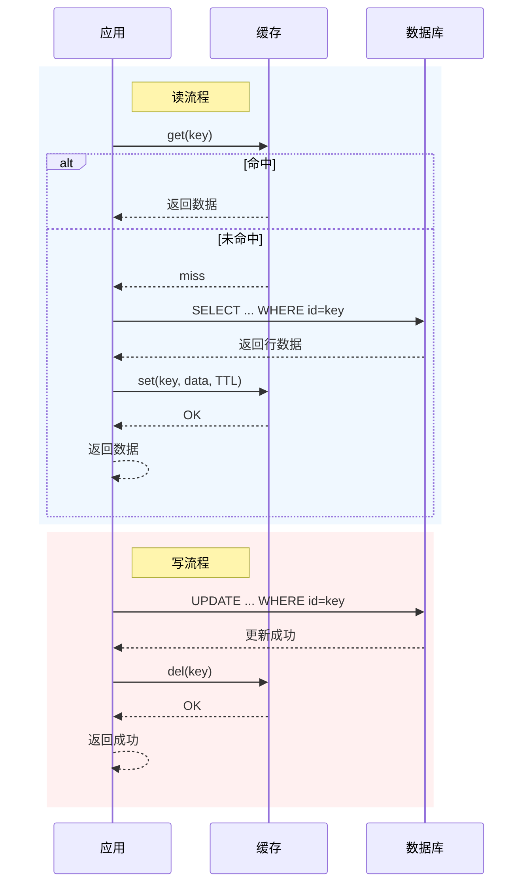
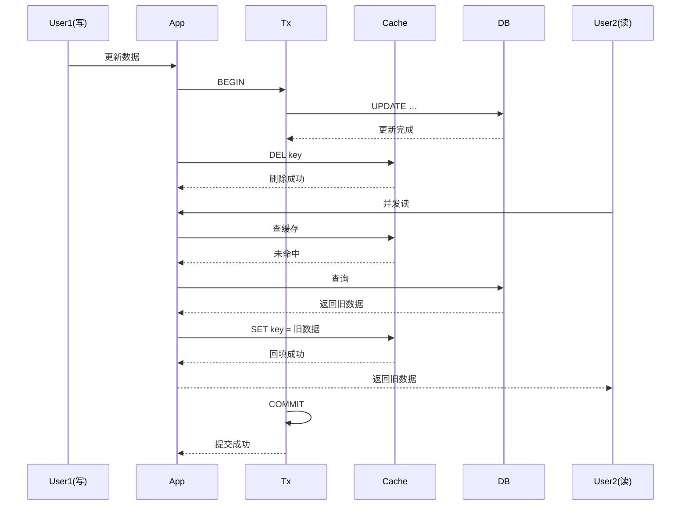

# 缓存

## 缓存模式

缓存模式（Cache Pattern），指的是在系统设计中，**缓存与后端数据源（如数据库）之间的数据读写策略和管理方式**。它决定了数据如何在缓存和数据库之间流转、同步，以及如何保证数据一致性和高性能

### 旁路缓存模式

旁路缓存模式（Cache Aside Pattern），是一种常见的缓存使用模式，在这种模式下，应用程序在访问数据时，首先尝试从缓存中读取数据；如果缓存未命中，则从数据库中读取数据，并将读取到的数据写入缓存，以便下次访问时可以直接从缓存中获取。

#### 工作流程

对于读操作:

1. 从缓存中查数据
2. 缓存命中直接返回数据; 缓存未命中查数据库, 并将新数据写入缓存

对于写操作:

1. 更新数据库
2. 删除缓存中的旧数据

> [!NOTE]
> 写操作不直接更新缓存, 因为在并发场景下, 多个写操作同时执行, 数据会相互覆盖, 由于无法确定执行顺序, 可能会导致最终缓存中的数据可能不是最新的.

> [!TIP]
> 对于写操作为什么不先删除缓存再更新数据库 
> 如果先删除缓存, 在删除和更新数据库之间的时间窗口内, 有读操作请求, 会导致缓存未命中, 读取到旧数据并回填缓存, 导致缓存不一致.



#### 模式缺陷

旁路缓存模式虽然简单易用，但也存在一些典型缺陷：

##### 读写并发

在高并发场景下，写操作和读操作并发进行时，可能出现“脏数据”问题。例如：写操作刚刚删除缓存但还未提交数据库事务，此时有新的读操作请求，缓存未命中后从数据库读取到旧数据并回填缓存，导致缓存中出现过期数据。



解决方案:

- **延迟双删**  
在写操作后执行之后，延迟一段时间后在进行一次删除缓存，减少读操作命中旧数据的概率。

> [!TIP]
> 延迟的时间至少要大于一次写缓存 + 读操作的时间, 否则无法减少读操作命中旧数据的概率.
> [NOTE]
> 这个方案只能够减少数据不一致的概率, 不能完全避免.

- **版本号异步删除缓存**

数据库表中增加版本号字段.  

**读操作时:** 缓存未命中时, 读数据库回写缓存时附带版本号  
**写操作时:** 先读取数据库版本号, 然后根据版本号更新缓存, 在事务提交之后异步删除缓存.

**注:** 通过本地消息表的方案(或使用Spring事件驱动)可以保证异步删除缓存发生在事务提交之后

> [!NOTE]
> 这个方案可以保证最终一致性, 但并发写场景下, 会出现更新失败(丢失)的问题

## 缓存问题

### 缓存穿透

缓存穿透是指查询一个在缓存和数据库中都不存在的数据，由于缓存未命中，系统会直接访问数据库。当大量此类请求发生时，会对数据库造成很大的压力，甚至可能导致数据库崩溃。

```plantuml
skinparam backgroundColor #f8fafc
skinparam sequenceArrowThickness 2
skinparam roundcorner 8

title 缓存穿透 (Cache Penetration)

actor "攻击者" as Attacker
participant "客户端" as Client
participant "缓存" as Cache
participant "数据库" as DB

== 恶意请求: 查询不存在的数据 (id=-1) ==

Attacker -> Client: 构造无效请求
Client -> Cache: GET(key=-1)
Cache --> Client: **Miss!** 数据不存在
Client -> DB: SELECT * WHERE id=-1
DB --> Client: NULL (数据不存在)

note over Attacker, DB #fef2f2
    攻击者重复发送大量不存在的 key
    每次请求都穿透缓存直达数据库
end note

Client -> Cache: GET(key=-1)
Cache --> Client: **Miss!**
Client -> DB: SELECT * WHERE id=-1
DB --> Client: NULL

... 重复攻击 ...

note right of DB #dc2626
    数据库压力骤增
    可能导致崩溃
end note
```

**解决方法**

- **布隆过滤器**：在缓存层增加布隆过滤器，用于拦截不存在的数据请求。如果布隆过滤器判断数据不存在，则直接返回空结果，避免访问数据库。
- **缓存空值**：对于查询结果为空的数据，将其缓存起来并设置较短的过期时间，防止频繁访问数据库。
- **参数校验**：在应用层对请求参数进行校验，过滤掉格式错误或超出范围的无效请求，在进入系统之前就拦截无效请求。

### 缓存雪崩

缓存雪崩是指在某一时刻，大量缓存同时失效，导致所有请求直接访问数据库，从而对数据库造成巨大压力，甚至可能导致系统崩溃。

```plantuml
skinparam backgroundColor #f8fafc
skinparam sequenceArrowThickness 2
skinparam roundcorner 8

title 缓存雪崩 (Cache Avalanche)

actor "用户" as User
participant "应用" as App
participant "缓存" as Cache
database "数据库" as DB

== 缓存集中过期 ==

note over Cache #fef2f2
    Key A: TTL=0 已过期
    Key B: TTL=0 已过期
    Key C: TTL=0 已过期
    Key D: TTL=0 已过期
    ... 同一时间大量 key 过期 ...
end note

== 大量请求同时穿透 ==

User -> App: 请求 A
App -> Cache: GET(keyA)
Cache --> App: Miss!
App -> DB: 查询 A

User -> App: 请求 B
App -> Cache: GET(keyB)
Cache --> App: Miss!
App -> DB: 查询 B

User -> App: 请求 C
App -> Cache: GET(keyC)
Cache --> App: Miss!
App -> DB: 查询 C

... 所有请求都打到数据库 ...

note right of DB #dc2626
    数据库瞬间承受全部请求
    压力暴增，可能崩溃
end note
```

**解决方法**

- **过期时间分散**：为不同的缓存设置随机的过期时间，避免大量缓存同时失效。
- **缓存预热**：在系统启动或流量高峰到来之前，提前将热点数据加载到缓存中，确保缓存命中率较高。
- **缓存降级**：在缓存失效或不可用时，返回默认值或部分数据，避免直接访问数据库。
- **多级缓存**：引入本地缓存和分布式缓存，在缓存失效时优先从本地缓存中获取数据。
- **限流与熔断**：通过限流和熔断机制控制请求的数量，避免数据库因过载而崩溃。

### 缓存击穿

缓存击穿是指某些热点数据在缓存中失效后，大量并发请求直接访问数据库，导致数据库压力骤增，甚至可能引发系统性能问题。

```plantuml
skinparam backgroundColor #f8fafc
skinparam sequenceArrowThickness 2
skinparam roundcorner 8

title 缓存击穿 (Cache Breakdown)

actor "用户" as User
participant "应用" as App
participant "缓存" as Cache
database "数据库" as DB

== 热点 Key 过期 ==

note over Cache #fef3c7
    热点 Key: "热门商品:10001"
    每秒访问 10000+ 次
    **刚刚过期!**
end note

== 并发请求同时到达 ==

User -> App: 请求 R1
User -> App: 请求 R2
User -> App: 请求 R3
User -> App: 请求 R4
User -> App: 请求 R5

par 并发查询缓存
    App -> Cache: GET(hotKey)
    Cache --> App: Miss!
    App -> DB: SELECT ...
else
    App -> Cache: GET(hotKey)
    Cache --> App: Miss!
    App -> DB: SELECT ...
else
    App -> Cache: GET(hotKey)
    Cache --> App: Miss!
    App -> DB: SELECT ...
else
    App -> Cache: GET(hotKey)
    Cache --> App: Miss!
    App -> DB: SELECT ...
else
    App -> Cache: GET(hotKey)
    Cache --> App: Miss!
    App -> DB: SELECT ...
end

note right of DB #dc2626
    数据库瞬间承受所有并发查询
    压力暴增，响应超时
end note
```

**解决方法**

- **永不过期**：对于热点数据，设置缓存永不过期，确保其始终存在于缓存中。
- **逻辑过期**：在缓存中存储数据的同时记录其逻辑过期时间，即使数据逻辑上已过期，仍暂时返回旧数据，同时异步更新缓存。此方案牺牲数据一致性来避免击穿。
- **互斥锁**：在缓存失效时，通过加锁机制限制只有一个线程访问数据库并更新缓存，其余线程等待缓存更新完成后再读取数据。
- **请求分流**：将高并发请求分散到多个缓存节点或服务实例上，减少单点压力。
- **限流与熔断**：通过限流和熔断机制控制访问数据库的请求数量，避免数据库因过载而崩溃。
