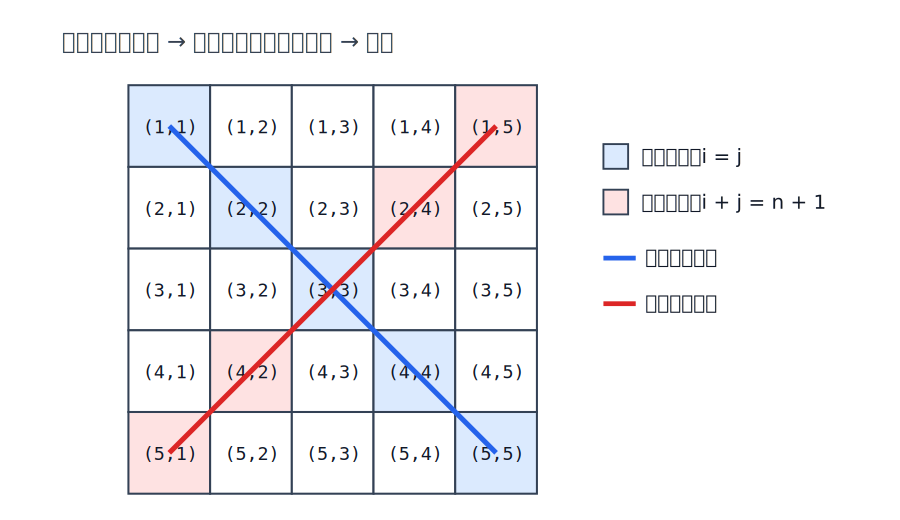
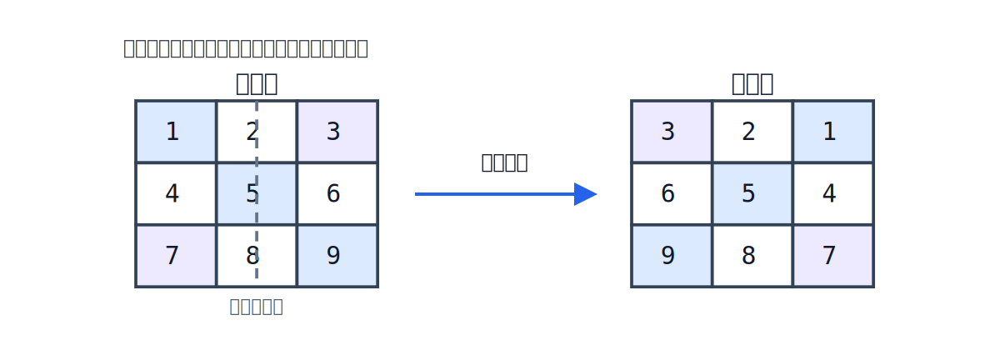
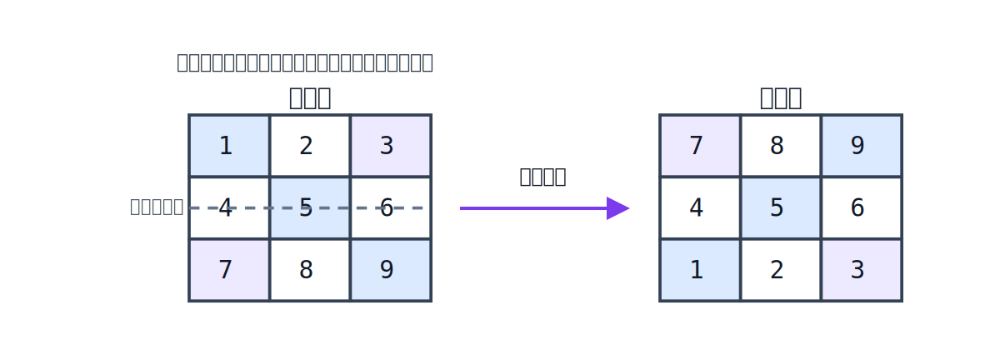
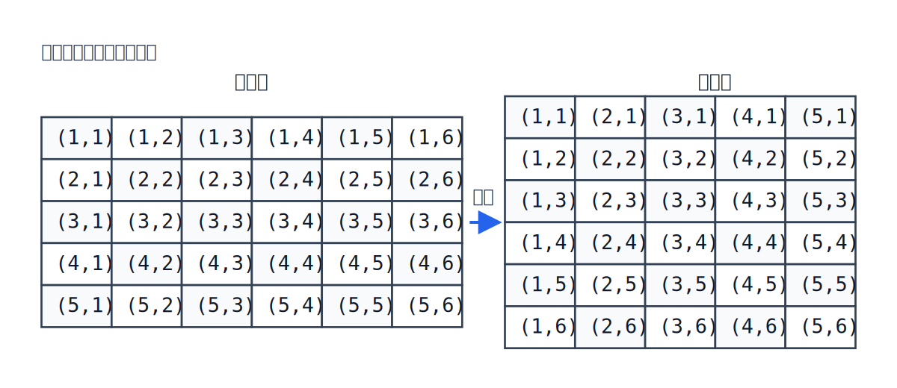
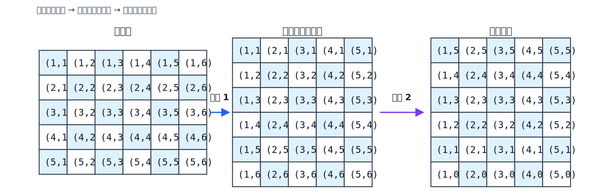
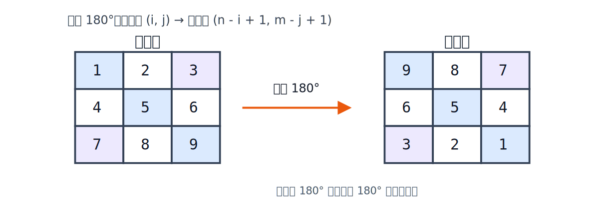
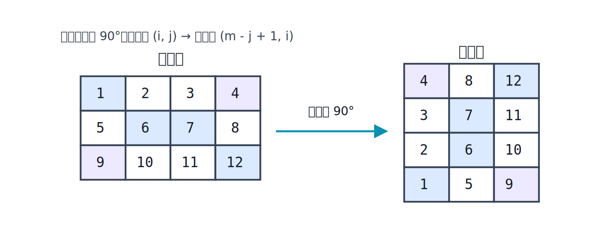

# 数学

## 矩阵

### 对角线

一个矩阵有两种对角线：主对角线和副对角线。

### 翻转

#### 水平翻转

矩阵水平翻转时，元素的位置变化如下：

- 原位置：`(i, j)`
- 翻转后：`(i, m - j + 1)`

其中，`m` 表示矩阵的列数。  
对于一个 `n × m` 的矩阵，水平翻转后仍然是 `n × m`，只是每一行的顺序被反转了。

#### 垂直翻转

矩阵垂直翻转时，元素的位置变化如下：

- 原位置：`(i, j)`
- 翻转后：`(n - i + 1, j)`

其中，`n` 表示矩阵的行数。  
对于一个 `n × m` 的矩阵，垂直翻转后仍然是 `n × m`，只是行的顺序被反转了。

#### 主对角线翻转
沿主对角线翻转（转置）时，矩阵中的元素位置满足：

- 原位置：`(i, j)`
- 翻转后：`(j, i)`

因此，一个 `m × n` 的矩阵翻转后会变成 `n × m`。

#### 顺时针翻转

##### 90°

矩阵顺时针旋转 90° 时，元素的位置会发生如下变化：

- 原位置：`(i, j)`
- 翻转后：`(j, n - i + 1)`

其中，`n` 表示矩阵的行数，`m` 表示矩阵的列数。  
对于一个 `n × m` 的矩阵，顺时针翻转后会变成 `m × n`。

顺时针旋转 90° 等价于：

1. 先沿主对角线翻转
2. 再进行水平翻转

##### 180°

矩阵旋转 180° 时，元素的位置会发生如下变化：

- 原位置：`(i, j)`
- 翻转后：`(n - i + 1, m - j + 1)`

其中，`n` 表示矩阵的行数，`m` 表示矩阵的列数。  
对于一个 `n × m` 的矩阵，旋转 180° 后仍然是 `n × m`。

180° 翻转等价于：

1. 先进行水平翻转
2. 再进行垂直翻转

如果你需要，我也可以继续帮你为这个专题绘制对应的 SVG 图示。

#### 逆时针翻转

##### 90°

矩阵逆时针旋转 90° 时，元素的位置会发生如下变化：

- 原位置：`(i, j)`
- 翻转后：`(m - j + 1, i)`

其中，`n` 表示矩阵的行数，`m` 表示矩阵的列数。  
对于一个 `n × m` 的矩阵，逆时针翻转后会变成 `m × n`。

逆时针旋转 90° 等价于：

1. 先沿主对角线翻转
2. 再进行垂直翻转

##### 180°

矩阵逆时针旋转 180° 时，元素的位置会发生如下变化：

- 原位置：`(i, j)`
- 翻转后：`(n - i + 1, m - j + 1)`

其中，`n` 表示矩阵的行数，`m` 表示矩阵的列数。  
对于一个 `n × m` 的矩阵，逆时针翻转 180° 后仍然是 `n × m`。

逆时针旋转 180° 与顺时针旋转 180° 完全等价。

