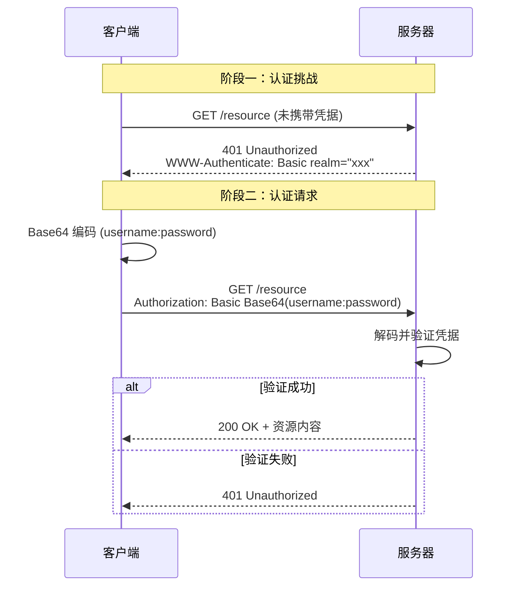

# HTTP Basic Auth

HTTP Basic Authentication（基本认证）是 HTTP 协议中最简单的身份验证方式，客户端通过在请求头中携带用户名和密码来证明身份。

## 工作流程

Basic Auth 的工作流程如下：



## 认证请求头

客户端在请求头中通过 `Authorization` 字段携带凭据。凭据需将 `用户名:密码` 进行 Base64 编码后填入。

格式：

```
Authorization: Basic <Base64编码的用户名:密码>
```

> [!NOTE]
> `Authorization: Basic` 是 Basic Auth 规范中固定的写法，其中 `Basic` 为认证方案(scheme)。

例如，用户名 `admin`，密码 `123456`：

- 原始凭据：`admin:123456`
- Base64 编码：`YWRtaW46MTIzNDU2`
- 最终请求头：`Authorization: Basic YWRtaW46MTIzNDU2`

完整 HTTP 请求：

```http
GET /api/resource HTTP/1.1
Host: example.com
Authorization: Basic YWRtaW46MTIzNDU2
```

> [!WARNING]
> Base64 不是加密，仅是编码。任何人都可以轻松解码获取明文用户名和密码。

## 认证响应头

当客户端未携带凭据或凭据无效时，服务器返回 `401 Unauthorized`，并在响应头中通过 `WWW-Authenticate` 字段声明认证方式，提示客户端进行认证。

格式：

```
WWW-Authenticate: Basic realm="<描述>"
```

`realm` 用于标识受保护的区域，浏览器会将其显示在认证弹窗中。

完整 HTTP 响应：

```http
HTTP/1.1 401 Unauthorized
WWW-Authenticate: Basic realm="example.com"
```

## 安全性

> [!CAUTION]
> Basic Auth 必须配合 HTTPS 使用。

| 风险 | 说明 |
|------|------|
| 明文传输 | Base64 可被任意解码，HTTP 下凭据等同于明文传输 |
| 无过期机制 | 凭据不会自动失效，除非服务器主动拒绝 |
| 无防重放 | 截获的 Authorization 头可被重复使用 |

因此，Basic Auth 通常适用于：
- 内部系统或开发环境的简单认证
- 配合 HTTPS 的 API 简单访问控制
- 短期、低敏感度的场景

对于生产环境，推荐使用 OAuth 2.0、JWT 等更安全的认证方案。
