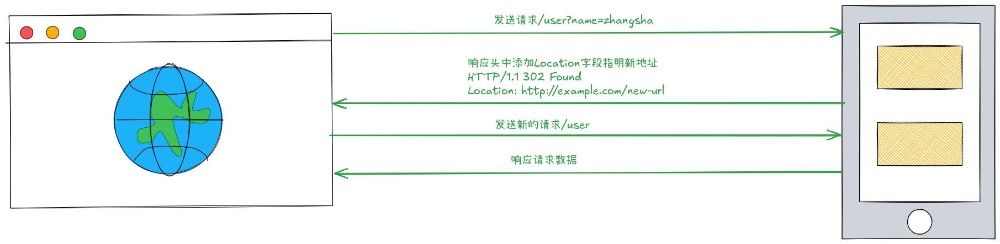

# HTTP

HTTP（HyperText Transfer Protocol，超文本传输协议）是用于从 Web 服务器传输超文本（如 HTML、CSS、JS、图片等）到客户端（如浏览器）的 应用层协议

## 基本特点

**无状态（Stateless）**: 

每个 HTTP 请求都是独立的，服务器不会记住之前的请求（需借助 Cookie/Session机制维持状态）。

**基于请求-响应模型（Request-Response）**: 

客户端发送请求，服务器返回响应。

**可扩展性强**: 

支持自定义头部（Headers）和多种数据格式（JSON、XML 等）。

> [!NOTE]
> 默认端口
>
> HTTP：80, HTTPS：443

## 请求方式

| 方法   | 名称         | 作用描述                                   | 是否有请求体 | 是否有响应体 | 常见用途                   |
| ------ | ------------ | ------------------------------------------ | ------------ | ------------ | -------------------------- |
| GET    | 获取资源     | 从服务器获取数据或资源                     | 否           | 是           | 获取网页、API数据           |
| POST   | 创建资源     | 向服务器提交数据，通常用于创建新资源       | 是           | 是           | 表单提交、用户注册、登录    |
| PUT    | 更新资源     | 用于更新服务器上的资源（整体替换）         | 是           | 是           | 更新用户信息、修改数据      |
| PATCH  | 局部更新资源 | 用于对服务器资源进行部分修改               | 是           | 是           | 局部更新，如修改部分字段    |
| DELETE | 删除资源     | 请求服务器删除指定资源                     | 否/是        | 是           | 删除用户、移除数据          |
| HEAD   | 获取头部信息 | 类似 GET，但只返回响应头，不返回响应体     | 否           | 否           | 检查资源是否存在、获取元数据|
| OPTIONS| 查询支持方法 | 查询服务器支持哪些 HTTP 方法               | 否           | 是           | 跨域预检、API能力查询       |
| TRACE  | 跟踪请求     | 回显收到的请求，主要用于诊断和调试         | 否           | 是           | 网络调试、诊断              |
| CONNECT| 建立隧道     | 用于代理服务器建立 TCP 隧道（如 HTTPS）    | 否           | 是           | HTTPS 代理、VPN连接         |

> [!NOTE]
> GET 和 POST 请求的区别：
> - GET 请求通过 URL 传递参数，参数暴露在地址栏，且有长度限制(具体长度限制由浏览器和服务器决定)
> - POST 请求通过请求体传递参数，参数不暴露在地址栏，且没有长度限制
> - GET 请求支持缓存，POST 请求不支持缓存

> [!TIP]
>  在ful API设计中，CRUD操作通常映射为：
> - Create -> POST
> - Read -> GET
> - Update -> PUT
> - Delete -> DELETE

## 请求结构

HTTP 请求是客户端（如浏览器、Postman、curl）向服务器发送数据的格式。其结构主要包括三部分：Reuest Line、Headers 和 Body(可选)。

```http
# Request Line = 请求方法 + 请求路径 + HTTP版本
POST /api/login HTTP/1.1   
# Headers
Host: www.example.com
User-Agent: Mozilla/5.0 (Windows NT 10.0; Win64; x64)
Accept: application/json
Content-Type: application/json
Content-Length: 49
Connection: keep-alive
# 空白行
# Body(可选)
{
  "username": "alice",
  "password": "secret123"
}

```
> [!TIP]
> 请求头和请求体之间使用空行分隔

**常见请求头:**

| 请求头              | 描述                                             | 示例值                                        |
| ------------------- | ------------------------------------------------ | --------------------------------------------- |
| Host                | 请求的目标主机和端口号                           | `www.example.com`                             |
| User-Agent          | 发出请求的客户端信息（浏览器、操作系统等）       | `Mozilla/5.0 (Windows NT 10.0; Win64; x64)`   |
| Accept              | 客户端能够接收的响应内容类型                     | `application/json, text/html`                 |
| Accept-Language     | 客户端偏好的自然语言                             | `zh-CN, en-US;q=0.9`                          |
| Accept-Encoding     | 客户端支持的内容编码（压缩算法）                 | `gzip, deflate, br`                           |
| Content-Type        | 请求体的数据格式（POST/PUT 时必须）             | `application/json`                            |
| Content-Length      | 请求体的字节长度                                 | `49`                                          |
| Authorization       | 身份认证凭证                                     | `Bearer eyJhbGciOi...`                        |
| Cookie              | 发送给服务器的 Cookie 数据                       | `session_id=abc123; theme=dark`               |
| Referer             | 发起请求的页面 URL                               | `https://www.example.com/home`                |
| Connection          | 连接管理策略                                     | `keep-alive`                                  |
| Cache-Control       | 缓存控制指令                                     | `no-cache`                                    |
| If-Modified-Since   | 条件请求：仅在资源在此时间后修改时才返回资源     | `Tue, 09 Jul 2024 12:00:00 GMT`               |
| If-None-Match       | 条件请求：配合 ETag 判断资源是否变化             | `"abc123"`                                    |

## 响应结构

HTTP 响应是服务器返回给客户端的数据格式。其结构主要包括三部分：Status Line、Headers 和 Body(可选)。

```http
# Status Line = HTTP版本 + 状态码 + 状态描述
HTTP/1.1 200 OK
# Headers
Date: Tue, 09 Jul 2024 12:00:00 GMT
Server: Apache/2.4.41 (Ubuntu)
Content-Type: text/html; charset=UTF-8
Content-Length: 70
Connection: close
# 空白行
# Body(可选)
<html>
  <head><title>Example</title></head>
  <body>Hello, world!</body>
</html>

```

**常见响应头:**

| 响应头              | 描述                                             | 示例值                                        |
| ------------------- | ------------------------------------------------ | --------------------------------------------- |
| Content-Type        | 响应体的数据格式和字符编码                       | `text/html; charset=UTF-8`                    |
| Content-Length      | 响应体的字节长度                                 | `70`                                          |
| Content-Encoding    | 响应体的内容编码（压缩算法）                     | `gzip`                                        |
| Cache-Control       | 缓存控制指令                                     | `max-age=3600, public`                        |
| ETag                | 资源的唯一标识，用于缓存验证                     | `"33a64df551425fcc55e4d42a148795d9f25f89d4"`  |
| Expires             | 响应过期的绝对时间（已被 Cache-Control 取代）    | `Tue, 09 Jul 2024 13:00:00 GMT`               |
| Last-Modified       | 资源最后修改时间                                 | `Tue, 09 Jul 2024 12:00:00 GMT`               |
| Location            | 重定向的目标 URL（配合 3xx 状态码使用）          | `https://www.example.com/new-page`            |
| Set-Cookie          | 服务器要求客户端存储的 Cookie                    | `session_id=abc123; HttpOnly; Secure`         |
| Access-Control-Allow-Origin | 允许跨域访问的源                         | `https://trusted-site.com` 或 `*`             |
| Server              | 服务器软件信息                                   | `nginx/1.24.0`                                |
| Date                | 响应生成的时间                                   | `Tue, 09 Jul 2024 12:00:00 GMT`               |
| Connection          | 连接管理策略                                     | `keep-alive`                                  |
| X-Content-Type-Options | 阻止浏览器 MIME 类型嗅探                      | `nosniff`                                     |
| Strict-Transport-Security | 强制使用 HTTPS 连接                       | `max-age=31536000; includeSubDomains`         |

## 状态码表

| 状态码 | 名称                  | 描述                                       | 示例场景                                         |
| ------ | --------------------- | ------------------------------------------ | ------------------------------------------------ |
| 100    | Continue              | 服务器已收到请求头，客户端应继续发送请求体 | 上传大文件时，服务器确认可以接收数据继续传输     |
| 101    | Switching Protocols   | 服务器根据客户端的请求切换协议             | 从 HTTP 升级到 WebSocket 连接时                  |
| 200    | OK                    | 请求成功                                   | 成功获取网页、API 成功返回数据                   |
| 201    | Created               | 请求已完成，新资源已创建                   | 成功提交表单创建新用户、POST 请求创建新资源      |
| 204    | No Content            | 服务器成功处理请求，但没有返回任何内容      | 删除操作成功、保存设置成功但不需要刷新页面        |
| 301    | Moved Permanently     | 请求的资源已永久移动到新位置               | 网站域名更改、URL 结构永久调整                   |
| 302    | Found                 | 请求的资源临时从不同 URI 响应请求          | 临时重定向到登录页、支付完成后重定向回商店        |
| 304    | Not Modified          | 资源未修改，可使用缓存版本                 | 浏览器请求页面时使用 If-Modified-Since 获取缓存资源 |
| 400    | Bad Request           | 服务器无法理解请求的格式                   | 提交的 JSON 格式错误、URL 参数格式不正确         |
| 401    | Unauthorized          | 用户未认证                                 | 访问需要登录的 API、token 过期                   |
| 403    | Forbidden             | 用户已认证, 但未授权                             | 用户无权访问特定资源、IP 被封禁                  |
| 404    | Not Found             | 请求的资源不存在                           | 访问已删除的页面、API 端点错误                   |
| 405    | Method Not Allowed    | 请求方法不允许                             | 对只读资源使用 POST 方法、对只能 POST 的接口使用 GET |
| 429    | Too Many Requests     | 客户端发送了太多请求                       | API 限流保护、爬虫访问频率过高                   |
| 500    | Internal Server Error | 服务器内部错误                             | 服务器代码异常、数据库连接失败                   |
| 502    | Bad Gateway           | 服务器作为网关时收到了无效响应             | 负载均衡器无法连接到后端服务、上游服务返回错误   |
| 503    | Service Unavailable   | 服务器暂时不可用                           | 服务器维护中、系统过载                           |
| 504    | Gateway Timeout       | 作为网关的服务器请求超时                   | 代理服务器等待后端服务响应超时                   |


## Redirect

Redirect（重定向）是指服务器指示客户端自动跳转到另一个 URL 的过程。常见的重定向状态码有 301（永久重定向）和 302（临时重定向）。

### 工作流程



> [!TIP]
> - 重定向的新请求由浏览器自动发送
> - 重定向支持跨域, 新的 URL 能够跨域
> - 重定向总共发送两次请求
> - 重定向通常情况下不会自动传递原请求的参数和请求
