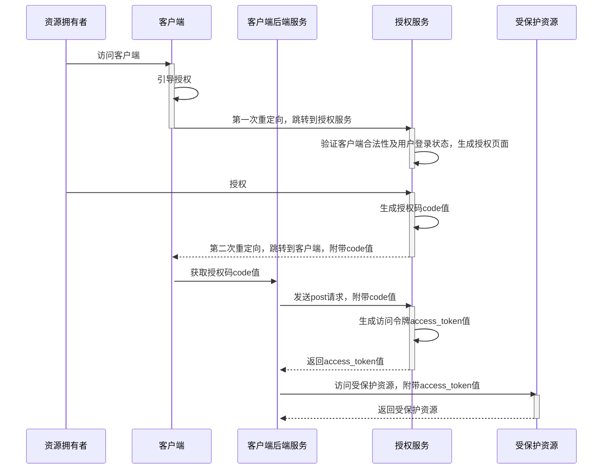
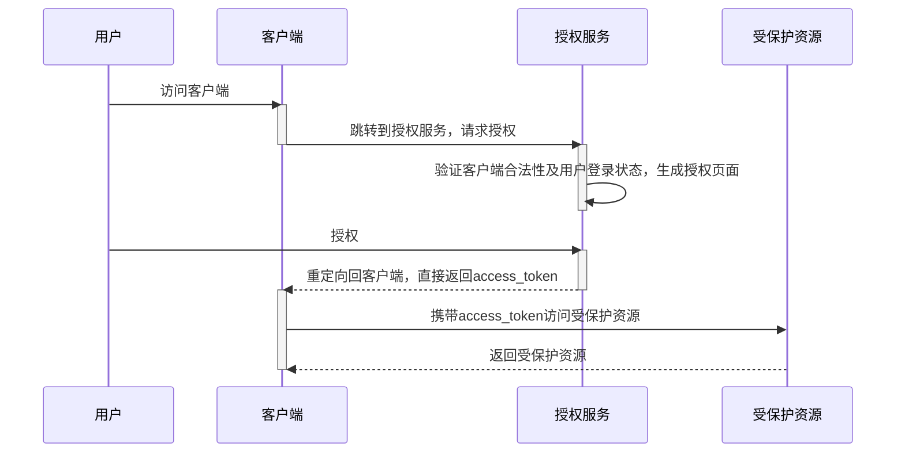
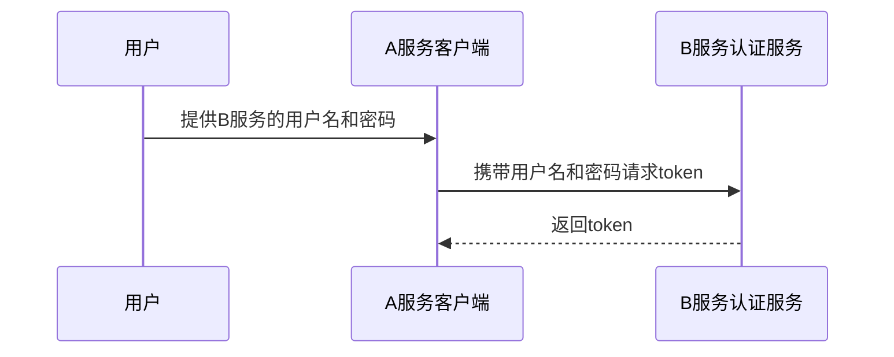
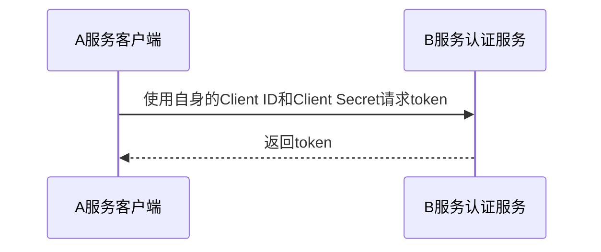

# OAuth

OAuth是Open Authorization的简写。 OAuth协议为用户资源的授权提供了一个安全的、开放而又简易的标准。与以往的授权方式不同之处是OAuth的授权不会使第三方触及到用户的帐号信息（如用户名与密码），即第三方无需使用用户的用户名与 密码就可以申请获得该用户资源的授权，因此OAuth是安全的

## OAuth 2.0

### 授权方式

OAuth2.0定义了四种授权模式，分别是授权码模式、简化模式、密码模式和客户端模式。

#### 授权码模式

工作流程:

<!---->

适用场景:

授权码模式是OAuth2中最安全最完善的一种模式，应用场景最广泛，可以实现服务之间的调用，常见的微信，QQ等第三方登录也可采用这种方式实现。

<QAList :items="[
  { 
    question: '为什么不直接返回Access Token给客户端对应的后端服务, 还需要使用授权码?', 
    answer: '在进行第三方应用授权时, 发送的请求会附带一个回调地址用于授权成功(或拒绝)后的重定向. Access Token直接返回给客户端后端服务, 意味着回调地址是后端服务地址. 这会带来两个问题: 1. 后端地址暴露, 增加了被恶意攻击的风险; 2. 授权成功后. 由于不经过客户端, 无法知道是哪一个用户授权成功.'
  }
]"/>

#### 简化模式

工作流程:

适用场景:

- 适用于没有服务器但客户端安全的情况, 微信小程序、JavaScript实现的网页插件等

#### 密码模式

工作流程:

适用场景:

- 高度信任的客户端: 某个服务的官方手机App, 官方桌面客户端
- 一体化系统: 客户端和资源服务器属于同一个组织

#### 客户端模式

工作流程:

适用场景:

- 无需用户参与，A服务本身需要访问B服务资源
- 适用于服务与服务之间的通信，例如定时任务、后端服务调用等
