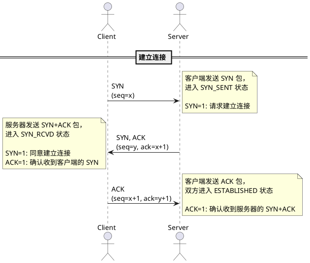
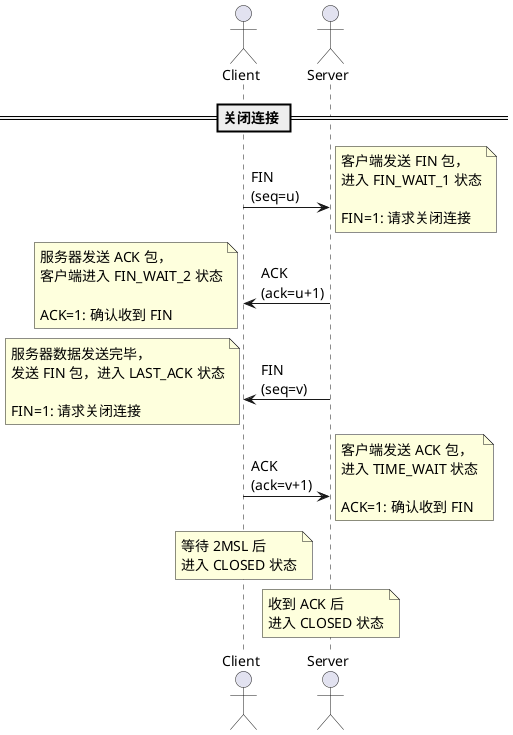
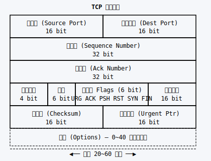

# TCP

TCP（Transmission Control Protocol，传输控制协议）是 TCP/IP 协议栈中的核心协议之一，位于传输层，提供面向连接的、可靠的字节流服务。

## 基本特点

**面向连接**：在数据传输前，需要通过三次握手建立连接，数据传输结束后通过四次挥手释放连接。

**可靠传输**：通过序列号、确认应答、超时重传等机制保证数据可靠到达目的地。

**字节流服务**：TCP 将数据视为连续的字节流，而不是独立的数据报。

**全双工通信**：允许通信双方同时发送和接收数据。

> [!NOTE]
> 默认端口：http(80)、https(443)、ftp(21)、ssh(22)、telnet(23)、smtp(25)

## 三次握手

三次握手是 TCP 建立连接的过程，确保双方都能正常通信。

**每一次握手作用:**

| 次数 | 作用 |
|------|------|
| 第一次 | 客户端确认自己可以发送数据 |
| 第二次 | 服务器确认自己可以接收和发送数据 |
| 第三次 | 客户端确认服务器可以接收数据 |

## 四次挥手

四次挥手是 TCP 释放连接的过程，确保数据完整传输。

### 挥手说明

- **FIN**：表示发送方不再发送数据
- **TIME_WAIT**：等待 2MSL（Maximum Segment Lifetime，最大报文存活时间），确保服务器收到最后的 ACK
- **CLOSE_WAIT**：服务器等待应用关闭连接

## TCP 头部结构

TCP 头部最小为 20 字节，包含以下主要字段：

### 字段说明

| 字段 | 长度 | 说明 |
|------|------|------|
| 源端口 | 16 位 | 发送方端口号 |
| 目标端口 | 16 位 | 接收方端口号 |
| 序列号 | 32 位 | 标识数据的字节序号 |
| 确认号 | 32 位 | 期望收到的下一个字节序号 |
| 数据偏移 | 4 位 | TCP 头部长度 |
| 标志位 | 6 位 | URG、ACK、PSH、RST、SYN、FIN |
| 窗口大小 | 16 位 | 接收方窗口大小 |
| 校验和 | 16 位 | 头部和数据校验 |
| 紧急指针 | 16 位 | 紧急数据位置 |

### 标志位说明

| 标志位 | 名称 | 说明 |
|--------|------|------|
| SYN | 同步 | 用于建立连接 |
| ACK | 确认 | 确认应答有效 |
| FIN | 结束 | 关闭连接 |
| RST | 重置 | 复位连接 |
| PSH | 推送 | 立即推送数据 |
| URG | 紧急 | 紧急指针有效 |

## 常见状态

| 状态 | 说明 |
|------|------|
| LISTEN | 服务器监听连接 |
| SYN_SENT | 客户端已发送 SYN |
| SYN_RCVD | 服务器收到 SYN |
| ESTABLISHED | 连接已建立 |
| FIN_WAIT_1 | 主动关闭，已发送 FIN |
| FIN_WAIT_2 | 等待对方 FIN |
| CLOSE_WAIT | 被动关闭，等待关闭 |
| TIME_WAIT | 等待最后 ACK |
| CLOSED | 连接已关闭 |
