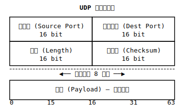

# UDP

UDP（User Datagram Protocol，用户数据报协议）是 TCP/IP 协议栈中的核心协议之一，位于传输层，提供无连接的、不可靠的数据报服务。

## 基本特点

**无连接**：不需要在数据传输前建立连接，直接发送数据。

**不可靠**：不保证数据能够到达目的地，不进行重传、确认等可靠性机制。

**数据报服务**：UDP 将数据视为独立的数据报，每个数据报都是独立的。

**低开销**：头部仅 8 字节，相比 TCP（20-60 字节）开销更小。

> [!NOTE]
> 常见应用：DNS 查询（53）、DHCP（67/68）、SNMP（161）、RTMP（1935）

## UDP 头部结构

UDP 头部固定为 8 字节，包含以下四个字段：

### 字段说明

| 字段 | 长度 | 说明 |
|------|------|------|
| 源端口 | 16 位 | 发送方端口号，可选 |
| 目标端口 | 16 位 | 接收方端口号 |
| 长度 | 16 位 | UDP 数据报总长度（头部+数据） |
| 校验和 | 16 位 | 头部和数据校验，可选 |

## 使用场景

UDP 适用于对实时性要求高、可容忍少量丢包的应用场景：

| 场景 | 说明 |
|------|------|
| DNS 查询 | 快速查询，失败可重试 |
| 视频流 | 实时播放，少量丢帧不影响 |
| VoIP | 语音通话，实时性优先 |
| 在线游戏 | 状态同步频繁，允许少量丢包 |
| DHCP | 动态分配 IP，快速响应 |
| 广播/多播 | 向多个接收者发送数据 |

> [!TIP]
> 选择 UDP 时需要考虑：
> - 应用能否容忍丢包
> - 是否需要保证数据顺序
> - 是否需要流量控制或拥塞控制
>
> 如需在 UDP 上实现可靠传输，可在应用层添加确认、重传、顺序控制等机制（如 QUIC 协议）。