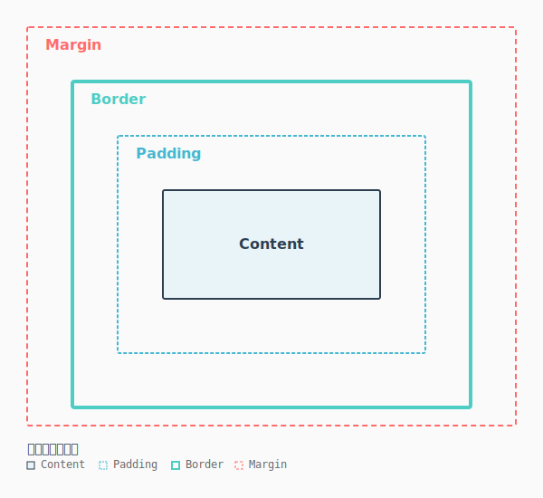

# CSS盒子模型

CSS盒子模型是网页布局的基础，它描述了如何通过内容、内边距、边框和外边距来组织元素的尺寸和间距。理解盒子模型对于正确控制元素的大小、间距和定位至关重要，是掌握 CSS 的必备基础知识。

## 盒子模型的组成

盒子模型由四个主要部分组成，从内到外分别是：Content（内容区）、Padding（内边距）、Border（边框）和 Margin（外边距）。



### Content

Content (内容区) 是盒子模型的最核心部分，用于存放元素的实际内容，如文本、图片等。

**width 和 height 属性：**
```css
/* 设置宽度和高度 */
div {
    width: 300px;
    height: 200px;
}

/* 使用百分比 */
div {
    width: 50%;
    height: 100%;
}

/* 使用 auto（自动计算） */
div {
    width: auto;
    height: auto;
}
```

**内容的实际尺寸计算：**
- 在标准盒模型中，width/height 只包括内容区的大小
- 最终的盒子总尺寸需要加上 padding、border 和 margin
- 使用浏览器开发者工具可以清晰看到各部分的尺寸

### Padding

Padding (内边距) 是内容与边框之间的距离，用于创建内容周围的空间。背景色会作用在内边距区域。

**padding 属性详解：**
```css
/* 设置四个方向 - 所有边相同 */
div {
    padding: 20px;
}

/* 设置四个方向 - 上下、左右 */
div {
    padding: 10px 20px;  /* 上下10px，左右20px */
}

/* 设置四个方向 - 上、左右、下 */
div {
    padding: 10px 20px 15px;  /* 上10px，左右20px，下15px */
}

/* 设置四个方向 - 上、右、下、左 */
div {
    padding: 10px 15px 20px 25px;  /* 顺时针方向 */
}
```

**单边 padding 设置：**
```css
/* 分别设置各边 */
div {
    padding-top: 10px;
    padding-right: 15px;
    padding-bottom: 20px;
    padding-left: 25px;
}
```

**padding 的特点：**
```css
/* padding 不能为负值 */
div {
    padding: -10px;  /* ❌ 无效 */
}

/* 背景色作用在 padding 区域 */
.box {
    width: 100px;
    padding: 20px;
    background-color: #007bff;
    /* 背景包括 content 和 padding，总宽度为 100 + 20 + 20 = 140px */
}

/* 可以使用 box-sizing 改变计算方式 */
.box {
    width: 100px;
    padding: 20px;
    box-sizing: border-box;
    /* 使用 border-box，总宽度为 100px，content 宽度为 60px */
}
```

### Border

(Border) 边框是环绕在内边距外部的线条，用于给元素添加边界和装饰效果。

**border 属性详解：**
```css
/* border 简写 - width, style, color */
div {
    border: 2px solid #333;
}

/* 分别设置 */
div {
    border-width: 2px;
    border-style: solid;
    border-color: #333;
}
```

**border-style 的常见值：**
```css
div {
    border-style: solid;      /* 实线 */
}

div {
    border-style: dashed;     /* 虚线 */
}

div {
    border-style: dotted;     /* 点线 */
}

div {
    border-style: double;     /* 双线 */
}

div {
    border-style: groove;     /* 凹陷线 */
}

div {
    border-style: ridge;      /* 凸起线 */
}

div {
    border-style: inset;      /* 内凹线 */
}

div {
    border-style: outset;     /* 外凸线 */
}

div {
    border-style: none;       /* 无边框 */
}
```

**单边边框设置：**
```css
/* 分别设置各边 */
div {
    border-top: 2px solid red;
    border-right: 3px dashed blue;
    border-bottom: 1px dotted green;
    border-left: 4px double purple;
}
```

**border-radius 圆角边框：**
```css
/* 所有角都是圆角 */
div {
    border-radius: 10px;
}

/* 设置不同的圆角 */
div {
    border-radius: 10px 20px 30px 40px;  /* 左上、右上、右下、左下 */
}

/* 创建圆形 */
div {
    width: 100px;
    height: 100px;
    border-radius: 50%;
}

/* 创建椭圆 */
div {
    width: 100px;
    height: 50px;
    border-radius: 50%;
}

/* 单个角的圆角 */
div {
    border-top-left-radius: 10px;
    border-top-right-radius: 20px;
    border-bottom-right-radius: 30px;
    border-bottom-left-radius: 40px;
}
```

### Margin

(Margin) 外边距是元素与周围元素之间的距离，不受背景色影响，是透明的。

**margin 属性详解：**
```css
/* 设置四个方向 - 所有边相同 */
div {
    margin: 20px;
}

/* 简写语法与 padding 完全相同 */
div {
    margin: 10px 20px;           /* 上下10px，左右20px */
}

div {
    margin: 10px 20px 15px;      /* 上10px，左右20px，下15px */
}

div {
    margin: 10px 15px 20px 25px; /* 上、右、下、左 */
}
```

**单边 margin 设置：**
```css
div {
    margin-top: 10px;
    margin-right: 15px;
    margin-bottom: 20px;
    margin-left: 25px;
}
```

**margin 可以为负值：**
```css
/* 负值可以拉近元素距离 */
div {
    margin: -10px;  /* ✅ 有效 */
}

/* 常见应用：图片网格布局 */
.image-wrapper {
    margin: -5px;
}

.image-item {
    display: inline-block;
    margin: 5px;
}
```

**margin 的自动计算：**
```css
/* 使用 auto 居中 */
div {
    width: 300px;
    margin: 0 auto;  /* 上下边距为0，左右自动计算，实现水平居中 */
}

/* 使用 auto 垂直居中（需要 flexbox 或其他条件） */
div {
    margin: auto;
}
```

### 外边距塌陷

外边距塌陷是一个常见但容易被忽视的现象。当两个块级元素相邻且都有外边距时，它们的外边距会合并为较大的一个。

**塌陷发生的条件：**
```css
/* ❌ 会发生塌陷 - 两个 div 都是块级元素 */
.parent {
    margin-bottom: 20px;
}

.child {
    margin-top: 30px;
}
/* 实际距离为 30px（取较大值），而不是 50px */
```

**解决外边距塌陷的方案：**

1. **为父元素添加 overflow**
```css
.parent {
    overflow: hidden;  /* 或 auto, scroll */
}
```

2. **为父元素添加 border**
```css
.parent {
    border-top: 1px solid transparent;
}
```

3. **为父元素添加 padding**
```css
.parent {
    padding-top: 1px;
}
```

4. **使用 display: flex 或 grid**
```css
.parent {
    display: flex;
}
/* 或 */
.parent {
    display: grid;
}
```

5. **使用 transform**
```css
.parent {
    transform: translateZ(0);
}
```

> [!TIP]
> 在现代布局中，使用 flexbox 或 grid 会自动避免外边距塌陷的问题。

## 盒子模型类型

### 标准盒模型

标准盒模型是 W3C 标准定义的盒模型，也是浏览器的默认设置。

**计算方式：**
```
总宽度 = width + padding-left + padding-right + border-left + border-right + margin-left + margin-right
总高度 = height + padding-top + padding-bottom + border-top + border-bottom + margin-top + margin-bottom
```

**代码示例：**
```css
div {
    box-sizing: content-box;  /* 显式设置（默认值） */
    width: 300px;
    padding: 20px;
    border: 2px solid #333;
    margin: 10px;
}

/* 实际占用的宽度 = 300 + 20×2 + 2×2 + 10×2 = 366px */
```

**优点和缺点：**
- ✅ 符合 W3C 标准
- ✅ 宽度设置对应内容实际宽度
- ❌ 计算复杂，容易出错
- ❌ 添加 padding 或 border 会改变元素总宽度

### IE 盒模型

IE 盒模型（也称为怪异盒模型）的 width 和 height 包含了 border 和 padding。

**计算方式：**
```
总宽度 = width + margin-left + margin-right
总高度 = height + margin-top + margin-bottom
```

**代码示例：**
```css
div {
    box-sizing: border-box;
    width: 300px;
    padding: 20px;
    border: 2px solid #333;
    margin: 10px;
}

/* 实际占用的宽度 = 300 + 10×2 = 320px */
/* width 已包含 padding 和 border */
```

**优点和缺点：**
- ✅ 计算更直观
- ✅ 添加 padding 或 border 不会扩大元素
- ✅ 更适合响应式设计
- ❌ 不是 W3C 标准（但现代浏览器广泛支持）

### 指定盒子模型

默认情况下使用**标准盒模型**, 通过 `box-sizing` 属性可以切换盒模型。

**两个主要值：**
```css
/* content-box：标准盒模型（默认） */
div {
    box-sizing: content-box;
}

/* border-box：IE 盒模型 */
div {
    box-sizing: border-box;
}
```

**现代开发最佳实践：**
```css
/* 推荐：全局使用 border-box */
* {
    box-sizing: border-box;
}

body {
    margin: 0;
    padding: 0;
}

/* 这样所有元素的宽高计算都更加直观 */
.container {
    width: 100%;
    padding: 20px;
    /* 宽度仍为 100%，不会超出父容器 */
}
```

> [!WARNING]
> 虽然 `box-sizing: border-box` 在现代开发中很常见，但要注意与第三方库的兼容性。某些库可能有不同的默认设置。

## 速查卡片

### Padding 速查表

| 属性 | 说明 | 示例 |
|------|------|------|
| `padding` | 四边内边距 | `padding: 20px` |
| `padding-top` | 上内边距 | `padding-top: 10px` |
| `padding-right` | 右内边距 | `padding-right: 15px` |
| `padding-bottom` | 下内边距 | `padding-bottom: 20px` |
| `padding-left` | 左内边距 | `padding-left: 25px` |

### Border 速查表

| 属性 | 说明 | 示例 |
|------|------|------|
| `border` | 简写 | `border: 2px solid #333` |
| `border-width` | 边框宽度 | `border-width: 2px` |
| `border-style` | 边框样式 | `border-style: solid` |
| `border-color` | 边框颜色 | `border-color: #333` |
| `border-radius` | 圆角 | `border-radius: 10px` |
| `border-top/right/bottom/left` | 单边边框 | `border-top: 2px solid #333` |

### Margin 速查表

| 属性 | 说明 | 示例 |
|------|------|------|
| `margin` | 四边外边距 | `margin: 20px` |
| `margin-top` | 上外边距 | `margin-top: 10px` |
| `margin-right` | 右外边距 | `margin-right: 15px` |
| `margin-bottom` | 下外边距 | `margin-bottom: 20px` |
| `margin-left` | 左外边距 | `margin-left: 25px` |
| `margin: auto` | 自动计算 | `margin: 0 auto` |

### Margin 简写语法

| 值的个数 | 说明 | 示例 |
|---------|------|------|
| 1 个 | 四边相同 | `margin: 20px` |
| 2 个 | 上下、左右 | `margin: 10px 20px` |
| 3 个 | 上、左右、下 | `margin: 10px 20px 15px` |
| 4 个 | 上、右、下、左（顺时针） | `margin: 10px 15px 20px 25px` |

### Box-sizing 属性速查

| 值 | 说明 | 总宽度计算 |
|----|------|-----------|
| `content-box` | 标准盒模型（默认） | width + padding + border + margin |
| `border-box` | IE 盒模型 | width + margin |
