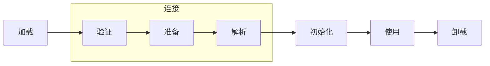
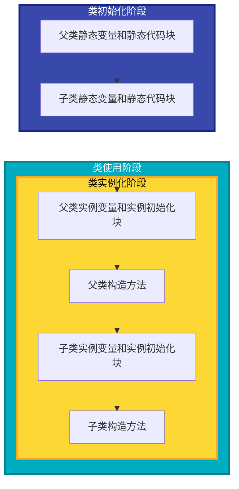

# Java 类

## 类修饰符

在 Java 中，类的修饰符主要有两种：`public` 和 默认（即不显示声明修饰符）, 类修饰符描述了类的包访问权限。

| 修饰符   | 访问范围                  | 是否可被其他包访问 | 是否可被同包类访问 |
|----------|---------------------------|-------------------|-------------------|
| public   | 当前包和所有其他包         | 是                | 是                |
| 默认 | 仅限当前包                | 否                | 是                |

## 类加载器

Java 的类加载器（ClassLoader）是 Java 虚拟机（JVM）中负责加载类文件（.class）的组件。它的主要作用是将字节码文件加载到内存，并为 JVM 提供类的定义

Java 的类加载器主要分为以下几种：

-   **启动类加载器（Bootstrap ClassLoader）**：负责加载 Java 核心类库（`JAVA_HOME/lib` 下的类），由 C++ 实现，属于 JVM 的一部分。
-   **扩展类加载器（Extension ClassLoader）**：负责加载 `JAVA_HOME/lib/ext` 目录下的类库。
-   **应用类加载器（AppClassLoader）**：负责加载应用程序的 classpath 下的类，是最常用的类加载器。
-   **自定义类加载器**：用户可以根据需要自定义类加载器，继承 `ClassLoader` 实现。

## 类的生命周期

Java 中类的生命周期是指一个类从被加载到内存、被使用、直到卸载出内存的整个过程。类的生命周期主要包括以下几个阶段：加载（Loading）、连接（Linking）、初始化（Initialization）、使用（Using）、卸载（Unloading）。

在验证过程中，主要包括以下几个环节，每个环节都有其特定的作用：

| 验证环节         | 主要作用说明                                                                 |
|------------------|------------------------------------------------------------------------------|
| 文件格式验证     | 检查字节码文件是否符合 Class 文件格式规范。例如，魔数、版本号等是否正确。      |
| 元数据验证       | 验证类的元数据信息是否符合 Java 语言规范。比如类的继承关系、字段和方法的描述等是否合法。 |
| 字节码验证       | 检查方法体中的字节码指令是否合法，确保不会破坏虚拟机的安全。例如，操作数栈不会出现溢出或下溢等问题。 |
| 符号引用验证     | 验证常量池中的符号引用（如类、字段、方法等）是否能被正确解析为直接引用，确保引用的类、方法等实际存在且可访问。 |

### 类初始化的时机

| 类型     | 场景描述                           | 是否触发类初始化 |
|----------|------------------------------------|------------------|
| 主动引用 | 创建类的实例                       | 是               |
| 主动引用 | 访问类的静态变量（非 final）       | 是               |
| 主动引用 | 调用类的静态方法                   | 是               |
| 主动引用 | 反射调用                           | 是               |
| 主动引用 | 初始化子类时父类会被初始化         | 是       |
| 主动引用 | JVM 启动时指定的主类               | 是               |
| 被动引用 | 通过子类引用父类的静态字段         | 否               |
| 被动引用 | 通过数组定义引用类                 | 否               |
| 被动引用 | 访问类的 final 常量                | 否               |

> [!TIP]
> 对于 `初始化子类时父类会被初始化` 的场景, 会先初始化父类, 然后再初始化子类. 

### 类成员初始化顺序

Java 中类成员的初始化顺序是有严格规定的，主要分为静态成员和实例成员的初始化。静态成员的初始化发生在类加载阶段，而实例成员的初始化发生在对象实例化阶段。

> [!TIP]
> 对于同级之间的初始化顺序, 例如:静态成员变量和静态代码块, 初始化顺序是**谁声明在前谁先初始化**

## 双亲委派机制

双亲委派机制（Parent Delegation Model）是 Java 类加载器（ClassLoader）的一种工作机制。它规定了类加载器在加载类时的查找顺序.

工作流程:

1. 当类加载器收到类加载请求时，首先不会自己去尝试加载，而是把请求委托给父加载器。
2. 父加载器如果还有父加载器，则继续向上委托，直到顶层的启动类加载器。
3. 从顶层加载器开始，尝试进行类加载, 如果无法加载, 再由下一级加载器尝试加载, 
4. 如果所有的类加载器都无法加载该类, 则抛出 `ClassNotFoundException` 异常, 否则返回加载的类.

> [!TIP]
> 当某个加载器成功加载类后, 会将加载结果逐级返回, 即使下级加载器也能够加载这个类, 也不会再进行类加载.

主要优点:

-   **安全性**：防止核心类库被篡改或替换。
-   **避免重复加载**：同一个类只会被加载一次，保证类的唯一性。
-   **层次清晰**：各类加载器职责分明，便于管理和扩展。

> [!NOTE]
> 某些框架（如 Tomcat、JSP/Servlet 容器、OSGi）会打破双亲委派机制，实现自己的类加载逻辑，以满足热部署、隔离等需求。
