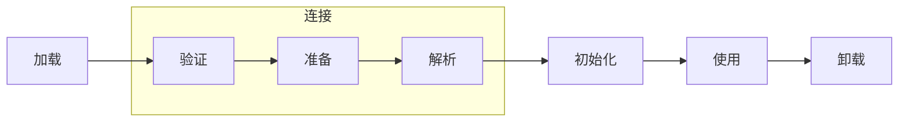
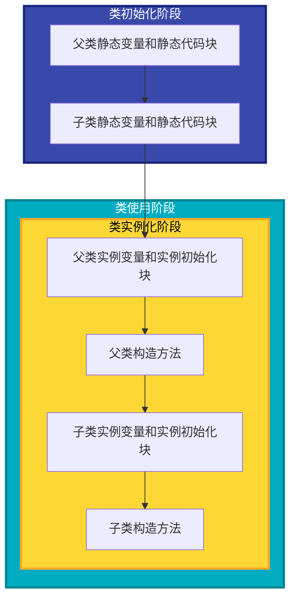
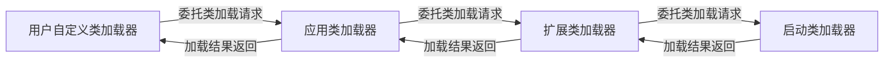

# Java 类

## 类修饰符

在 Java 中，类的修饰符主要有两种：`public` 和 默认（即不显示声明修饰符）, 类修饰符描述了类的包访问权限。

| 修饰符   | 访问范围                  | 是否可被其他包访问 | 是否可被同包类访问 |
|----------|---------------------------|-------------------|-------------------|
| public   | 当前包和所有其他包         | 是                | 是                |
| 默认 | 仅限当前包                | 否                | 是                |


## 类加载器

Java 的类加载器（ClassLoader）是 Java 虚拟机（JVM）中负责加载类文件（.class）的组件。它的主要作用是将字节码文件加载到内存，并为 JVM 提供类的定义

Java 的类加载器主要分为以下几种：

-   **启动类加载器（Bootstrap ClassLoader）**：负责加载 Java 核心类库（`JAVA_HOME/lib` 下的类），由 C++ 实现，属于 JVM 的一部分。
-   **扩展类加载器（Extension ClassLoader）**：负责加载 `JAVA_HOME/lib/ext` 目录下的类库。
-   **应用类加载器（AppClassLoader）**：负责加载应用程序的 classpath 下的类，是最常用的类加载器。
-   **自定义类加载器**：用户可以根据需要自定义类加载器，继承 `ClassLoader` 实现。

## 类的生命周期

Java 中类的生命周期是指一个类从被加载到内存、被使用、直到卸载出内存的整个过程。类的生命周期主要包括以下几个阶段：加载（Loading）、连接（Linking）、初始化（Initialization）、使用（Using）、卸载（Unloading）。


```mermaid
flowchart LR
    A[加载] --> B1
    subgraph 连接
        direction LR
        B1[验证] --> B2[准备] --> B3[解析]
    end
    B3 --> C[初始化]
    C --> D[使用]
    D --> E[卸载]
``` 

在验证过程中，主要包括以下几个环节，每个环节都有其特定的作用：

| 验证环节         | 主要作用说明                                                                 |
|------------------|------------------------------------------------------------------------------|
| 文件格式验证     | 检查字节码文件是否符合 Class 文件格式规范。例如，魔数、版本号等是否正确。      |
| 元数据验证       | 验证类的元数据信息是否符合 Java 语言规范。比如类的继承关系、字段和方法的描述等是否合法。 |
| 字节码验证       | 检查方法体中的字节码指令是否合法，确保不会破坏虚拟机的安全。例如，操作数栈不会出现溢出或下溢等问题。 |
| 符号引用验证     | 验证常量池中的符号引用（如类、字段、方法等）是否能被正确解析为直接引用，确保引用的类、方法等实际存在且可访问。 |


### 类初始化的时机

| 类型     | 场景描述                           | 是否触发类初始化 |
|----------|------------------------------------|------------------|
| 主动引用 | 创建类的实例                       | 是               |
| 主动引用 | 访问类的静态变量（非 final）       | 是               |
| 主动引用 | 调用类的静态方法                   | 是               |
| 主动引用 | 反射调用                           | 是               |
| 主动引用 | 初始化子类时父类会被初始化         | 是       |
| 主动引用 | JVM 启动时指定的主类               | 是               |
| 被动引用 | 通过子类引用父类的静态字段         | 否               |
| 被动引用 | 通过数组定义引用类                 | 否               |
| 被动引用 | 访问类的 final 常量                | 否               |

> [!TIP]
> 对于 `初始化子类时父类会被初始化` 的场景, 会先初始化父类, 然后再初始化子类. 

### 类成员初始化顺序

Java 中类成员的初始化顺序是有严格规定的，主要分为静态成员和实例成员的初始化。静态成员的初始化发生在类加载阶段，而实例成员的初始化发生在对象实例化阶段。


```mermaid
flowchart TD
    subgraph 类初始化阶段
        A1[父类静态变量和静态代码块]
        A2[子类静态变量和静态代码块]
    end
    
    subgraph 类使用阶段
        subgraph 类实例化阶段
            B1[父类实例变量和实例初始化块]
            B2[父类构造方法]
            C1[子类实例变量和实例初始化块]
            C2[子类构造方法]
        end
    end

    A1 --> A2
    A2 --> B1
    B1 --> B2
    B2 --> C1
    C1 --> C2

    style 类初始化阶段 fill:#3949AB,stroke:#1A237E,stroke-width:3px,color:#FFF
    style 类使用阶段 fill:#00ACC1,stroke:#00838F,stroke-width:3px,color:#FFF
    style 类实例化阶段 fill:#FDD835,stroke:#F9A825,stroke-width:3px,color:#000
```

> [!TIP]
> 对于同级之间的初始化顺序, 例如:静态成员变量和静态代码块, 初始化顺序是**谁声明在前谁先初始化**

## 双亲委派机制

双亲委派机制（Parent Delegation Model）是 Java 类加载器（ClassLoader）的一种工作机制。它规定了类加载器在加载类时的查找顺序.

工作流程:

1. 当类加载器收到类加载请求时，首先不会自己去尝试加载，而是把请求委托给父加载器。
2. 父加载器如果还有父加载器，则继续向上委托，直到顶层的启动类加载器。
3. 从顶层加载器开始，尝试进行类加载, 如果无法加载, 再由下一级加载器尝试加载, 
4. 如果所有的类加载器都无法加载该类, 则抛出 `ClassNotFoundException` 异常, 否则返回加载的类.


```mermaid

flowchart LR
    用户自定义类加载器 -- 委托类加载请求 --> 应用类加载器
    应用类加载器 -- 委托类加载请求 --> 扩展类加载器
    扩展类加载器 -- 委托类加载请求 --> 启动类加载器

    启动类加载器 -- 加载结果返回 --> 扩展类加载器
    扩展类加载器 -- 加载结果返回 --> 应用类加载器
    应用类加载器 -- 加载结果返回 --> 用户自定义类加载器
```

> [!TIP]
> 当某个加载器成功加载类后, 会将加载结果逐级返回, 即使下级加载器也能够加载这个类, 也不会再进行类加载.

主要优点:

-   **安全性**：防止核心类库被篡改或替换。
-   **避免重复加载**：同一个类只会被加载一次，保证类的唯一性。
-   **层次清晰**：各类加载器职责分明，便于管理和扩展。

## 抽象类

抽象类（Abstract Class）是一种不能被实例化的类，它主要用于定义子类的共同行为和属性。抽象类可以包含抽象方法（没有方法体的方法）和具体方法（有方法体的方法），子类必须实现所有抽象方法。

### 抽象类的定义

使用 `abstract` 关键字来定义抽象类和抽象方法.

| 特性 | 说明 |
|------|------|
| 不能实例化 | 抽象类不能直接使用 `new` 创建对象 |
| 可包含抽象方法 | 抽象方法没有方法体，子类必须实现 |
| 可包含具体方法 | 具体方法有方法体，可以被继承 |
| 可包含成员变量 | 可以定义各种类型的成员变量 |
| 可有构造方法 | 构造方法用于初始化子类成员 |
| 支持多级继承 | 子类可以继承抽象类，抽象类也可以继承其他类 |

> [!NOTE]
> 虽然抽象类可以有构造方法, 但是不能够被实例化.

```java
// 抽象类
public abstract class Animal {
    String name;
    
    // 抽象方法 - 没有方法体，必须由子类实现
    abstract void makeSound();
    
    // 具体方法 - 有方法体，子类可以直接继承
    public void eat() {
        System.out.println(name + "正在吃东西");
    }
    
    // 抽象类可以有构造方法
    public Animal(String name) {
        this.name = name;
    }
}

// 具体类 - 实现抽象类
class Dog extends Animal {
    public Dog(String name) {
        super(name);
    }
    
    @Override
    void makeSound() {
        System.out.println(name + "叫声：汪汪汪");
    }
}

class Cat extends Animal {
    public Cat(String name) {
        super(name);
    }
    
    @Override
    void makeSound() {
        System.out.println(name + "叫声：喵喵喵");
    }
}
```

### 抽象方法

抽象方法是一种没有实现的方法，它只有方法签名，子类必须提供具体实现：

```java
abstract class Shape {
    abstract double area();  // 抽象方法
    abstract double perimeter();  // 抽象方法
}

class Circle extends Shape {
    double radius;
    
    Circle(double radius) {
        this.radius = radius;
    }
    
    @Override
    double area() {
        return Math.PI * radius * radius;
    }
    
    @Override
    double perimeter() {
        return 2 * Math.PI * radius;
    }
}
```

### 抽象类与接口的区别

| 特征 | 抽象类 | 接口 |
|------|--------|------|
| 继承 | 单继承 | 多实现 |
| 成员变量 | 可以有 | 只能有常量 |
| 构造方法 | 可以有 | 不能有 |
| 方法类型 | 可以有抽象方法和具体方法 | Java 7及以前只能是抽象方法，Java 8之后可以有默认方法和静态方法 |
| 访问修饰符 | 任意 | 方法默认 public，变量默认 public static final |

**注意事项:**

- 抽象类不能被 `final` 修饰
- 抽象方法不能被 `private`、`static` 或 `final` 修饰
- 如果子类不能实现父类的所有抽象方法，则子类也必须声明为抽象类
- 抽象类可以有零个抽象方法

**常见问题**

**Q: 抽象类可以有 main 方法吗？**

A: 可以。抽象类可以有 main 方法，并且可以直接运行（虽然不能实例化抽象类，但可以运行静态方法）。

**Q: 抽象类和接口如何选择？**

A: 如果需要继承并且需要共享代码和状态，使用抽象类；如果需要定义行为规范或多重继承，使用接口。

**Q: 抽象类的构造方法有什么用？**

A: 抽象类的构造方法不能直接调用，但会在子类创建对象时被调用，用于初始化继承自抽象类的成员变量。

> [!TIP]
> 抽象类是面向对象编程的重要概念，合理使用抽象类可以提高代码的可维护性和可扩展性。
