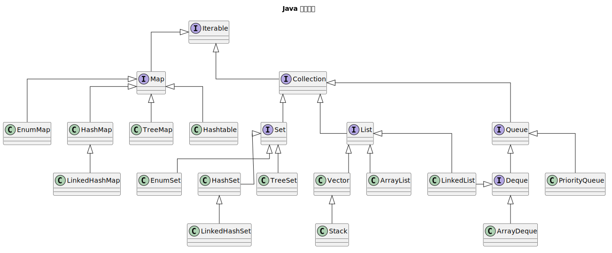

# Java 集合

## 集合框架概述

Java 集合框架（Java Collections Framework）是 Java 提供的一套用于存储和操作对象组的统一架构。主要位于 `java.util` 包中。



## List 接口

### ArrayList

**底层数据结构**：动态数组 `Object[]`

**核心特性**：
- 初始容量为 10
- 扩容机制：当容量不足时，新容量 = 当前容量 + (当前容量 >> 1)，即 1.5 倍扩容
- 支持快速随机访问，线程不安全

**常用 API**：

| 方法 | 说明 | 示例 |
|------|------|------|
| `add(E e)` | 添加元素到末尾 | `list.add("item")` |
| `add(int index, E e)` | 在指定位置插入元素，O(n) | `list.add(0, "first")` |
| `get(int index)` | 获取指定位置元素，O(1) | `String s = list.get(0)` |
| `set(int index, E e)` | 设置指定位置元素 | `list.set(0, "new")` |
| `remove(int index)` | 移除指定位置元素，O(n) | `list.remove(0)` |
| `remove(Object o)` | 移除第一个匹配元素 | `list.remove("item")` |
| `contains(Object o)` | 判断是否包含元素 | `list.contains("item")` |
| `size()` | 获取元素个数 | `int len = list.size()` |
| `clear()` | 清空所有元素 | `list.clear()` |
| `trimToSize()` | 缩小数组容量到实际大小 | `list.trimToSize()` |

**示例**：
```java
List<String> list = new ArrayList<>();
list.add("a");
list.add("b");
list.add(0, "z");      // [z, a, b]
list.set(1, "x");      // [z, x, b]
String first = list.get(0);  // "z"
list.remove("x");      // [z, b]
```

### LinkedList

**底层数据结构**：双向链表 `Node<E>`（prev, element, next）

**核心特性**：
- 每个节点维护前驱和后继指针
- 插入/删除操作高效 O(1)，但查询需要遍历 O(n)
- 实现 List 和 Deque 接口，可用作队列或双端队列

**常用 API**：

| 方法 | 说明 | 示例 |
|------|------|------|
| `add(E e)` | 添加元素到末尾 | `list.add("item")` |
| `addFirst(E e)` | 添加元素到头部，O(1) | `list.addFirst("head")` |
| `addLast(E e)` | 添加元素到尾部，O(1) | `list.addLast("tail")` |
| `get(int index)` | 获取指定位置元素，O(n) | `String s = list.get(0)` |
| `getFirst()` | 获取第一个元素 | `String first = list.getFirst()` |
| `getLast()` | 获取最后一个元素 | `String last = list.getLast()` |
| `remove()` / `removeFirst()` | 移除第一个元素，O(1) | `list.removeFirst()` |
| `removeLast()` | 移除最后一个元素，O(1) | `list.removeLast()` |
| `peek()` / `peekFirst()` | 查看第一个元素，不移除 | `String head = list.peek()` |

**示例**：
```java
LinkedList<String> list = new LinkedList<>();
list.addFirst("a");
list.addLast("b");
list.add("c");         // [a, b, c]
String first = list.getFirst();  // "a"
list.removeFirst();    // [b, c]
list.removeLast();     // [b]
```

### Vector

**底层数据结构**：动态数组 `Object[]`（线程安全版 ArrayList）

**核心特性**：
- 所有修改操作都用 `synchronized` 关键字保护
- 扩容因子为 2 倍（与 ArrayList 的 1.5 倍不同）
- 已过时，不推荐使用，应使用 `Collections.synchronizedList()` 或 `CopyOnWriteArrayList`

**常用 API**：

| 方法 | 说明 | 示例 |
|------|------|------|
| `add(E e)` | 添加元素 | `vector.add("item")` |
| `addElement(E e)` | 添加元素（传统方法） | `vector.addElement("item")` |
| `get(int index)` | 获取指定位置元素 | `String s = vector.get(0)` |
| `elementAt(int index)` | 获取指定位置元素（传统方法） | `String s = vector.elementAt(0)` |
| `remove(int index)` | 移除指定位置元素 | `vector.remove(0)` |
| `removeElement(Object o)` | 移除指定对象 | `vector.removeElement("item")` |
| `capacity()` | 获取当前容量 | `int cap = vector.capacity()` |
| `size()` | 获取元素个数 | `int len = vector.size()` |
| `contains(Object o)` | 判断是否包含元素 | `vector.contains("item")` |
| `clear()` | 清空所有元素 | `vector.clear()` |

**示例**：
```java
Vector<String> vector = new Vector<>();
vector.add("a");
vector.addElement("b");
vector.elementAt(0);   // "a"
vector.removeElement("a");
```

### Stack

**底层数据结构**：继承自 Vector（栈实现）

**核心特性**：
- LIFO（后进先出）数据结构
- 内部基于 Vector，所有操作都是线程安全的
- 已过时，推荐使用 `ArrayDeque` 或 `LinkedList` 作为栈

**常用 API**：

| 方法 | 说明 | 示例 |
|------|------|------|
| `push(E e)` | 入栈 | `stack.push(1)` |
| `pop()` | 出栈，获取并移除栈顶元素 | `int top = stack.pop()` |
| `peek()` | 查看栈顶元素，不移除 | `int top = stack.peek()` |
| `empty()` | 判断栈是否为空 | `if (stack.empty())` |
| `search(Object o)` | 查找元素在栈中的位置 | `int pos = stack.search(1)` |
| `size()` | 获取栈中元素个数 | `int len = stack.size()` |
| `add(E e)` | 添加元素（继承自 Vector） | `stack.add(1)` |
| `remove(int index)` | 移除指定位置元素 | `stack.remove(0)` |
| `clear()` | 清空栈 | `stack.clear()` |
| `removeAll(Collection<?> c)` | 移除指定集合中的所有元素 | `stack.removeAll(list)` |

**示例**：
```java
Stack<Integer> stack = new Stack<>();
stack.push(1);
stack.push(2);
stack.push(3);
int top = stack.pop();      // 3
top = stack.peek();         // 2
boolean isEmpty = stack.empty();  // false
```

## Set 接口

### HashSet

**底层数据结构**：`HashMap<E, Object>`（使用 HashMap 的键存储元素）

**核心特性**：
- 元素无序，不支持索引访问
- 使用 PRESENT（`Object` 类型）作为 HashMap 的值
- 允许一个 null 元素
- 查找/插入/删除时间复杂度 O(1)（平均情况）

**常用 API**：

| 方法 | 说明 | 示例 |
|------|------|------|
| `add(E e)` | 添加元素，返回是否成功 | `set.add("item")` |
| `remove(Object o)` | 移除元素 | `set.remove("item")` |
| `contains(Object o)` | 判断是否包含元素 | `set.contains("item")` |
| `size()` | 获取元素个数 | `int len = set.size()` |
| `isEmpty()` | 判断集合是否为空 | `if (set.isEmpty())` |
| `clear()` | 清空所有元素 | `set.clear()` |
| `iterator()` | 获取迭代器 | `Iterator<String> it = set.iterator()` |
| `stream()` | 获取流 | `set.stream().filter(...)` |
| `toArray()` | 转换为数组 | `Object[] arr = set.toArray()` |
| `addAll(Collection<? extends E> c)` | 添加集合中的所有元素 | `set.addAll(list)` |

**示例**：
```java
Set<String> set = new HashSet<>();
set.add("a");
set.add("b");
set.add("a");  // 不添加重复元素
set.contains("a");  // true
set.remove("b");
set.iterator();     // 遍历无序
```

### LinkedHashSet

**底层数据结构**：`LinkedHashMap<E, Object>`（继承 HashSet）

**核心特性**：
- 继承 HashSet，底层使用 LinkedHashMap
- 维护插入顺序，遍历时按插入顺序返回元素
- 性能略低于 HashSet（因为维护链表），但支持有序遍历

**常用 API**：

| 方法 | 说明 | 示例 |
|------|------|------|
| `add(E e)` | 添加元素，按插入顺序存储 | `set.add("item")` |
| `remove(Object o)` | 移除元素 | `set.remove("item")` |
| `contains(Object o)` | 判断是否包含元素 | `set.contains("item")` |
| `size()` | 获取元素个数 | `int len = set.size()` |
| `isEmpty()` | 判断集合是否为空 | `if (set.isEmpty())` |
| `clear()` | 清空所有元素 | `set.clear()` |
| `iterator()` | 获取迭代器，按插入顺序遍历 | `Iterator<String> it = set.iterator()` |
| `stream()` | 获取流，保持插入顺序 | `set.stream().filter(...)` |
| `toArray()` | 转换为数组，保持插入顺序 | `Object[] arr = set.toArray()` |
| `addAll(Collection<? extends E> c)` | 添加集合中的所有元素 | `set.addAll(list)` |

**示例**：
```java
Set<String> set = new LinkedHashSet<>();
set.add("b");
set.add("a");
set.add("c");
// 遍历结果：b, a, c（按插入顺序）
for (String s : set) {
    System.out.println(s);
}
```

### TreeSet

**底层数据结构**：`TreeMap<E, Object>`（红黑树 NavigableMap）

**核心特性**：
- 元素自动排序（自然顺序或自定义比较器）
- 实现 NavigableSet 接口，支持范围查询
- 查找/插入/删除时间复杂度 O(log n)
- 不允许 null 元素

**常用 API**：

| 方法 | 说明 | 示例 |
|------|------|------|
| `add(E e)` | 添加元素，自动排序 | `set.add(3); set.add(1)` |
| `remove(Object o)` | 移除元素 | `set.remove(1)` |
| `contains(Object o)` | 判断是否包含元素 | `set.contains(1)` |
| `first()` | 获取最小元素 | `int min = set.first()` |
| `last()` | 获取最大元素 | `int max = set.last()` |
| `lower(E e)` | 获取小于 e 的最大元素 | `int lower = set.lower(5)` |
| `higher(E e)` | 获取大于 e 的最小元素 | `int higher = set.higher(5)` |
| `subSet(E from, E to)` | 获取 [from, to) 范围的子集 | `SortedSet<Integer> sub = set.subSet(2, 5)` |
| `headSet(E to)` | 获取小于 to 的子集 | `SortedSet<Integer> head = set.headSet(5)` |
| `tailSet(E from)` | 获取大于等于 from 的子集 | `SortedSet<Integer> tail = set.tailSet(5)` |

**示例**：
```java
Set<Integer> set = new TreeSet<>();
set.add(3);
set.add(1);
set.add(2);
// 遍历结果：1, 2, 3（自动排序）
int min = set.first();      // 1
int max = set.last();       // 3
set.headSet(2);             // [1]
set.subSet(1, 3);           // [1, 2]
```

## Queue 接口

### ArrayDeque

**底层数据结构**：循环数组（Object[]），使用 head/tail 指针

**核心特性**：
- 双端队列（Deque），可用作栈或队列
- 容量为 2 的幂次方，自动扩容
- 性能优于 LinkedList（更高效的缓存局部性）
- 不允许 null 元素

**常用 API**：

| 方法 | 说明 | 示例 |
|------|------|------|
| `addFirst(E e)` | 添加元素到头部 | `deque.addFirst("a")` |
| `addLast(E e)` | 添加元素到尾部 | `deque.addLast("b")` |
| `removeFirst()` | 移除头部元素 | `String h = deque.removeFirst()` |
| `removeLast()` | 移除尾部元素 | `String t = deque.removeLast()` |
| `getFirst()` | 获取头部元素，不移除 | `String h = deque.getFirst()` |
| `getLast()` | 获取尾部元素，不移除 | `String t = deque.getLast()` |
| `peekFirst()` | 查看头部元素 | `String h = deque.peekFirst()` |
| `peekLast()` | 查看尾部元素 | `String t = deque.peekLast()` |
| `pollFirst()` | 移除并返回头部元素 | `String h = deque.pollFirst()` |
| `pollLast()` | 移除并返回尾部元素 | `String t = deque.pollLast()` |

**示例**：
```java
ArrayDeque<String> deque = new ArrayDeque<>();
deque.addFirst("a");
deque.addLast("b");
deque.addLast("c");    // [a, b, c]
String first = deque.removeFirst();  // "a"，[b, c]
String last = deque.removeLast();    // "c"，[b]

// 用作栈
deque.push("x");       // [b, x]
deque.push("y");       // [b, x, y]
String top = deque.pop();  // "y"，[b, x]
```

### PriorityQueue

**底层数据结构**：最小堆（Object[] 数组）

**核心特性**：
- 优先级队列，根据元素自然顺序或自定义比较器排序
- 取出元素时返回优先级最高（最小）的元素
- 插入/删除时间复杂度 O(log n)
- 不允许 null 元素

**常用 API**：

| 方法 | 说明 | 示例 |
|------|------|------|
| `add(E e)` | 添加元素 | `pq.add(5)` |
| `offer(E e)` | 添加元素（队列接口） | `pq.offer(3)` |
| `poll()` | 移除并返回优先级最高的元素 | `int min = pq.poll()` |
| `remove()` | 移除并返回优先级最高的元素 | `int min = pq.remove()` |
| `peek()` | 查看优先级最高的元素 | `int min = pq.peek()` |
| `element()` | 获取优先级最高的元素 | `int min = pq.element()` |
| `size()` | 获取元素个数 | `int len = pq.size()` |
| `isEmpty()` | 判断队列是否为空 | `if (pq.isEmpty())` |
| `contains(Object o)` | 判断是否包含元素 | `pq.contains(5)` |
| `comparator()` | 获取比较器 | `Comparator<Integer> cmp = pq.comparator()` |

**示例**：
```java
PriorityQueue<Integer> pq = new PriorityQueue<>();
pq.add(5);
pq.add(2);
pq.add(8);
int min = pq.poll();   // 2
min = pq.poll();       // 5

// 最大堆（降序）
PriorityQueue<Integer> maxPq = new PriorityQueue<>((a, b) -> b - a);
maxPq.add(5);
maxPq.add(2);
int max = maxPq.poll();  // 5
```

## Map 接口

### HashMap

**底层数据结构**：
- JDK7：数组 + 链表（链表用于解决哈希冲突）
- JDK8：数组 + 链表/红黑树（当链表长度 > 8 且数组长度 > 64 时转换为红黑树）

**核心特性**：
- 线程不安全，允许 null 键和 null 值
- 初始容量 16，扩容因子 2 倍，当负载因子 > 0.75 时扩容
- 哈希碰撞处理：扰动函数 `h ^ (h >>> 16)` 提高哈希分布质量

**常用 API**：

| 方法 | 说明 | 示例 |
|------|------|------|
| `put(K key, V value)` | 放入键值对 | `map.put("name", "Tom")` |
| `putIfAbsent(K key, V value)` | 键不存在时放入 | `map.putIfAbsent("age", 18)` |
| `get(Object key)` | 获取值 | `String name = map.get("name")` |
| `containsKey(Object key)` | 判断键是否存在 | `map.containsKey("name")` |
| `containsValue(Object value)` | 判断值是否存在 | `map.containsValue("Tom")` |
| `remove(Object key)` | 移除键值对 | `map.remove("name")` |
| `size()` | 获取键值对数量 | `int len = map.size()` |
| `keySet()` | 获取所有键 | `Set<String> keys = map.keySet()` |
| `values()` | 获取所有值 | `Collection<String> vals = map.values()` |
| `entrySet()` | 获取键值对集合 | `Set<Entry<String, String>> entries = map.entrySet()` |

**示例**：
```java
Map<String, Integer> map = new HashMap<>();
map.put("a", 1);
map.put("b", 2);
int value = map.get("a");      // 1
map.putIfAbsent("c", 3);       // 添加，返回 null
map.putIfAbsent("c", 4);       // 不添加，返回 3
map.remove("b");

// 遍历
for (String key : map.keySet()) {
    System.out.println(key + " = " + map.get(key));
}
```

### LinkedHashMap

**底层数据结构**：HashMap + 双向链表（维护插入顺序或访问顺序）

**核心特性**：
- 继承 HashMap，在此基础上维护一个双向链表
- 可通过 `accessOrder` 参数选择维护模式：false（插入顺序）或 true（访问顺序）
- 遍历时按链表顺序返回元素，保持顺序性

**常用 API**：

| 方法 | 说明 | 示例 |
|------|------|------|
| `put(K key, V value)` | 放入键值对 | `map.put("name", "Tom")` |
| `get(Object key)` | 获取值（可能更新访问顺序） | `String name = map.get("name")` |
| `remove(Object key)` | 移除键值对 | `map.remove("name")` |
| `containsKey(Object key)` | 判断键是否存在 | `map.containsKey("name")` |
| `size()` | 获取键值对数量 | `int len = map.size()` |
| `keySet()` | 按顺序获取所有键 | `Set<String> keys = map.keySet()` |
| `values()` | 按顺序获取所有值 | `Collection<String> vals = map.values()` |
| `entrySet()` | 按顺序获取键值对 | `Set<Entry<String, String>> entries = map.entrySet()` |
| `clear()` | 清空所有键值对 | `map.clear()` |
| `removeEldestEntry(Map.Entry eldest)` | 可覆盖此方法实现 LRU 缓存 | 用于实现缓存淘汰策略 |

**示例**：
```java
// 保持插入顺序
Map<String, Integer> map = new LinkedHashMap<>();
map.put("b", 2);
map.put("a", 1);
map.put("c", 3);
// 遍历顺序：b=2, a=1, c=3

// 保持访问顺序（LRU）
Map<String, Integer> lruMap = new LinkedHashMap<>(16, 0.75f, true);
lruMap.put("a", 1);
lruMap.put("b", 2);
lruMap.get("a");      // 移到末尾
// 遍历顺序：b, a
```

### TreeMap

**底层数据结构**：红黑树（NavigableMap）

**核心特性**：
- 键自动排序，可按自然顺序或自定义比较器排序
- 实现 NavigableMap 接口，支持范围查询
- 查找/插入/删除时间复杂度 O(log n)
- 不允许 null 键

**常用 API**：

| 方法 | 说明 | 示例 |
|------|------|------|
| `put(K key, V value)` | 放入键值对 | `map.put("b", 2)` |
| `get(Object key)` | 获取值 | `int val = map.get("b")` |
| `remove(Object key)` | 移除键值对 | `map.remove("b")` |
| `firstKey()` | 获取最小键 | `String minKey = map.firstKey()` |
| `lastKey()` | 获取最大键 | `String maxKey = map.lastKey()` |
| `lowerKey(K key)` | 获取小于 key 的最大键 | `String lower = map.lowerKey("b")` |
| `higherKey(K key)` | 获取大于 key 的最小键 | `String higher = map.higherKey("b")` |
| `subMap(K from, K to)` | 获取 [from, to) 范围的子图 | `Map<String, Integer> sub = map.subMap("a", "c")` |
| `headMap(K to)` | 获取小于 to 的子图 | `Map<String, Integer> head = map.headMap("c")` |
| `tailMap(K from)` | 获取大于等于 from 的子图 | `Map<String, Integer> tail = map.tailMap("b")` |

**示例**：
```java
Map<String, Integer> map = new TreeMap<>();
map.put("c", 3);
map.put("a", 1);
map.put("b", 2);
// 遍历顺序：a=1, b=2, c=3（自动排序）

String first = map.firstKey();   // "a"
String last = map.lastKey();     // "c"
Map<String, Integer> sub = map.subMap("a", "c");  // {a=1, b=2}
```

### Hashtable

**底层数据结构**：数组 + 链表（线程安全版 HashMap）

**核心特性**：
- 所有方法都用 `synchronized` 修饰，线程安全
- 初始容量 11，扩容因子 2 倍 + 1
- 不允许 null 键和 null 值
- 已过时，不推荐使用

**常用 API**：

| 方法 | 说明 | 示例 |
|------|------|------|
| `put(K key, V value)` | 放入键值对 | `table.put("name", "Tom")` |
| `get(Object key)` | 获取值 | `String name = table.get("name")` |
| `containsKey(Object key)` | 判断键是否存在 | `table.containsKey("name")` |
| `containsValue(Object value)` | 判断值是否存在 | `table.containsValue("Tom")` |
| `remove(Object key)` | 移除键值对 | `table.remove("name")` |
| `size()` | 获取键值对数量 | `int len = table.size()` |
| `keys()` | 获取键的枚举 | `Enumeration<String> keys = table.keys()` |
| `elements()` | 获取值的枚举 | `Enumeration<String> values = table.elements()` |
| `clear()` | 清空所有键值对 | `table.clear()` |
| `isEmpty()` | 判断是否为空 | `if (table.isEmpty())` |

**示例**：
```java
Hashtable<String, Integer> table = new Hashtable<>();
table.put("a", 1);
table.put("b", 2);
int value = table.get("a");   // 1
table.remove("b");

// 遍历（传统方式）
Enumeration<String> keys = table.keys();
while (keys.hasMoreElements()) {
    String key = keys.nextElement();
    System.out.println(key + " = " + table.get(key));
}
```

### ConcurrentHashMap

**底层数据结构**：
- JDK7：分段数组（Segment[]），每个 Segment 是一个 HashMap，内部使用分段锁
- JDK8：数组 + 链表/红黑树（每个桶使用 synchronized 关键字锁定）

**核心特性**：
- 高性能线程安全哈希表，采用分段锁或更细粒度的同步
- 初始容量 16，扩容因子 2 倍，当链表长度 > 8 时转换为红黑树（JDK8+）
- 允许多个线程同时读取和修改不同的段
- 不允许 null 键和 null 值

**常用 API**：

| 方法 | 说明 | 示例 |
|------|------|------|
| `put(K key, V value)` | 放入键值对 | `map.put("name", "Tom")` |
| `putIfAbsent(K key, V value)` | 键不存在时放入 | `map.putIfAbsent("age", 18)` |
| `get(Object key)` | 获取值 | `String name = map.get("name")` |
| `containsKey(Object key)` | 判断键是否存在 | `map.containsKey("name")` |
| `remove(Object key)` | 移除键值对 | `map.remove("name")` |
| `compute(K key, BiFunction<K,V,V> func)` | 基于键值计算新值 | `map.compute("age", (k, v) -> v + 1)` |
| `computeIfAbsent(K key, Function<K,V> func)` | 键不存在时计算值 | `map.computeIfAbsent("addr", k -> "Unknown")` |
| `merge(K key, V value, BiFunction<V,V,V> func)` | 合并值 | `map.merge("score", 10, Integer::sum)` |
| `size()` | 获取键值对数量 | `int len = map.size()` |
| `keySet()` | 获取所有键 | `Set<String> keys = map.keySet()` |

**示例**：
```java
ConcurrentHashMap<String, Integer> map = new ConcurrentHashMap<>();
map.put("a", 1);
map.putIfAbsent("b", 2);
map.compute("a", (k, v) -> v + 10);  // a = 11
map.computeIfAbsent("c", k -> 3);    // c = 3
map.merge("a", 5, Integer::sum);     // a = 16（11 + 5）
```

## 迭代器

### Iterator 接口

**底层数据结构**：
- ArrayList：基于整数索引的指针（cursor），通过 cursor 控制位置
- LinkedList：基于 Node 节点的链表遍历，维护当前节点指针
- 核心机制：modCount（修改计数器）
  * Iterator 创建时记录集合的 modCount 值
  * 每次 next() 前都会检查当前 modCount 是否改变
  * 若改变则抛出 ConcurrentModificationException（fail-fast）

**常用 API**：

| 方法 | 返回值 | 说明 | 示例 |
|------|--------|------|------|
| `hasNext()` | boolean | 判断是否有下一个元素 | `while(it.hasNext())` |
| `next()` | E | 返回下一个元素，游标后移 | `String s = it.next()` |
| `remove()` | void | 移除最后返回的元素，同步更新 modCount | `it.remove()` |
| `forEachRemaining(Consumer<? super E>)` | void | 对剩余元素执行操作（Java 8+） | `it.forEachRemaining(System.out::println)` |

**场景1：基础遍历**
```java
List<String> list = new ArrayList<>();
list.add("a");
list.add("b");
list.add("c");

Iterator<String> it = list.iterator();
while (it.hasNext()) {
    System.out.println(it.next());
}
// 输出：a, b, c
```

**场景2：安全删除（关键）**
```java
List<String> list = new ArrayList<>(Arrays.asList("a", "b", "c"));
Iterator<String> it = list.iterator();

while (it.hasNext()) {
    String element = it.next();
    if (element.equals("b")) {
        it.remove();  // ✅ 安全删除，modCount 同步更新
    }
}
// 结果：[a, c]

// 错误做法：
// list.remove(element);  // ❌ 会导致 ConcurrentModificationException
```

**场景3：fail-fast 异常处理**
```java
List<String> list = new ArrayList<>(Arrays.asList("a", "b", "c"));
Iterator<String> it = list.iterator();

try {
    while (it.hasNext()) {
        String element = it.next();
        if (element.equals("b")) {
            list.add("d");  // ❌ 直接修改集合
        }
    }
} catch (ConcurrentModificationException e) {
    System.out.println("集合在迭代时被修改了");
}
```

### ListIterator 接口

**底层数据结构**：
- 继承 Iterator，扩展为双向迭代
- 维护两个关键变量：
  * cursor：下一个元素的索引位置
  * lastRet：最后返回元素的索引（用于 remove/set）
- 仅由 List 类型提供（ArrayList、LinkedList）

**与 Iterator 的对比**：

| 特性 | Iterator | ListIterator |
|------|----------|--------------|
| 遍历方向 | 单向（只能向前） | 双向 |
| add() 方法 | ❌ 无 | ✅ 有 |
| set() 方法 | ❌ 无 | ✅ 有 |
| 索引访问 | ❌ 无 | ✅ nextIndex/previousIndex |
| 适用集合 | 所有 Collection | 仅 List |

**常用 API**：

| 方法 | 返回值 | 说明 | 示例 |
|------|--------|------|------|
| `hasNext()` | boolean | 是否有下一个元素 | `while(it.hasNext())` |
| `next()` | E | 获取下一个元素 | `String s = it.next()` |
| `hasPrevious()` | boolean | 是否有上一个元素 | `while(it.hasPrevious())` |
| `previous()` | E | 获取上一个元素 | `String s = it.previous()` |
| `nextIndex()` | int | 下一个元素的索引 | `int idx = it.nextIndex()` |
| `previousIndex()` | int | 上一个元素的索引 | `int idx = it.previousIndex()` |
| `remove()` | void | 移除最后返回的元素 | `it.remove()` |
| `set(E e)` | void | 替换最后返回的元素 | `it.set("new")` |
| `add(E e)` | void | 在当前位置前插入元素 | `it.add("insert")` |

**场景1：双向遍历**
```java
List<String> list = new ArrayList<>(Arrays.asList("a", "b", "c"));
ListIterator<String> it = list.listIterator();

// 正向遍历
System.out.println("Forward:");
while (it.hasNext()) {
    System.out.println(it.next());  // a, b, c
}

// 反向遍历（无需重新创建）
System.out.println("Backward:");
while (it.hasPrevious()) {
    System.out.println(it.previous());  // c, b, a
}
```

**场景2：原地修改（set/add）**
```java
List<String> list = new ArrayList<>(Arrays.asList("a", "b", "c"));
ListIterator<String> it = list.listIterator();

while (it.hasNext()) {
    String element = it.next();
    if (element.equals("b")) {
        it.set("B");        // 替换为 "B"
        it.add("inserted"); // 在 B 后插入
    }
}
// 结果：[a, B, inserted, c]
```

**场景3：基于索引的精确操作**
```java
List<String> list = new ArrayList<>(Arrays.asList("a", "b", "c", "d"));
ListIterator<String> it = list.listIterator(2);  // 从索引 2 开始

while (it.hasNext()) {
    int nextIdx = it.nextIndex();      // 当前下一个元素的索引
    int prevIdx = it.previousIndex();  // 当前上一个元素的索引
    String current = it.next();
    
    System.out.println("Previous Index: " + prevIdx + ", Next Index: " + nextIdx);
}
// 输出：
// Previous Index: -1, Next Index: 0
// Previous Index: 0, Next Index: 1
// 等等
```

### 遍历方式对比

**性能与特性对比表**：

| 遍历方式 | 时间复杂度 | 空间复杂度 | 线程安全 | 适用场景 |
|---------|-----------|-----------|---------|---------|
| **for-each** | O(n) | O(1) | ❌ | 大多数场景（推荐首选） |
| **Iterator** | O(n) | O(1) | ✅ 安全删除 | 需要删除元素时 |
| **ListIterator** | O(n) | O(1) | ✅ 安全修改 | 双向遍历或原地修改 |
| **传统 for 循环** | O(n) | O(1) | ❌ | ArrayList 快速访问 |
| **Stream.forEach()** | O(n) | O(1) | ❌ | 函数式风格、链式操作 |
| **parallelStream** | O(n/p) | O(k) | ⚠️ 需注意 | 大数据集并行处理 |

**代码示例对比**：

**1. for-each（推荐，最简洁最安全）**
```java
List<String> list = Arrays.asList("a", "b", "c");
for (String item : list) {
    System.out.println(item);
}
```

**2. Iterator（需要删除时）**
```java
Iterator<String> it = list.iterator();
while (it.hasNext()) {
    if (it.next().equals("b")) {
        it.remove();
    }
}
```

**3. ListIterator（双向遍历）**
```java
ListIterator<String> it = list.listIterator();
while (it.hasNext()) {
    System.out.println(it.next());
}
while (it.hasPrevious()) {
    System.out.println(it.previous());
}
```

**4. 传统 for 循环（ArrayList 最快）**
```java
for (int i = 0; i < list.size(); i++) {
    System.out.println(list.get(i));
}
```

**5. Stream.forEach()（函数式风格）**
```java
list.stream()
    .filter(s -> s.length() > 1)
    .forEach(System.out::println);
```

**6. parallelStream（并行处理）**
```java
list.parallelStream()
    .filter(s -> s.length() > 1)
    .forEach(System.out::println);
```

**最佳实践建议**：
- ✅ 默认使用 **for-each**（简洁、安全）
- ✅ 需要删除时用 **Iterator**
- ✅ 双向操作用 **ListIterator**
- ✅ 函数式处理用 **Stream**
- ⚠️ 避免 parallelStream 除非有特殊需求

## Collections 工具类

### 常用方法

```java
List<Integer> list = new ArrayList<>(Arrays.asList(3, 1, 2));

Collections.sort(list);              // 排序
Collections.reverse(list);           // 反转
Collections.shuffle(list);           // 随机打乱
Collections.max(list);               // 最大值
Collections.min(list);               // 最小值
Collections.frequency(list, 1);      // 元素 1 出现的次数
Collections.fill(list, 0);           // 用 0 填充所有元素
Collections.binarySearch(list, 2);   // 二分查找（需先排序）
Collections.swap(list, 0, 1);        // 交换两个位置的元素
Collections.rotate(list, 2);         // 旋转（右移 2 位）
```

### 线程安全集合

```java
// 包装为线程安全的集合
List<String> syncList = Collections.synchronizedList(new ArrayList<>());
Set<String> syncSet = Collections.synchronizedSet(new HashSet<>());
Map<String, Integer> syncMap = Collections.synchronizedMap(new HashMap<>());
```

### 不可修改集合

```java
// 创建不可修改的集合
List<String> unmodifiableList = Collections.unmodifiableList(list);
Set<String> unmodifiableSet = Collections.unmodifiableSet(set);
Map<String, Integer> unmodifiableMap = Collections.unmodifiableMap(map);
```

## 集合选择指南

| 场景 | 推荐集合 | 原因 |
|------|---------|------|
| 需要快速随机访问，查询多 | ArrayList | O(1) 随机访问 |
| 需要频繁插入/删除头尾 | LinkedList | O(1) 插入删除 |
| 需要线程安全的 List | Vector / CopyOnWriteArrayList | 同步保护，后者性能更好 |
| 需要去重、无序 | HashSet | 平均 O(1) 性能 |
| 需要保持插入顺序去重 | LinkedHashSet | 既去重又有序 |
| 需要自动排序去重 | TreeSet | 有序且去重 |
| 需要自定义排序 | TreeSet（传入 Comparator） | 灵活排序 |
| 需要高效的双端操作 | ArrayDeque | 性能优于 LinkedList |
| 需要优先级队列 | PriorityQueue | 基于堆的优先级 |
| 需要键值存储，查询快 | HashMap | 平均 O(1) 性能 |
| 需要保持插入顺序的 Map | LinkedHashMap | 既保序又高效 |
| 需要自动排序的 Map | TreeMap | 键有序 |
| 需要线程安全的 Map | ConcurrentHashMap | JDK8+ 性能最优 |
| 需要范围查询 | TreeSet / TreeMap | NavigableSet/Map 支持范围操作 |

## 性能对比

| 操作 | ArrayList | LinkedList | HashSet | TreeSet | HashMap | TreeMap |
|------|-----------|------------|---------|---------|---------|---------|
| 添加到末尾 | O(1)* | O(1) | O(1)* | O(log n) | O(1)* | O(log n) |
| 在头部添加 | O(n) | O(1) | - | - | - | - |
| 删除末尾 | O(1) | O(1) | O(1)* | O(log n) | O(1)* | O(log n) |
| 删除头部 | O(n) | O(1) | - | - | - | - |
| 随机访问 | O(1) | O(n) | - | - | - | - |
| 查找元素 | O(n) | O(n) | O(1)* | O(log n) | O(1)* | O(log n) |
| 删除元素 | O(n) | O(1)** | O(1)* | O(log n) | O(1)* | O(log n) |
| 排序 | O(n log n) | O(n log n) | - | O(n) | - | O(n) |

**说明**：
- `O(1)*` 表示平均情况下为 O(1)，最坏情况下可能不同（如哈希冲突）
- `O(1)**` 需要先找到元素位置 O(n)，然后删除 O(1)

## 总结

**List 类型**：
- 频繁**随机访问** → ArrayList
- 频繁**头尾操作** → LinkedList 或 ArrayDeque
- 需要**线程安全** → CopyOnWriteArrayList

**Set 类型**：
- 无需排序去重 → HashSet
- 需要**有序** → LinkedHashSet（插入顺序）或 TreeSet（自然排序）
- 需要**范围查询** → TreeSet

**Map 类型**：
- 高效键值存储 → HashMap
- 需要**有序** → LinkedHashMap（插入顺序）或 TreeMap（自然排序）
- 需要**线程安全** → ConcurrentHashMap

**Queue 类型**：
- 高效双端操作 → ArrayDeque（作为栈或队列）
- 优先级处理 → PriorityQueue
