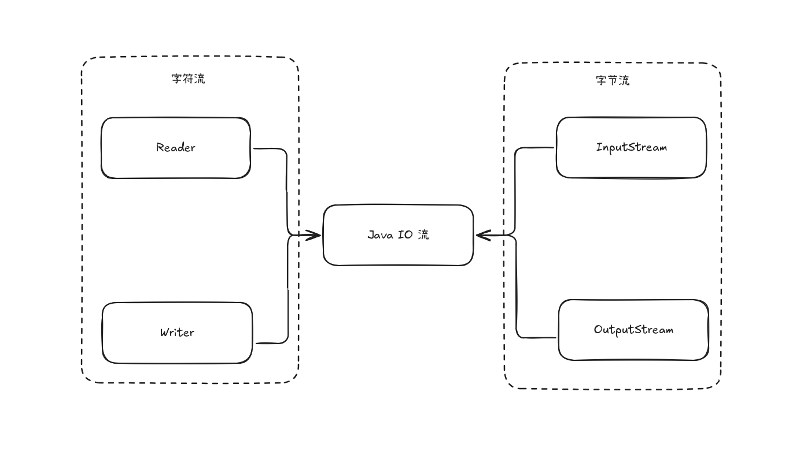

# Java IO 流

Java IO（Input/Output）流是 Java 标准库中用于处理数据输入和输出的核心机制。IO 流广泛应用于文件读写、网络通信、数据传输等场景。

## IO 流架构

Java IO 流主要分为两大类：

1. **字节流**
   - 以字节为单位进行数据传输。
   - 适用于所有类型的数据（如图片、音频、视频、二进制文件等）。

2. **字符流**
   - 以字符为单位进行数据传输，自动处理字符编码。
   - 适用于文本数据的读写。

> [!TIP]
> Java中字节流的名称以 `InputStream` 和 `OutputStream` 结尾, 而字符流则以 `Reader` 和 `Writer` 结尾。

## 包装流

包装流（也称为处理流、装饰流）是对基础流进行功能增强的流。它们通过“包装”其他流对象，实现缓冲、数据类型处理、对象序列化等功能。包装流依赖于其包装的基础流与数据源（如文件、网络）交互.

常见包装流有：

| 包装流类型   | 主要功能                        | 常用类名                                                         |
|------------|-------------------------------|------------------------------------------------------------------|
| 缓冲流      | 提高读写效率，减少实际IO操作次数   | 字节缓冲流：`BufferedInputStream`、`BufferedOutputStream` 字符缓冲流：`BufferedReader`、`BufferedWriter` |
| 数据流      | 支持基本数据类型的读写            | `DataInputStream`、`DataOutputStream`                            |
| 对象流      | 对象的序列化与反序列化            | `ObjectInputStream`、`ObjectOutputStream`                        |
| 转换流      | 字节流与字符流之间的转换，常用于编码处理 | `InputStreamReader`、`OutputStreamWriter`                        |

> [!TIP]
> 包装流的核心思想是“装饰者模式”，可以层层包装，灵活组合各种功能。
