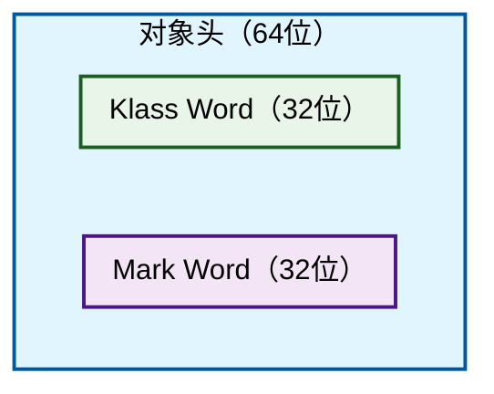
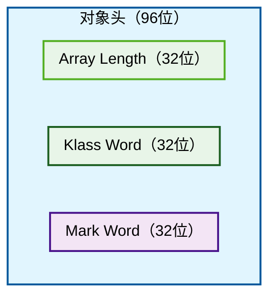

# Java 内存结构
## Java 对象内存结构

Java 对象在内存中的结构主要由以下几个部分组成：
- **对象头（Object Header）**：包含对象的元数据，如哈希码、GC 信息、锁信息等。
- **实例数据（Instance Data）**：存储对象的实际数据字段。
- **对齐填充（Padding）**：为了满足内存对齐要求，


### 对象头

+ 普通对象的对象头主要由 `Mark Word` 和 `Klass Pointer` 组成



+ 数组对象的对象头主要由 `Mark Word` , `Klass Pointer`  和 `Array Length` 组成


**注:** 
- ArrayLength字段始终占 4 字节，无论 JVM 是 32 位还是 64 位, 这是因为 Java 语言规范规定数组长度为 int 类型。
- 在 32 位 JVM 中，对象头总是占用 8 字节（64 位），而在 64 位 JVM 中，对象头通常占用 16 字节（128 位）。但是，如果启用了指针压缩（-XX:+UseCompressedOops），对象头大小可以减少到 12 字节（96 位）。

#### Mark Word

`Mark Word` 是对象头的一部分，包含了对象的运行时数据，如哈希码、GC 信息、锁信息等。

32 位的 `Mark Word` 结构如下所示：

```bash
|-------------------------------------------------------|--------------------|
|             Mark Word (32 bits)                       |        State       |
|-------------------------------------------------------|--------------------|
| hashcode:25 | age:4 | biased_lock:0              | 01 | Normal             |
|-------------------------------------------------------|--------------------|
| thread:23 | epoch:2 | age:4 | biased_lock:1      | 01 | Biased             |
|-------------------------------------------------------|--------------------|
| ptr_to_lock_record:30                            | 00 | Lightweight Locked |
|-------------------------------------------------------|--------------------|
| ptr_to_heavyweight_monitor:30                    | 10 | Heavyweight Locked |
|-------------------------------------------------------|--------------------|
|                                                  | 11 | Marked for GC      |
|-------------------------------------------------------|--------------------|
```

64 位的 `Mark Word` 结构如下所示：

```bash
|-----------------------------------------------------------------|--------------------|
|             Mark Word (64 bits)                                 |        State       |
|-----------------------------------------------------------------|--------------------|
| unused:25 | hashcode:31 | unused:1 | age:4 | biased_lock:0 | 01 | Normal             |
|-----------------------------------------------------------------|--------------------|
| thread:54 | epoch:2 | unused:1 | age:4 | biased_lock:1     | 01 | Biased             |
|-----------------------------------------------------------------|--------------------|
| ptr_to_lock_record:62                                      | 00 | Lightweight Locked |
|-----------------------------------------------------------------|--------------------|
| ptr_to_heavyweight_monitor:62                              | 10 | Heavyweight Locked |
|-----------------------------------------------------------------|--------------------|
|                                                            | 11 | Marked for GC      |
|-----------------------------------------------------------------|--------------------|
```


