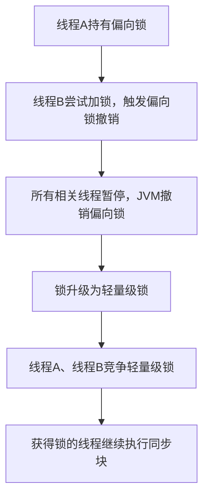
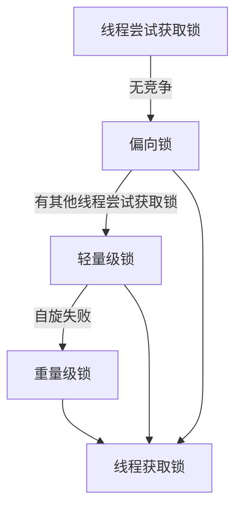

# Java 多线程

## 进程与线程

进程可以视为程序的一个实例。大部分程序可以同时运行多个实例进程（例如记事本、画图、浏览器
等），也有的程序只能启动一个实例进程（例如网易云音乐、360 安全卫士等）

线程是进程中的一个执行单元，一个进程可以包含多个线程。线程共享进程的资源（如内存空间、文件句柄等），但每个线程有自己的栈空间和寄存器。

**进程与线程的对比:**

- 进程基本上相互独立的，而线程存在于进程内，是进程的一个子集。
- 进程拥有共享的资源，如内存空间等，供其内部的线程共享。
- 线程通信相对简单，因为它们共享进程内的内存，
- 线程更轻量，线程上下文切换成本一般上要比进程上下文切换低。

## 守护线程

守护线程（Daemon Thread）是为其他线程提供服务的线程，通常用于执行后台任务，如垃圾回收、定时任务等。守护线程的生命周期依赖于用户线程，当所有用户线程结束时，守护线程也会自动终止, 即使仍然有任务在执行。

## 栈帧

在 Java 中，每个线程都有自己的栈帧（Stack Frame），用于存储方法调用的信息。每当一个方法被调用时，Java 虚拟机会为该方法创建一个新的栈帧，并将其压入线程的调用栈中。当方法执行完毕后，栈帧会被弹出。

## 线程上下文切换

当因为某些原因（如时间片用完、等待 I/O 操作等）导致当前线程暂停执行，CPU 会切换到另一个线程继续执行，这个过程称为线程上下文切换。

## 临界区 

当多线程在同一段代码块中访问和操作共享资源时，这段代码块被称为临界区（Critical Section）。临界区内的操作需要保证同一时刻只能有一个线程执行，以避免数据竞争和不一致问题。

## 竞态条件 

竞态条件(Race Condition)指多个线程在临界区内执行，由于代码的执行序列不同而导致最终结果无法预测的情况.

## 可见性

Java 内存模型规定，将所有的变量都存放在主内存中, 当线程使用变量时会把主内存里面的变量复制到自己的工作空间(工作内存), 线程读写变量时操作的是自己工作内存中的变量. 

```java
public class VisibilityProblem {
    // 没有volatile修饰
    private static boolean running = true;

    public static void main(String[] args) throws InterruptedException {
        Thread thread = new Thread(() -> {
            System.out.println("子线程开始循环...");
            while (running) {
                // 空循环
            }
            System.out.println("子线程结束循环。");
        }, "t1");

        thread.start();

        // 主线程休眠1秒，确保子线程已经启动并进入循环
        Thread.sleep(1000);

        System.out.println("主线程准备将running设置为false。");
        running = false;

        // 等待子线程结束
        thread.join();
        System.out.println("主线程结束。");
    }
}
```

上述代码线程t1并不会结束, 由于线程的工作内存是独立的, 所以一个线程对变量的修改, 另一个线程是不可见的. 要解决这个问题, 需要使用`volatile` 关键字, 被 `volatile` 修饰的变量, 保证了对该变量的写操作会立即刷新到主内存, 而对该变量的读操作会直接从主内存中读取. 这样就保证了不同线程之间对该变量的可见性.

## 指令重排序

Java内存模型允许编译器和处理器对指令重排序以提高运行性能，并且只会对不存在数据依赖性的指令重排序。在单线程下重排序可以保证最终执行的结果与程序顺序执行的结果一致，但是在多线程下就会存在问题

```java
public class InstructionReordering {
    private static int num;
    private static boolean ready;

    static class ReadThread extends Thread {
        @Override
        public void run() {
            if (ready) { 
                System.out.println(num);
            }
        }
    }

    static class WriteThread extends Thread {
        @Override
        public void run() {
            num = 2; // 1
            ready = true; // 2
        }
    }
}
```

上述代码中, `WriteThread` 线程中, 语句 `num = 2;` 和 `ready = true;` 之间没有数据依赖关系, 因此编译器或处理器可能会对这两条语句进行重排序, 使得 `ready = true;` 先执行. 如果发生这种情况, 那么 `ReadThread` 线程在检查 `if (ready)` 时会看到 `ready` 已经是 `true`, 然后打印 `num`, 但此时 `num` 可能还没有被赋值为 `2`, 因此打印的结果可能是 `0`. 要解决这个问题只需要对 `ready` 变量使用 `volatile` 关键字修饰

## 伪共享

当CPU访问某个变量时，首先会去看CPU Cache内是否有该变量，如果有则直接从中获取，否则就去主内存里面获取该变量，然后把该变量所在内存区域的一个Cache行大小的内存复制到Cache中。由于存放到Cache行的是内存块而不是单个变量，所以可能会把多个变量存放到一个Cache行中。当多个线程同时修改一个缓存行里面的多个变量时，由于同时只能有一个线程操作缓存行，所以相比将每个变量放到一个缓存行，性能会有所下降，这就是**伪共享**

**如何解决伪共享问题:**

- 对变量进行内存填充, 使得每个变量占用一个缓存行

```java
public class PaddedData implements java.io.Serializable {
    public volatile long value1 = 0L;
    // 填充字段，加transient避免无意义的序列化
    public transient long p1, p2, p3, p4, p5, p6, p7;
    public volatile long value2 = 0L;
}
```

- 使用 `@Contended` 注解, 该注解会自动对变量进行内存填充, 但需要在JVM启动时添加参数 `-XX:-RestrictContended`

> [!NOTE]
> 使用@Contended注解的方式这里不详细展开, 需要时请自行查阅如何导入和使用 


## CAS

CAS（Compare And Swap）是一种常用的原子操作机制，广泛应用于多线程编程中。它通过比较内存中的某个值是否等于预期值，如果相等则将其更新为新值，否则不做任何操作。CAS 操作通常由硬件(CPU)指令支持，能够保证在多线程环境下的并发安全。

> [!TIP]
> CAS 操作是无锁的，不会引起线程阻塞，因此性能较高, 但也存在一些缺点，如 ABA 问题、循环时间长开销大等。

> [!NOTE]
> Java 的CAS操作由 `Unsafe` 类提供支持.

### ABA问题

ABA问题是指在多线程环境下，一个变量的值从A变为B，然后又变回A，导致其他线程无法检测到这个变化，从而引发错误的操作。

## 线程管理工具

JDK 中提供了一些工具来查看和管理线程：

- `jps`：列出所有正在运行的 Java 进程。
- `jstack <PID>`：查看指定 Java 进程（PID）的所有线程堆栈信息。
- `jconsole`：图形界面工具，可实时监控 Java 进程中的线程运行情况。

> [!TIP]
> `jconsole` 支持远程连接, 可以监控远程服务器上的 Java 进程

## 线程创建

Java中创建线程有以下四种方式：

1. **继承 Thread 类**
2. **实现 Runnable 接口**
3. **实现 Callable 接口并结合 FutureTask**
4. **使用线程池（Executor 框架）**

代码示例:

```java
import java.util.concurrent.Callable;
import java.util.concurrent.FutureTask;
import java.util.concurrent.ExecutorService;
import java.util.concurrent.Executors;

// 1. 继承 Thread 类
class MyThread extends Thread {
    @Override
    public void run() {
        System.out.println("继承 Thread 类方式运行线程");
    }
}

// 2. 实现 Runnable 接口
class MyRunnable implements Runnable {
    @Override
    public void run() {
        System.out.println("实现 Runnable 接口方式运行线程");
    }
}

// 3. 实现 Callable 接口并结合 FutureTask
class MyCallable implements Callable<String> {
    @Override
    public String call() throws Exception {
        return "实现 Callable 接口方式运行线程";
    }
}

public class Main {
    public static void main(String[] args) throws Exception {
        // 1. 继承 Thread 类
        Thread thread1 = new MyThread();
        thread1.start();

        // 2. 实现 Runnable 接口
        Thread thread2 = new Thread(new MyRunnable());
        thread2.start();

        // 3. 实现 Callable 接口并结合 FutureTask
        FutureTask<String> futureTask = new FutureTask<>(new MyCallable());
        Thread thread3 = new Thread(futureTask);
        thread3.start();
        System.out.println(futureTask.get());

        // 4. 使用线程池（Executor 框架）
        ExecutorService executor = Executors.newFixedThreadPool(2);
        executor.execute(() -> System.out.println("线程池方式运行线程"));
        executor.shutdown();
    }
}
```


> [!TIP]
> 实现 `Runnable` 接口的方式更为常用，因为它避免了 Java 单继承的限制，并且更符合面向接口编程的思想。

## 线程常用方法

Java 中 `Thread` 类提供了许多方法来管理和控制线程。下面是一些常用的方法：

| 方法名                       | static | 功能说明                                                         | 注意事项                                                                                 |
|------------------------------|--------|------------------------------------------------------------------|------------------------------------------------------------------------------------------|
| `start()`                    |        | 启动一个新线程，运行 `run()` 方法                                 | 只能调用一次，调用多次抛出 `IllegalThreadStateException`，进入就绪态但不一定立刻运行      |
| `run()`                      |        | 线程启动后执行的方法                                             | 可通过继承 Thread 或实现 Runnable 覆盖默认行为                                           |
| `join()`                     |        | 等待线程运行结束                                                 |                                                                                          |
| `join(long n)`               |        | 最多等待 n 毫秒线程运行结束                                       |                                                                                          |
| `getId()`                    |        | 获取线程唯一的长整型 id                                          |                                                                                          |
| `getName()`                  |        | 获取线程名                                                       |                                                                                          |
| `setName(String)`            |        | 修改线程名                                                       |                                                                                          |
| `getPriority()`              |        | 获取线程优先级                                                   |                                                                                          |
| `setPriority(int)`           |        | 修改线程优先级（1~10）                                           | 优先级高的线程被调度概率更大                                                             |
| `getState()`                 |        | 获取线程状态                                                     | 状态包括：NEW, RUNNABLE, BLOCKED, WAITING, TIMED_WAITING, TERMINATED                     |
| `isInterrupted()`            |        | 判断线程是否被打断，不清除打断标记                               |                                                                                          |
| `isAlive()`                  |        | 判断线程是否存活（还未运行完毕）                                 |                                                                                          |
| `interrupt()`                |        | 打断线程                                                         | sleep、wait、join 状态下被打断会抛出 `InterruptedException` 并清除打断标记               |
| `interrupted()`              | static | 判断当前线程是否被打断，并清除打断标记                           |                                                                                          |
| `currentThread()`            | static | 获取当前正在执行的线程                                           |                                                                                          |
| `sleep(long n)`              | static | 让当前线程休眠 n 毫秒，休眠时让出 CPU 时间片                     |                                                                                          |
| `yield()`                    | static | 提示线程调度器让出当前线程对 CPU 的使用权，主要用于测试和调试    |                                                                                          |

## 线程状态

Java 中的线程模型有以下几种状态：

| 状态              | 描述                                                             |
| ----------------- | ---------------------------------------------------------------- |
| **NEW**           | 初始状态，线程被创建但还未启动。                                 |
| **RUNNABLE**      | 可运行状态，包括 `READY`（就绪）和 `RUNNING`（运行中）两种状态。 |
| **BLOCKED**       | 阻塞状态，线程等待锁释放。                                       |
| **WAITING**       | 等待状态，线程等待其他线程的通知。                               |
| **TIMED_WAITING** | 定时等待状态，线程在指定时间内等待其他线程的通知。               |
| **TERMINATED**    | 终止状态，线程执行完毕。                                         |

简化图示:


完整线程模型以及线程状态转图示：


## 常见线程安全类

Java 提供了一些内置的线程安全类，常见的有：

- `String`：不可变对象，线程安全。
- `Integer`：不可变对象，线程安全。
- `StringBuffer`：可变字符串，方法加锁，线程安全。
- `Random`（`java.util.Random`）：大部分方法线程安全，但并发场景推荐使用 `ThreadLocalRandom`。
- `Vector`：线程安全的动态数组，方法加锁。
- `Hashtable`：线程安全的哈希表，方法加锁。
- `java.util.concurrent` 包下的类，如 `ConcurrentHashMap`、`CopyOnWriteArrayList`、`BlockingQueue` 等，专为高并发设计，线程安全且性能优于早期同步类。

> [!TIP]
> 这里提到的线程安全, 是指这些类的单个方法在多线程环境下调用是安全的, 但如果多个方法组合调用, 仍然需要额外的同步措施来保证整体操作的原子性.


## volatile

在 Java 中`volatile`关键字仅能够用于修饰变量, 主要有两个作用:

1. **保证内存可见性**: 当一个线程修改了被 `volatile` 修饰的变量的值, 新的值会立即被写回主内存, 其他线程读取该变量时会直接从主内存中获取最新的值, 而不是从工作内存中读取缓存的旧值.

2. **禁止指令重排序**: 编译器和处理器在执行代码时可能会对指令进行重排序以提高性能, 使用 `volatile` 修饰的变量会在读写操作时插入内存屏障, 防止指令重排序, 保证代码执行的顺序性.

    - **写操作**  
        - 在对`volatile`修饰的变量进行写(赋值)操作时，JVM 会在写指令之前插入一个“写屏障”（Store Barrier）。
        - 写屏障作用: 确保屏障之前的命令不会被重排到屏障之后, 也就是说, 在写屏障之前的写操作一定会在当前`volatile`修饰变量的写操作之前完成

    - **读操作**  
        - 在对`volatile` 修饰的变量进行读操作时，JVM 会在读指令之前插入一个“读屏障”（Store Barrier）。
        - 读屏障作用: 确保屏障之后的命令不会被重排到屏障之前, 也就是说, 在读屏障之后的读操作一定会在当前`volatile`修饰变量的读操作之后完成


Double-Checked Locking (DCL) 示例:

```java
public class Singleton {
    // 在进行赋值时会添加写屏障, 在读取时会添加读屏障
    private static volatile Singleton instance;

    private Singleton() {}
    public static Singleton getInstance() {
        if (instance == null) { // 第一次检查
            synchronized (Singleton.class) {
                if (instance == null) { // 第二次检查
                    /*
                    *
                    * instance = new Singleton();
                    * 这行代码实际上由三个指令组成:
                    * 1. 分配内存空间
                    * 2. 初始化对象 (写操作)
                    * 3. 设置 instance 指向刚分配的内存地址(写操作)
                    * 多线程的情况下2, 3之间发生指令重排序, 最终执行顺序可能会变成 1->3->2, 造成半初始化问题
                    * 使用 volatile 修饰变量instance后, 会在3之前添加写屏障, 保证2在3之前完成, 避免半初始化问题
                    */
                    instance = new Singleton();
                }
            }
        }
        return instance;
    }
}
```

## synchronized

`synchronized` 关键字用于为指定对象加对象锁，确保同一时刻只有一个线程能够执行被同步的方法或代码块，从而保证线程安全。

### 基本语法

```java
synchronized(对象) {
    // 临界区代码
}

// 能够简写的情况
public synchronized void synchronizedMethod() {
}
// 等价于
public void synchronizedMethod() {
    synchronized(this) {
        // 临界区代码
    }
}

public static synchronized void staticSynchronizedMethod() {
}
// 等价于
public static void staticSynchronizedMethod() {
    synchronized(类名.class) {
        // 临界区代码
    }
}
```
### Monitor

Monitor Lock 是 Java 中实现线程同步的基础。每个对象都有一个与之关联的 Monitor，当一个线程访问一个对象的同步方法或同步块时，它会尝试获取该对象的 Monitor。如果 Monitor 已经被其他线程持有，当前线程将进入阻塞状态，直到 Monitor 被释放。

> [!TIP]
> Monitor 是 JVM 内部实现的, 无法直接操作 Monitor, 只能通过 `synchronized` 关键字间接使用. \
> Monitor 组成部分:
> - **Entry List**: 等待获取 Monitor 的线程队列。(此时线程状态为 BLOCKED)
> - **Owner**: 当前持有 Monitor 的线程。
> - **Recursion Count**: 记录当前线程重入 Monitor 的次数。
> - **Wait Set**: 通过 `wait()` 方法进入等待状态的线程队列。(此时线程状态为 WAITING 或 TIMED_WAITING)

### Lock Record

当线程进入一个 `synchronized` 代码块或方法时，JVM会在**当前线程的栈帧**中分配一个 Lock Record用于记录锁相关的信息，比如对象头的原始值，以及当前线程是否持有锁

- Lock Record 在线程尝试获取轻量锁和重量锁时才会创建, 如果线程获取偏向锁, 则不会创建 LockRecord

- Lock Record 仅在当前线程的栈帧中存在, 当线程退出同步块或方法时, 该栈帧被弹出, Lock Record 也随之销毁

### 工作流程 


### 锁的优化与升级

为了提升 `synchronized` 关键字实现的对象锁的性能，JVM 引入了锁的优化与升级机制，包括**偏向锁**、**轻量级锁**和**重量级锁**（也称为互斥锁或 Monitor 锁）。锁会根据竞争情况在不同状态之间升级或降级，以兼顾性能和线程安全。

#### 偏向锁

- 偏向锁适用于只有一个线程访问同步块的场景。
- 当对象第一次被某线程获取锁时，对象头会记录该线程的 ID，后续该线程再次进入同步块时无需加锁操作，提升性能。
- 如果有其他线程竞争，偏向锁会被撤销，升级为轻量级锁。

偏向锁撤销和升级流程:



> [!TIP]
> - **JDK 15 及之前**：偏向锁默认启用。
> - **JDK 16**：偏向锁默认禁用。
> - **JDK 17 及以后**：偏向锁已被移除，不再支持

> [!NOTE]
> JVM 可通过参数 `-XX:+UseBiasedLocking` 控制偏向锁的启用。\
> JVM 偏向锁的启动默认存在一些延迟。
> - 这个延迟是为了让 JVM 在启动阶段（类加载、对象初始化等）避免不必要的偏向锁元数据操作，提高启动性能。
> - 延迟时间可以通过 JVM 参数 `-XX:BiasedLockingStartupDelay=0` 设置为 0，表示**立即启用偏向锁**

#### 轻量级锁

- 轻量级锁适用于多个线程交替（但不并发）访问同步块的场景。
- 当偏向锁被撤销或有多个线程尝试获取锁时，JVM 会将锁升级为轻量级锁。
- 线程通过自旋的方式尝试获取锁，避免了线程阻塞和唤醒的开销。
- 如果自旋失败（即存在激烈竞争），锁会进一步升级为重量级锁。

#### 重量级锁

- 当多个线程同时竞争同一个锁时，JVM 会将锁升级为重量级锁。
- 线程会被阻塞，操作系统需要进行线程切换，性能开销较大。
- 这是传统的互斥锁实现方式，保证线程安全但性能较低。

#### 锁升级流程



> [!TIP]
> 锁只能升级不能降级，即锁一旦升级为更高等级，不会自动降回低等级。

### 可见性和有序性

对于`synchronized` 同步块，JVM 会在进入同步块时添加**写屏障**, 退出同步块时添加**读屏障**，以确保线程之间的可见性和有序性

> [!NOTE]
> `synchronized` 关键字之所以能够保证有序性是因为, 在代码块中的变量仅有一个线程在操作, 不存在多个线程对同一变量进行读写操作的情况. 如果某个变量即在同步块中又在同步块外被访问, 那么该变量必须使用 `volatile` 修饰, 否则无法保证可见性 

## final

在多线程的环境下`final`关键字修饰变量能够禁止指令重排序, 解决半初始化问题

```java
public class FinalDemo {
    private final int value;

    public FinalDemo() {
        value = 42; // 初始化
    }

    public int getValue() {
        return value;
    }

    // 多线程环境下，final保证value在对象可见前已初始化完成
    public static void main(String[] args) {
        Runnable task = () -> {
            // 下面这行代码主要分为三个指令
            // 1. 分配内存空间
            // 2. 初始化对象 (写操作)
            // 3. 设置引用指向刚分配的内存地址(写操作)
            // final关键字防止2重排序到3之后, 保证对象在被引用前已初始化完成, 避免半初始化问题
            FinalDemo demo = new FinalDemo();
            // 始终输出42，不会出现半初始化问题
            // 如果没有final修饰，可能输出0
            System.out.println(demo.getValue()); 
        };
        new Thread(task).start();
    }
}
```