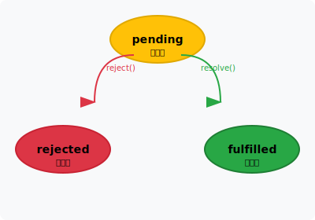

# JavaScript 异步编程

JavaScript 是 **单线程** 语言，但通过 **事件循环（Event Loop）** 实现异步操作。

```javascript
// 同步 — 按顺序执行
console.log('1');
console.log('2');

// 异步 — 不会阻塞后续代码
console.log('1');
setTimeout(() => console.log('2'), 0);
console.log('3');
// 输出: 1, 3, 2
```

## Promise

Promise 对象是 JavaScript 中异步编程的解决方案，该对象包装了一个异步操作及其状态信息。Promise 有三种状态：

| 状态        | 含义   |
| ----------- | ------ |
| `pending`   | 进行中 |
| `fulfilled` | 已成功 |
| `rejected`  | 已失败 |

其状态转换图如下：



状态一旦改变就不可再变。

```javascript
// 创建 Promise
const promise = new Promise((resolve, reject) => {
    // 异步操作
    setTimeout(() => {
        const success = true;
        if (success) {
            resolve('操作成功'); // 状态变为 fulfilled
        } else {
            reject(new Error('操作失败')); // 状态变为 rejected
        }
    }, 1000);
});

// 处理 Promise 结果
// 注意：每次调用 .then() 会返回一个新的 Promise 实例
const promise1 = promise.then((result) => {
    console.log(result); // '操作成功'
    return result; // 返回值作为下一个 then 的回调参数
});

const promise2 = promise1.then((result) => {
    console.log(result); // '操作成功' — 上一个 then 的返回值
    return '新的返回值'; // 为下一个 then 提供参数
});

console.log(promise === promise1); // false — 每次 .then() 都返回新实例
console.log(promise1 === promise2); // false — 同上

// 链中错误处理：如果某个 .then() 抛出错误，后续 .then() 不会执行
promise2
    .then(() => {
        throw new Error('模拟错误'); // 抛出错误
    })
    .then(() => {
        console.log('不会执行到这里'); // 错误发生后，此回调不会执行
    })
    .catch((error) => {
        console.error(error.message); // 错误被捕获
    })
    .finally(() => {
        console.log('操作完成'); // 无论成功失败都会执行
    });
```

> [!TIP]
>
> - `then()` 每次调用都会返回一个新的 Promise 实例，链式调用基于此实现。
> - `then()` 注册的回调函数，在 Promise 对象状态变为 fulfilled 或 rejected 时被调用。
> - `catch()` 是 `then(null, onRejected)` 的语法糖，用于捕获 rejected 状态的错误。
> - `finally()` 注册的回调函数，无论 Promise 最终状态如何都会执行。

### resolve 与 reject

Promise 构造函数接受一个回调函数作为参数，该回调函数接收两个参数：`resolve` 和 `reject`。

**resolve(value)** — 将 Promise 状态设置为 fulfilled

- 参数可以是任意值（非 Promise 时直接作为结果）
- 如果参数是 Promise 或 thenable 对象，会采用其最终状态
- 这就是 Promise 的"展平"（flattening）特性

**reject(reason)** — 将 Promise 状态设置为 rejected

- 参数通常是 Error 对象或任意错误原因
- 建议传入 Error 对象，便于错误处理和调试

```javascript
// resolve 传入任意值
new Promise((resolve) => resolve('直接值')).then((result) => console.log(result)); // '直接值'

// resolve 传入 Promise（自动展平）
new Promise((resolve) => resolve(Promise.resolve('inner'))).then((result) => console.log(result)); // 'inner' — 展平了嵌套 Promise

// resolve 传入 thenable 对象
const thenable = {
    then(resolve) {
        resolve('thenable 结果');
    },
};
new Promise((resolve) => resolve(thenable)).then((result) => console.log(result)); // 'thenable 结果'

// reject 通常传入 Error 对象
new Promise((resolve, reject) => reject(new Error('操作失败'))).catch((error) =>
    console.log(error.message),
); // '操作失败'
```

### Promise.all

等待所有 Promise 成功，或任一失败。

```javascript
let p1 = Promise.resolve(1);
let p2 = Promise.resolve(2);
let p3 = Promise.resolve(3);

Promise.all([p1, p2, p3])
    .then((values) => console.log(values)) // [1, 2, 3]
    .catch((error) => console.error(error));
```

### Promise.allSettled

等待所有 Promise 完成（无论成功或失败）。

```javascript
let p1 = Promise.resolve('ok');
let p2 = Promise.reject('error');

Promise.allSettled([p1, p2]).then((results) => {
    console.log(results);
    // [
    //   { status: 'fulfilled', value: 'ok' },
    //   { status: 'rejected', reason: 'error' }
    // ]
});
```

## Promise 静态方法

Promise 提供了多个静态方法，用于组合管理多个 Promise 实例。

### Promise.all

等待所有 Promise 成功，或任一失败。

```javascript
let p1 = Promise.resolve(1);
let p2 = Promise.resolve(2);
let p3 = Promise.resolve(3);

Promise.all([p1, p2, p3])
    .then((values) => console.log(values)) // [1, 2, 3]
    .catch((error) => console.error(error));
```

async / await 语法糖： 

```javascript
// ❌ 串行 — 依次等待，总耗时 = 两个请求之和
async function sequential() {
    let user = await fetchUser(1);
    let orders = await fetchOrders(user);
    return orders;
}

// ✅ 并行 — 同时发起，总耗时 = 较长的那个
async function parallel() {
    let [user, config] = await Promise.all([fetchUser(1), fetchConfig()]);
    return { user, config };
}
```

### Promise.allSettled

等待所有 Promise 完成（无论成功或失败）。

```javascript
let p1 = Promise.resolve('ok');
let p2 = Promise.reject('error');

Promise.allSettled([p1, p2]).then((results) => {
    console.log(results);
    // [
    //   { status: 'fulfilled', value: 'ok' },
    //   { status: 'rejected', reason: 'error' }
    // ]
});
```

### Promise.race

返回最先完成的 Promise（无论成功或失败）。

```javascript
Promise.race([
    new Promise((resolve) => setTimeout(() => resolve('fast'), 100)),
    new Promise((_, reject) => setTimeout(() => reject(new Error('slow')), 200)),
]).then((result) => console.log(result)); // 'fast'
```

### Promise.any

返回最先成功的 Promise（全部失败则抛出 `AggregateError`）。

```javascript
Promise.any([
    Promise.reject(new Error('error1')),
    Promise.resolve('success'),
    Promise.resolve('success2'),
]).then((result) => console.log(result)); // 'success'
```

## async / await

`async/await` 是基于 Promise 的语法糖，让异步代码看起来像同步代码。

**基本使用**
```javascript
// 传统Promise方式
function delay(ms) {
    return new Promise((resolve) => setTimeout(resolve, ms));
}
delay(10)
    .then(() => console.log('1秒后'))
    .then(() => delay(1000))
    .then(() => console.log('2秒后'))
    .catch((error) => console.error(error));
    .finally(() => console.log('完成'));

// 基于 async/await 语法糖
async function demo() {
    let loading = true;
    try {
        console.log('开始');
        await delay(1000); // 暂停执行，等待 Promise 完成
        console.log('1秒后');
        await delay(1000);
        console.log('2秒后');
    } catch (e) {
        
    } finally {
        loading = false;
        console.log('完成');
    }
}

demo();
```

### 并行执行

## 事件循环

详见 [事件循环](./js-event-loop.md)
