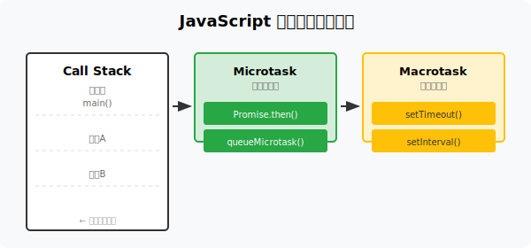

# JavaScript 事件循环

JavaScript 是 **单线程** 语言，通过 **事件循环（Event Loop）** 实现异步操作。

## 基本概念

### 调用栈（Call Stack）

同步代码在调用栈中执行。每当调用一个函数，该函数会被添加到调用栈顶部；函数执行完毕后从栈中弹出。

### 微任务队列（Microtask Queue）

微任务具有更高的优先级，在当前宏任务执行完毕后立即执行。

**微任务包括：**

- Promise 的回调（`.then()`、`.catch()`、`.finally()`）
- `queueMicrotask()`
- `MutationObserver`
- `async/await` 隐式返回的 Promise

### 宏任务队列（Macrotask Queue）

宏任务是较大的任务，会在微任务队列清空后执行。

**宏任务包括：**

- `setTimeout()`
- `setInterval()`
- `setImmediate()`（Node.js）
- I/O 操作
- UI 渲染

## 执行模型

事件循环每一轮循环以`Tick`为单位，每一轮`Tick`执行流程如下：

1. **每一轮事件循环（Event Loop Tick）开始时：**
   - 先执行所有同步任务（即主线程上的普通代码）。

2. **同步任务执行完毕后：**
   - 立即执行所有微任务队列（Microtask Queue）中的任务，直到清空。

3. **微任务清空后：**
   - 执行一个宏任务（Macrotask），比如 setTimeout、setInterval、I/O、UI 渲染等。

4. **宏任务执行完毕后：**
   - 再次进入微任务阶段，清空所有微任务(宏任务产生的微任务）。

5. **然后进入下一轮事件循环，重复上述过程。**




示例代码：

```javascript
console.log('1'); // 加入到Call Stack

setTimeout(() => console.log('2'), 0); // 加入到Macrotask Queue

Promise.resolve().then(() => console.log('3')); // 加入到Microtask Queue

console.log('4'); //  加入到Call Stack

// 执行顺序分析:
// 1. 同步代码先执行，输出 '1' 和 '4'。
// 2. 同步代码执行完毕后，先执行微任务队列中的任务，输出 '3'。
// 3. 微任务执行完毕后，执行宏任务队列中的任务，输出 '2'。
// 4. 最终输出顺序: 1, 4, 3, 2
```

> [!TIP]
> 微任务优先级高于宏任务。即使宏任务设置了 0ms 延迟，微任务仍会先执行。

> [!NOTE]
> 由于 JavaScript 单线程特性，一次只能执行一个任务。事件循环机制确保了异步代码不会阻塞主线程。
