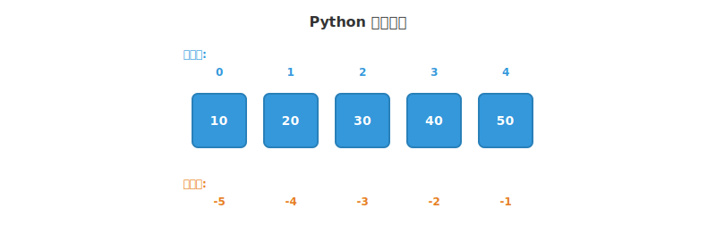

# Python 容器类型

Python 容器类型用于存储多个元素，包括列表、元组、字典和集合。它们共享索引、切片、迭代等基本操作，但在可变性和结构上各有特点。

## list

列表是可变的有序序列，可以包含任意类型的元素：

```python
# 创建
fruits = ["apple", "banana", "cherry"]
mixed = [1, "hello", True, [1, 2]]

# 增
fruits.append("date")
fruits.insert(1, "avocado")
fruits.extend(["fig", "grape"])

# 删
fruits.remove("banana")  # 按值删除
fruits.pop()              # 弹出末尾
fruits.pop(0)             # 按索引弹出
del fruits[1]

# 改
fruits[0] = "apricot"

# 查
fruits.index("cherry")
fruits.count("apple")
"apple" in fruits  # True
```

| 方法 | 作用 |
|------|------|
| `append(x)` | 在末尾添加元素 |
| `insert(i, x)` | 在指定位置插入元素 |
| `extend(iterable)` | 扩展列表，添加可迭代对象中的所有元素 |
| `remove(x)` | 删除第一个值为 x 的元素 |
| `pop([i])` | 删除并返回指定位置的元素，默认为末尾 |
| `clear()` | 清空列表 |
| `index(x)` | 返回第一个值为 x 的元素的索引 |
| `count(x)` | 返回值为 x 的元素个数 |
| `sort()` | 原地排序列表 |
| `reverse()` | 原地反转列表 |
| `copy()` | 返回列表的浅复制 |

### 列表推导式

列表推导式是一种简洁的语法，用于基于现有列表创建新列表。

**基本语法：**
```
[expression for item in iterable]
```

**带条件的语法：**
```
[expression for item in iterable if condition]
```

**示例：**

```python
squares = [x ** 2 for x in range(10)]
evens = [x for x in range(20) if x % 2 == 0]
matrix = [[i * j for j in range(3)] for i in range(3)]
```

## tuple

元组是不可变的有序序列，创建后无法修改：

```python
point = (3, 4)
single = (42,)      # 单元素元组需要逗号
empty = ()

# 解包
x, y = point

# 命名元组
from collections import namedtuple
Point = namedtuple("Point", ["x", "y"])
p = Point(3, 4)
print(p.x, p.y)
```

| 方法 | 作用 |
|------|------|
| `index(x)` | 返回第一个值为 x 的元素的索引 |
| `count(x)` | 返回值为 x 的元素个数 |

### 解包与组包

**解包**: 将元组中的元素分配给多个变量：

```python
point = (3, 4)
x, y = point  # x=3, y=4

# 忽略某些值
a, _, c = (1, 2, 3)  # a=1, c=3
```

**扩展解包**：

`*` 用于捕获多个元素，只能在解包中使用一次：

```python
# * 捕获中间的元素
first, *middle, last = (1, 2, 3, 4, 5)
# first=1, middle=[2, 3, 4], last=5

# * 捕获开头的元素
*head, tail = (1, 2, 3, 4, 5)
# head=[1, 2, 3, 4], tail=5

# * 捕获末尾的元素
head, *tail = (1, 2, 3, 4, 5)
# head=1, tail=[2, 3, 4, 5]

# * 捕获所有元素
*all_items, = (1, 2, 3)
# all_items=[1, 2, 3]
```

**组包**: 将多个值组合成元组：

```python
x, y = 3, 4  # 组包成 (3, 4)
a = 1, 2, 3  # 组包成 (1, 2, 3)

# 函数返回多个值（实际上是返回元组）
def get_coordinates():
    return 10, 20  # 返回 (10, 20)

x, y = get_coordinates()
```

## dict

字典是键值对的映射，基于哈希表实现，键必须是不可变类型：

```python
# 创建
user = {"name": "Tom", "age": 25}
empty = {}
from_keys = dict.fromkeys(["a", "b"], 0)  # {"a": 0, "b": 0}

# 增/改
user["email"] = "tom@example.com"
user.update({"age": 26, "city": "Beijing"})

# 删
del user["email"]
user.pop("city")
user.clear()

# 查
user["name"]              # KeyError if missing
user.get("name")          # None if missing
user.get("name", "N/A")   # 自定义默认值

"name" in user            # True

# 视图
user.keys()    # dict_keys(['name', 'age'])
user.values()  # dict_values(['Tom', 25])
user.items()   # dict_items([('name', 'Tom'), ('age', 25)])

for k, v in user.items():
    print(f"{k}: {v}")

# 合并
d1 = {"a": 1, "b": 2}
d2 = {"b": 3, "c": 4}

# | 运算符（Python 3.9+）
merged = d1 | d2  # {"a": 1, "b": 3, "c": 4}

# update
d1.update(d2)

# 解包
merged = {**d1, **d2}
```

| 方法 | 作用 |
|------|------|
| `get(key, [default])` | 获取键对应的值，不存在返回默认值 |
| `keys()` | 返回所有键的视图 |
| `values()` | 返回所有值的视图 |
| `items()` | 返回所有键值对的视图 |
| `pop(key, [default])` | 删除并返回键对应的值 |
| `popitem()` | 删除并返回最后一个键值对 |
| `clear()` | 清空字典 |
| `update(other)` | 用另一个字典的键值对更新字典 |
| `setdefault(key, [default])` | 获取值，不存在则设置默认值 |
| `copy()` | 返回字典的浅复制 |
| `fromkeys(keys, [value])` | 创建新字典，所有键对应相同的值 |

### 解包与组包

**解包**：使用 `**` 操作符展开字典的键值对：

```python
d = {"a": 1, "b": 2}

# 在函数调用中解包
def func(a, b):
    print(a, b)

func(**d)  # 相当于 func(a=1, b=2)

# 在字典创建中解包
new_d = {**d, "c": 3}  # {"a": 1, "b": 2, "c": 3}

# 多个字典解包
d1 = {"a": 1, "b": 2}
d2 = {"b": 3, "c": 4}
merged = {**d1, **d2}  # {"a": 1, "b": 3, "c": 4}（后面的值覆盖前面的）
```

**组包**：将关键字参数组合成字典：

```python
# 函数中使用 **kwargs 接收任意关键字参数
def func(**kwargs):
    print(kwargs)  # 接收到的是一个字典

func(a=1, b=2)  # kwargs = {"a": 1, "b": 2}

# 使用 dict() 构造函数
d = dict(a=1, b=2)  # {"a": 1, "b": 2}
```

### 字典推导式

字典推导式是一种简洁的语法，用于基于现有数据创建新字典。

**基本语法：**
```
{key_expression: value_expression for item in iterable}
```

**带条件的语法：**
```
{key_expression: value_expression for item in iterable if condition}
```

**示例：**

```python
squares = {x: x**2 for x in range(6)}
# {0: 0, 1: 1, 2: 4, 3: 9, 4: 16, 5: 25}

# 过滤
even_sq = {x: x**2 for x in range(10) if x % 2 == 0}
```

## set

集合是无序不重复元素的集合，基于哈希表实现：

```python
# 创建
s = {1, 2, 3}
s2 = set([2, 3, 4])
empty = set()  # 注意：{} 创建的是空字典

# 增
s.add(4)

# 删
s.remove(3)    # 不存在则 KeyError
s.discard(10)  # 不存在不报错
s.pop()        # 随机弹出

# 运算
a = {1, 2, 3, 4}
b = {3, 4, 5, 6}

a | b   # 并集 {1, 2, 3, 4, 5, 6}
a & b   # 交集 {3, 4}
a - b   # 差集 {1, 2}
a ^ b   # 对称差集 {1, 2, 5, 6}

a.issubset(b)      # False
a.issuperset({1})  # True
a.isdisjoint({7})  # True
```

| 方法 | 作用 |
|------|------|
| `add(x)` | 添加元素 |
| `remove(x)` | 删除元素，不存在则抛出 KeyError |
| `discard(x)` | 删除元素，不存在不报错 |
| `pop()` | 删除并返回任意元素 |
| `clear()` | 清空集合 |
| `union(*others)` 或 `\|` | 返回并集 |
| `intersection(*others)` 或 `&` | 返回交集 |
| `difference(*others)` 或 `-` | 返回差集 |
| `symmetric_difference(other)` 或 `^` | 返回对称差集 |
| `issubset(other)` | 检查是否为子集 |
| `issuperset(other)` | 检查是否为超集 |
| `isdisjoint(other)` | 检查是否不相交 |
| `copy()` | 返回集合的浅复制 |

### 解包与组包

**解包**：使用 `*` 操作符展开集合的元素：

```python
s = {1, 2, 3}

# 在列表中解包
lst = [*s, 4, 5]  # [1, 2, 3, 4, 5]（集合无序，顺序可能不同）

# 在集合中解包
s2 = {*s, 4, 5}  # {1, 2, 3, 4, 5}

# 在函数调用中解包
def func(a, b, c):
    print(a, b, c)

func(*s)  # 将集合元素作为位置参数传递
```

**组包**：在函数中使用 `*args` 接收任意位置参数组成集合：

```python
def func(*args):
    s = set(args)  # 将位置参数组成集合
    print(s)

func(1, 2, 3)  # {1, 2, 3}
```

### 集合推导式

集合推导式是一种简洁的语法，用于基于现有数据创建新集合。

**基本语法：**
```
{expression for item in iterable}
```

**带条件的语法：**
```
{expression for item in iterable if condition}
```

**示例：**

```python
s = {x**2 for x in range(-3, 4)}
# {0, 1, 4, 9}

# 带条件
even_squares = {x**2 for x in range(10) if x % 2 == 0}
# {0, 4, 16, 36, 64}
```

## 通用操作

### 索引

**索引规则**：

- **正索引**：从 0 开始，从左到右递增
  - `s[0]` 获取第一个元素
  - `s[1]` 获取第二个元素
  - 以此类推...

- **负索引**：从 -1 开始，从右到左递减
  - `s[-1]` 获取最后一个元素
  - `s[-2]` 获取倒数第二个元素
  - 以此类推...

- **超出范围**：抛出 `IndexError`



**示例**：

```python
s = [10, 20, 30, 40, 50]

# 正索引
s[0]     # 10
s[2]     # 30
s[4]     # 50

# 负索引
s[-1]    # 50
s[-3]    # 30
s[-5]    # 10

# 超出范围
s[10]    # IndexError: list index out of range
```

### 切片

**切片规则**：

切片语法为 `[start:stop:step]`，用于从序列中提取子序列。

- **start**：起始位置（包含）
  - 默认值：0（从开头开始）
  - 支持负索引

- **stop**：结束位置（不包含）
  - 默认值：len(s)（到末尾）
  - 支持负索引

- **step**：步长（间隔）
  - 默认值：1（每个元素）
  - 负数表示反向切片

**重要特性**：
- 返回新序列（不修改原序列）
- 超出范围不报错，返回可用部分
- 空切片返回空序列
- 适用于 list、tuple、str

**示例**：

```python
s = [10, 20, 30, 40, 50]

# 基本切片
s[1:4]      # [20, 30, 40]
s[0:3]      # [10, 20, 30]
s[2:]       # [30, 40, 50]
s[:3]       # [10, 20, 30]

# 步长切片
s[::2]      # [10, 30, 50]（每隔一个元素）
s[1::2]     # [20, 40]（从索引1开始，每隔一个）

# 反向切片
s[::-1]     # [50, 40, 30, 20, 10]（完全反向）
s[3:0:-1]   # [40, 30, 20]（从索引3到1，反向）

# 负索引切片
s[-3:]      # [30, 40, 50]（最后三个）
s[:-2]      # [10, 20, 30]（除了最后两个）
s[-4:-1]    # [20, 30, 40]

# 超出范围（不报错）
s[10:20]    # []（空列表）
s[-10:2]    # [10, 20]（自动调整）
```

### 运算与内置函数

```python
# 运算
[1, 2] + [3, 4]   # [1, 2, 3, 4]
[0] * 5            # [0, 0, 0, 0, 0]

# 内置函数
len(s)    # 5
min(s)    # 10
max(s)    # 50
sum(s)    # 150
sorted(s, reverse=True)  # [50, 40, 30, 20, 10]
```

### 并行迭代

```python
names = ["Alice", "Bob"]
scores = [90, 85]

for name, score in zip(names, scores):
    print(f"{name}: {score}")
```

## range

`range` 生成不可变的整数序列，常用于循环：

```python
range(5)          # 0, 1, 2, 3, 4
range(2, 8)       # 2, 3, 4, 5, 6, 7
range(0, 10, 2)   # 0, 2, 4, 6, 8

list(range(5))    # [0, 1, 2, 3, 4]
```
