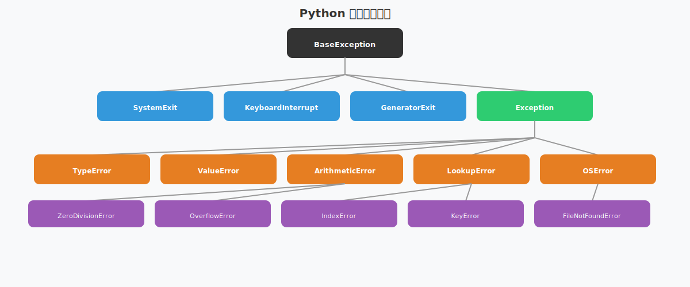

# Python 异常处理

Python 使用 try-except 机制处理运行时错误，异常是类对象，支持自定义和层级继承。

## 基本语法

```python
try:
    result = 10 / 0
except ZeroDivisionError:
    print("不能除以零")
except (TypeError, ValueError) as e:
    print(f"类型或值错误: {e}")
else:
    print("没有异常时执行")
finally:
    print("总是执行")
```

## 异常架构

Python 异常采用继承层次结构，所有异常都继承自 `BaseException`。理解异常的层次关系有助于更好地捕获和处理异常。



异常体系的关键特点：

- **BaseException** 是所有异常的根类，包括系统级异常（`SystemExit`、`KeyboardInterrupt`）
- **Exception** 是常规异常的基类，大多数应用异常都继承自它
- **ArithmeticError** 处理数学运算错误（如除以零）
- **LookupError** 处理序列和映射的访问错误（如索引越界、键不存在）
- **OSError** 处理操作系统相关错误（如文件不存在）
- **ValueError** 和 **TypeError** 是最常见的异常类型

> [!TIP]
> 捕获异常时，优先捕获具体的异常类型而不是 `Exception`，这样可以更精确地处理不同的错误情况。

## 异常抛出

异常抛出是主动触发异常的方式，用于在程序遇到错误条件时中断执行流程。使用 `raise` 关键字可以抛出异常，也可以通过异常链保留原始异常的上下文信息。

### 基本抛出

```python
# 抛出内置异常
if age < 0:
    raise ValueError("年龄不能为负数")

# 抛出异常并指定消息
raise RuntimeError("发生了严重错误")
```

### 异常链

异常链用于在捕获一个异常后抛出另一个异常，同时保留原始异常的信息。这样可以提供更清晰的错误追踪路径。

```python
try:
    open("missing.txt")
except FileNotFoundError as e:
    # 使用 from 保留原始异常信息
    raise RuntimeError("配置文件缺失") from e

# 输出会显示完整的异常链：
# RuntimeError: 配置文件缺失
# The above exception was the direct cause of the following exception:
# FileNotFoundError: [Errno 2] No such file or directory: 'missing.txt'
```

异常链的优势：

- **保留上下文**：通过 `from e` 保留原始异常，便于调试
- **清晰的错误追踪**：显示异常发生的完整链路
- **隐式链接**：即使不使用 `from`，Python 也会自动记录异常上下文

```python
# 隐式异常链（自动记录上下文）
try:
    result = 10 / 0
except ZeroDivisionError:
    raise ValueError("计算失败")  # 会自动记录 ZeroDivisionError 的上下文
```

## 自定义异常

```python
class AppError(Exception):
    """应用基础异常"""
    pass

class ValidationError(AppError):
    def __init__(self, field, message):
        self.field = field
        self.message = message
        super().__init__(f"{field}: {message}")

# 使用
raise ValidationError("email", "格式不正确")
```
