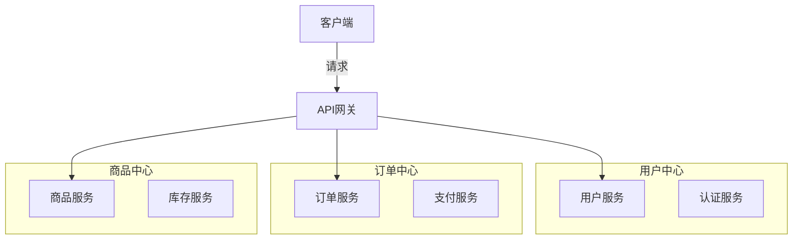
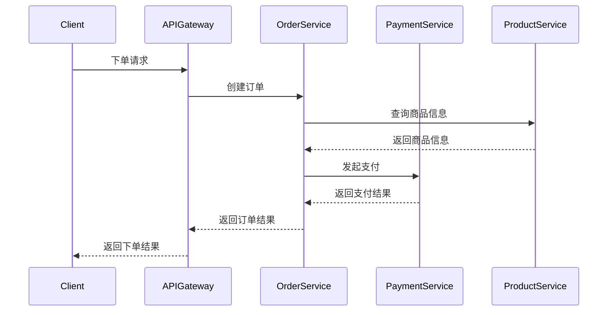
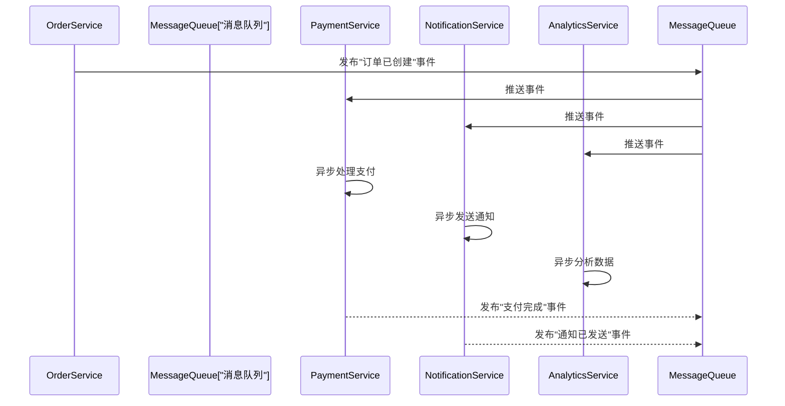
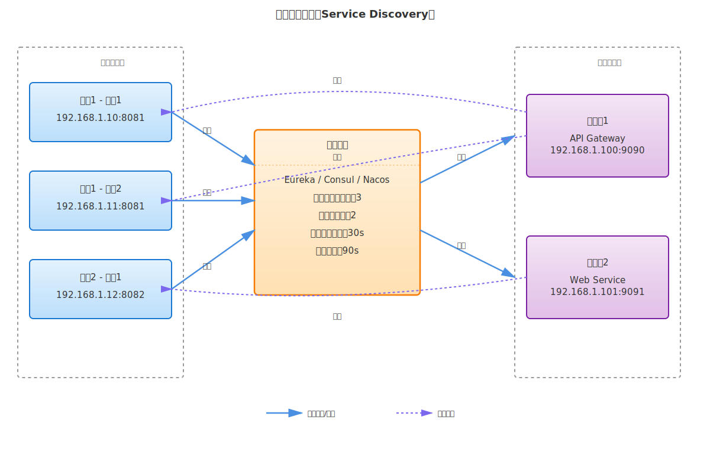
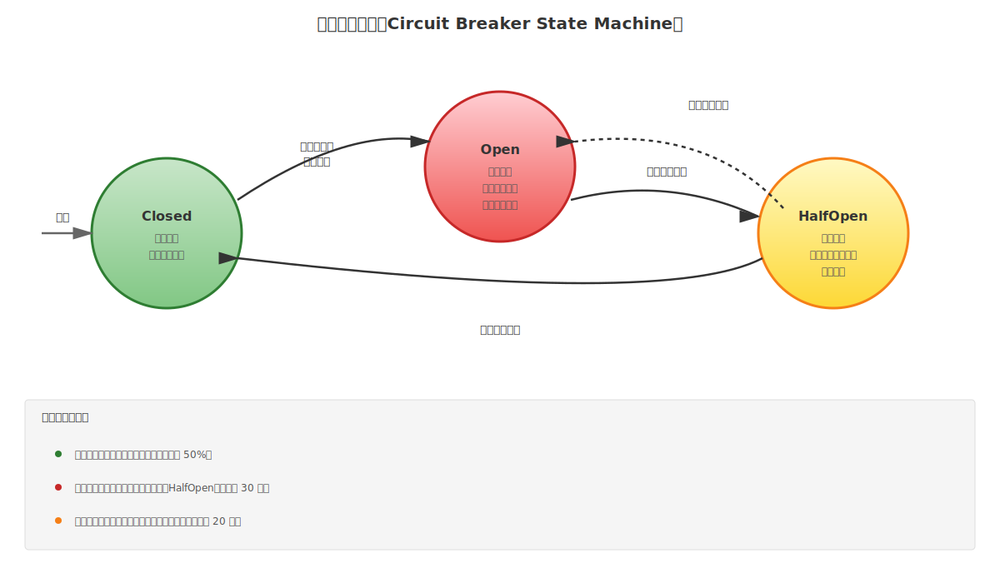
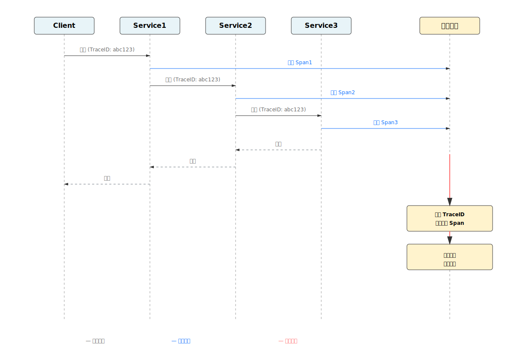
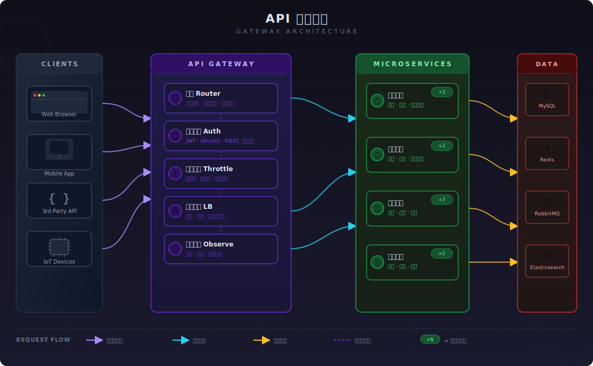

# 微服务架构

微服务架构是一种**将单个大型应用程序分解为多个小型、独立、松耦合的服务组件的架构风格**。每个服务通常运行在单独的进程中，通过网络通信（如HTTP、消息队列等）进行协作，共同完成业务功能。

**核心特征**：
- **独立性强**：每个微服务可独立开发、部署、扩展和维护。
- **业务导向**：按业务能力而非技术层次进行服务划分。
- **自治性高**：微服务拥有自己的数据存储、业务逻辑和通信接口。
- **分布式部署**：服务分散部署在不同的机器或容器中。

---

**微服务架构的优点**

- **独立开发与部署**：不同团队可并行开发不同的服务，提升开发效率。
- **技术栈灵活性**：各服务可采用不同的编程语言、框架和数据库，适应多样化需求。
- **易于扩展**：可针对性地对高并发服务进行水平扩展，提升资源利用率。
- **故障隔离**：单个服务故障不会直接导致整个系统瘫痪，提升系统容错性。
- **快速迭代**：独立的服务版本管理，支持灰度发布和快速回滚。

---

**微服务架构的缺点**

- **系统复杂度高**：分布式系统引入了网络通信、数据一致性、服务发现等复杂问题。
- **运维成本增加**：需要管理和监控众多服务实例，部署和维护难度提升。
- **网络延迟与可靠性**：服务间通信依赖网络，存在延迟和丢失风险。
- **数据一致性难以保证**：各服务独立存储数据，难以实现强一致性和分布式事务。
- **调试困难**：跨越多个服务的业务流程调试和故障定位复杂。

---

## 微服务划分原则

### 按业务能力划分

根据业务域（Domain）进行服务划分，确保每个微服务代表一个完整的业务功能。

### 按技术层次划分

传统的按技术层次划分（如前端服务、业务服务、数据服务）会导致服务间耦合度高，**不符合微服务理念**。

---

## 微服务通信模式

### 同步通信（请求-响应）

微服务通过HTTP、gRPC等协议进行同步调用，等待对方响应。

**工作流程**

### 异步通信（发布-订阅）

微服务通过消息队列进行异步通信，发送方无需等待接收方响应。

**工作流程**

---

## 服务治理

服务治理是微服务架构中对服务的全生命周期进行统一管理、协调和监控的一套机制。简单说，当系统拆分成几十上百个微服务后，需要一个"交通指挥中心"来管理它们之间的协作关系。

### 服务发现

微服务实例动态变化，需要自动注册和发现机制。常见方案有 Eureka、Consul、Nacos 等。

**流程**：
1. 微服务启动时，向注册中心注册自身信息（服务名、地址、端口等）。
2. 服务消费者从注册中心查询服务地址，获取可用实例列表。
3. 消费者根据负载均衡策略选择实例进行调用。
4. 微服务关闭时，从注册中心注销。

### 配置管理

微服务系统中存在大量配置项，需要集中管理和动态更新。常见工具有 Spring Cloud Config、Consul、Nacos、Apollo 等。

**核心功能**：
- **集中存储**：将分散在各个微服务中的配置统一存储在配置中心
- **动态更新**：支持配置热更新，无需重启服务
- **版本管理**：配置变更历史追踪和回滚
- **环境隔离**：支持开发、测试、生产等多环境配置

**配置类型**：
- **应用配置**：数据库连接、API 密钥等敏感信息
- **功能开关**：灰度发布、A/B 测试等
- **限流降级**：熔断阈值、超时时间等

### 负载均衡

在分布式系统中，请求需要均衡分配到多个后端实例，提升整体吞吐量和可用性。

**负载均衡算法**：
- **轮询（Round Robin）**：依次分配请求到每个实例
- **加权轮询**：根据实例权重分配请求
- **最少连接**：选择连接数最少的实例
- **随机**：随机选择一个实例
- **一致性哈希**：根据请求特征哈希，相同特征的请求路由到同一实例

**负载均衡位置**：
- **客户端负载均衡**：由客户端决定路由
- **服务端负载均衡**：由负载均衡器（如 Nginx、LVS）决定路由
- **网关负载均衡**：由 API 网关负责路由

### 熔断降级

当依赖的微服务出现故障或响应缓慢时，快速失败并降级处理，保护系统整体可用性。

**熔断状态机**：

熔断状态流转流程：

1. 系统正常运行于 Closed 状态
2. 失败达到阈值 → 转为 Open
3. 等待超时时间 → 转为 HalfOpen
4. 探测成功 → 恢复到 Closed

> [!TIP]
> 熔断机制的关键参数：
> - **故障阈值**：触发熔断的失败请求比例（如 50%）
> - **熔断时间**：熔断持续多久（如 30 秒）
> - **最小请求数**：计算失败率前需收到的最小请求数（如 20 个）

**常见降级策略**：
- **服务降级**：调用失败时返回缓存数据或默认值
- **限流降级**：限制请求流量，保护后端服务
- **超时降级**：请求超时时立即返回，避免长时间等待

### 链路追踪

在复杂的微服务调用链中，难以追踪一个请求的完整路径。分布式追踪通过唯一的追踪ID关联所有相关日志，帮助快速定位问题。

常见工具：Jaeger、Zipkin、SkyWalking

**核心概念**：
- **TraceID**：全局唯一的追踪标识
- **SpanID**：单个操作的标识
- **Span**：记录单个服务的处理信息（耗时、状态、标签等）

### API 网关

API 网关作为客户端与微服务之间的统一入口，负责请求路由、负载均衡、认证授权等功能。

**主要职责**：
- **请求路由**：根据请求特征转发到相应的微服务
- **协议转换**：支持多种协议转换（HTTP、gRPC、WebSocket 等）
- **认证授权**：统一的身份验证和权限管理
- **限流降级**：保护后端服务
- **日志审计**：记录所有请求信息

**优点**：
- 隐藏内部微服务拓扑，简化客户端调用。
- 集中处理横切关注点（认证、限流、日志等）。
- 支持版本控制和灰度发布。

**缺点**：
- API 网关本身可能成为性能瓶颈。
- 增加系统复杂度和运维成本。

**网关基本工作流程**：

1. **请求入口**：客户端请求先到达 API 网关的单一入口
2. **路由转发**：网关根据请求特征（路径、请求头等）进行初步路由转发
3. **身份认证**：对请求进行身份验证，确保请求来自合法用户或应用
4. **限流控制**：对请求流量进行限制和控制，保护后端服务
5. **负载均衡**：选择合适的微服务实例进行请求转发，提升可用性和吞吐量
6. **微服务处理**：请求被分配到相应的微服务进行业务处理

