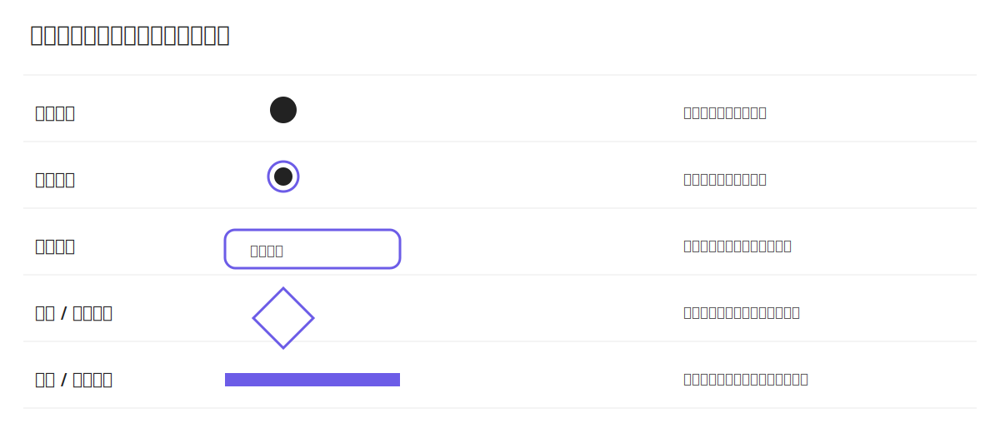

# 活动图

活动图（Activity Diagram）用于描述业务流程、控制流和并发行为。学习活动图的关键是看懂节点类型、流转方向以及条件分支。

## 活动图基础元素

### 起始节点与结束节点

起始节点表示流程开始，结束节点表示流程终止。

```plantuml
title 起始与结束节点示意
skinparam backgroundColor white
skinparam componentStyle rectangle
skinparam defaultFontName "Microsoft YaHei"
skinparam defaultFontSize 14

start
:提交申请;
:系统校验;
stop
```

> [!TIP]
> - 实心圆是起始节点（`start`）。  
> - 同心圆是结束节点（`stop`）。

### 动作节点与控制流

动作节点表示一个业务步骤，箭头表示控制流方向。

```plantuml
title 动作节点与控制流
skinparam backgroundColor white
skinparam componentStyle rectangle
skinparam defaultFontName "Microsoft YaHei"
skinparam defaultFontSize 14

start
:读取订单;
:校验库存;
:计算金额;
stop
```

### 常见节点符号



## 控制结构

活动图通过分支、循环和并发表达复杂流程：

| 结构 | 作用 | 典型场景 |
| --- | --- | --- |
| `if/else` | 条件分支 | 余额是否充足 |
| `repeat while` | 循环执行 | 重试调用外部接口 |
| `fork` / `end fork` | 并发分叉与汇合 | 并行查询多个服务 |

### `if/else`

```plantuml
title if/else 演示：审批分支
skinparam backgroundColor white
skinparam componentStyle rectangle
skinparam defaultFontName "Microsoft YaHei"
skinparam defaultFontSize 14

start
:提交审批单;
if (金额 > 10000?) then (是)
  :进入经理审批;
else (否)
  :自动通过;
endif
:通知申请人;
stop
```

说明：`if/else` 用于表达互斥分支，流程根据条件只会进入其中一个分支。

### `repeat while`

```plantuml
title repeat while 演示：接口重试
skinparam backgroundColor white
skinparam componentStyle rectangle
skinparam defaultFontName "Microsoft YaHei"
skinparam defaultFontSize 14

start
repeat
  :调用支付网关;
  :检查响应结果;
repeat while (调用失败且未超最大重试次数?) is (是)
:记录最终结果;
stop
```

说明：`repeat while` 表示后置循环，至少执行一次，再根据条件决定是否继续。

### `fork / end fork`

```plantuml
title fork 演示：并行准备结算数据
skinparam backgroundColor white
skinparam componentStyle rectangle
skinparam defaultFontName "Microsoft YaHei"
skinparam defaultFontSize 14

start
:进入结算页;
fork
  :查询商品价格;
fork again
  :查询优惠活动;
fork again
  :查询库存状态;
end fork
:汇总结算结果;
stop
```

说明：`fork` 表示并发分叉，`end fork` 表示并发路径全部完成后再继续后续步骤。

## 泳道

泳道用于按角色或系统边界拆分职责，让流程责任更清晰。

```plantuml
title 订单支付流程（泳道）
skinparam backgroundColor white
skinparam componentStyle rectangle
skinparam defaultFontName "Microsoft YaHei"
skinparam defaultFontSize 14

|用户|
start
:提交订单;

|订单系统|
:创建待支付订单;

|支付系统|
:发起支付;
if (支付成功?) then (是)
  :回调订单系统;
else (否)
  :返回失败结果;
endif

|订单系统|
:更新订单状态;

|用户|
:查看支付结果;
stop
```

> [!TIP]
> 阅读泳道图建议顺序：先看泳道划分（谁负责），再看控制流方向（怎么走），最后看条件分支（为什么分支）。
