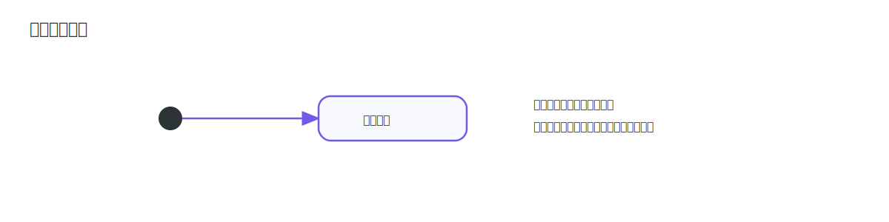
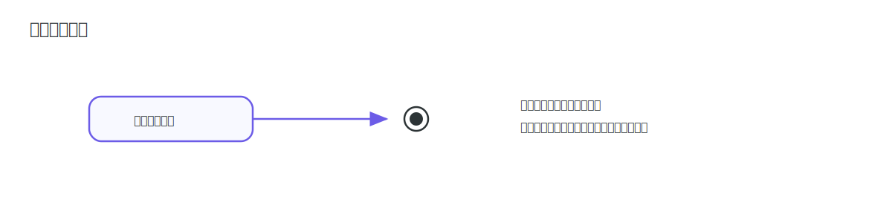
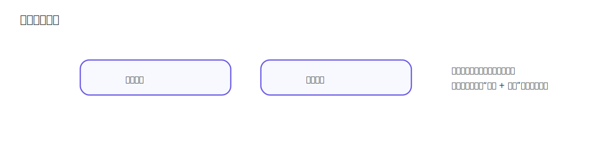
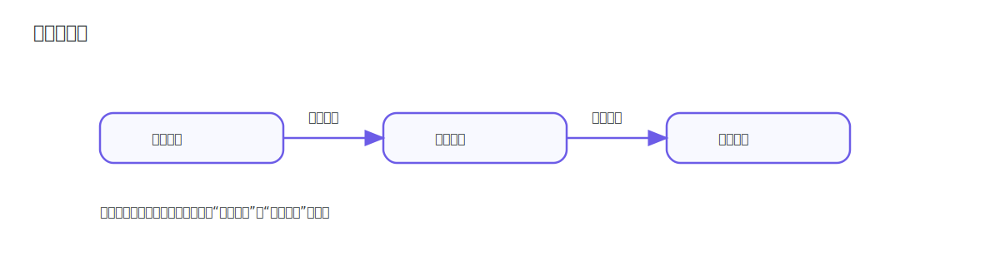
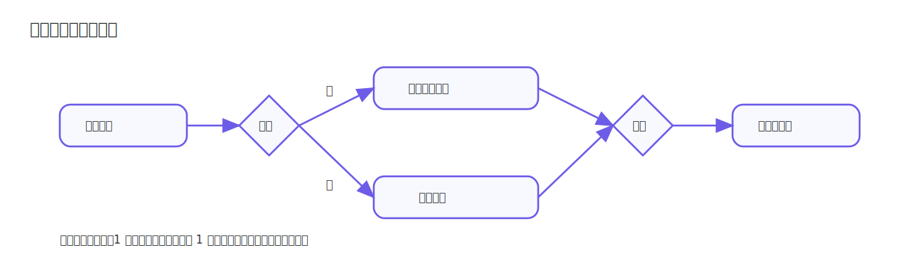
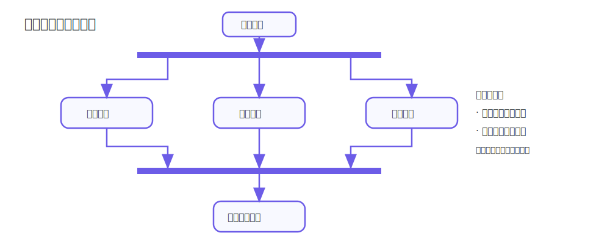
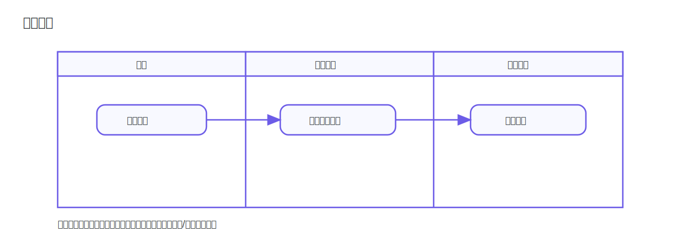
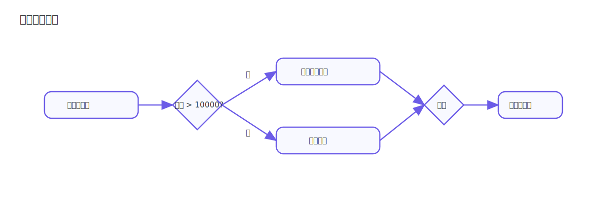
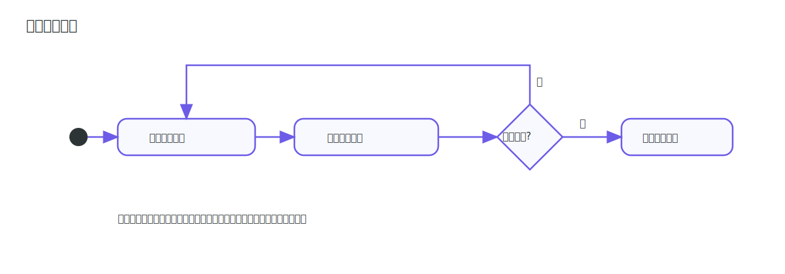
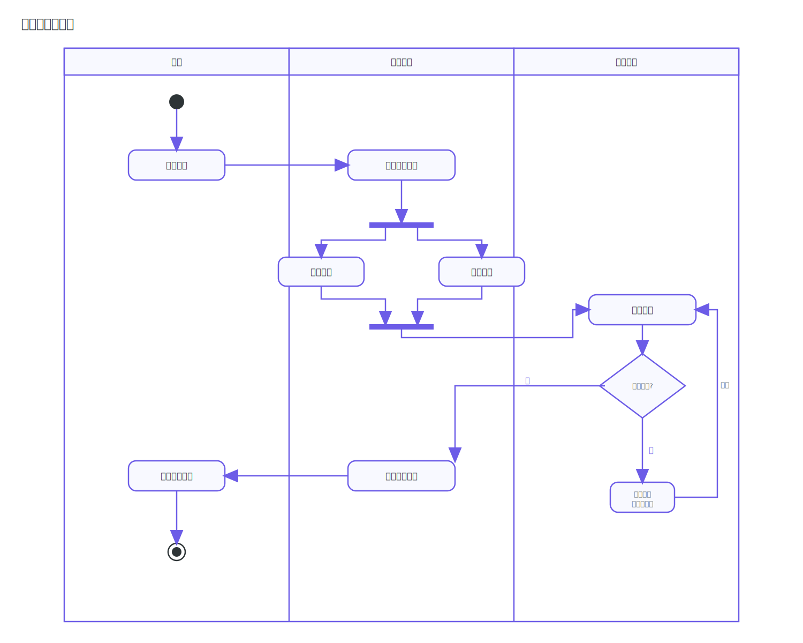

# 活动图

活动图（Activity Diagram）用于描述业务流程中的动作顺序、条件分支与并发执行。学习活动图的关键是看懂节点符号、箭头方向和控制结构。

## 核心符号

### 起始节点

起始节点表示流程入口，常见写法是实心圆。

### 结束节点

结束节点表示流程终止，常见写法是同心圆。

### 动作节点

动作节点表示一个可执行步骤，通常绘制为圆角矩形。

### 控制流

控制流使用带箭头的连线表示执行顺序，箭头方向即流程方向。

### 决策与合并节点

菱形既可用于条件分支（决策），也可用于分支回收（合并）。

### 分叉与汇合节点

粗横条用于并发分叉与同步汇合，常用于并行任务编排。

### 泳道

泳道按角色或系统边界划分职责，便于明确“谁执行这个动作”。

## 控制结构

### 条件分支

图中菱形处根据条件 `金额 > 10000` 分为“是/否”两条路径，最终在合并节点汇合后继续。

### 循环执行

图中动作先执行一次，再根据条件 `调用失败且未超最大重试次数` 决定是否回到循环起点。

### 示例

> [!TIP]
> 读活动图建议顺序：先看起止节点，再沿箭头看主流程，最后看菱形与并发条上的分支语义。
