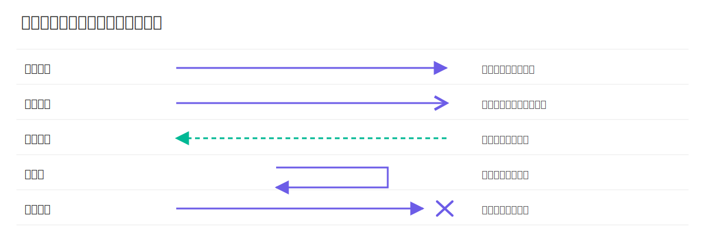

# 时序图

时序图（Sequence Diagram）用于描述对象在一个业务场景中的交互顺序。学习时序图的关键是看懂参与者、消息方向以及消息发生的先后关系。

## 时序图基础元素

### 参与者与生命线

参与者可以是用户、系统组件或第三方服务。生命线表示该参与者在交互过程中的存在周期，时间从上往下流动。

```plantuml
title 下单主流程（参与者与生命线）
skinparam backgroundColor white
skinparam componentStyle rectangle
skinparam defaultFontName "Microsoft YaHei"
skinparam defaultFontSize 14

actor "用户" as User
participant "Web 前端" as Web
participant "订单服务" as OrderService
database "MySQL" as DB

User -[#6c5ce7,bold]-> Web : 提交下单请求
Web -[#6c5ce7,bold]-> OrderService : createOrder(dto)
OrderService -[#6c5ce7,bold]-> DB : INSERT order
DB -[#00b894,dashed]-> OrderService : 写入成功
OrderService -[#00b894,dashed]-> Web : 返回订单号
Web -[#00b894,dashed]-> User : 下单成功
```

> [!TIP]
> - 参与者是图最上方的角色/对象名称（如 `用户`、`Web 前端`）。  
> - 生命线是从参与者向下延伸的竖直虚线，表示该对象在交互期间的存在时间。

### 激活条

激活条表示对象正在处理某个调用，通常从收到请求开始，到返回结果结束。

```plantuml
title 激活条示意
skinparam backgroundColor white
skinparam componentStyle rectangle
skinparam defaultFontName "Microsoft YaHei"
skinparam defaultFontSize 14

participant "Controller" as C
participant "Service" as S
participant "Repository" as R

C -[#6c5ce7,bold]-> S : createOrder()
activate S
S -[#6c5ce7,bold]-> R : save()
activate R
R -[#00b894,dashed]-> S : orderId
deactivate R
S -[#00b894,dashed]-> C : success
deactivate S
```

> [!TIP]
> - 激活条是生命线上的细长矩形，表示对象正在执行某段逻辑。  
> - `activate` / `deactivate` 分别表示激活条开始和结束。

### 常见消息符号



## 组合片段

时序图通过组合片段表达分支、循环与并发逻辑：

| 片段 | 作用 | 典型场景 |
| --- | --- | --- |
| `alt` | 条件分支（二选一或多选一） | 登录成功/失败 |
| `opt` | 可选执行（单分支） | 有优惠券才计算折扣 |
| `loop` | 循环执行 | 遍历订单项 |
| `par` | 并行执行 | 并行查询多个下游服务 |
| `break` | 中断当前交互 | 参数校验失败直接返回 |
| `critical` | 临界区 | 保证一段操作串行执行 |
| `ref` | 引用子时序 | 复用公共流程 |

### `alt`

```plantuml
title alt 演示：登录成功 / 失败
skinparam backgroundColor white
skinparam componentStyle rectangle
skinparam defaultFontName "Microsoft YaHei"
skinparam defaultFontSize 14

actor "用户" as User
participant "网关" as Gateway
participant "认证服务" as Auth

User -[#6c5ce7,bold]-> Gateway : 登录请求
Gateway -[#6c5ce7,bold]-> Auth : verify()

alt 凭证有效
    Auth -[#00b894,dashed]-> Gateway : ok
    Gateway -[#00b894,dashed]-> User : 登录成功
else 凭证无效
    Auth -[#00b894,dashed]-> Gateway : fail
    Gateway -[#00b894,dashed]-> User : 登录失败
end
```

说明：`alt` 表示互斥分支。图中根据凭证是否有效，流程只会进入“登录成功”或“登录失败”其中一个分支。

### `opt`

```plantuml
title opt 演示：有优惠券才计算折扣
skinparam backgroundColor white
skinparam componentStyle rectangle
skinparam defaultFontName "Microsoft YaHei"
skinparam defaultFontSize 14

actor "用户" as User
participant "结算服务" as Checkout
participant "营销服务" as Promotion

User -[#6c5ce7,bold]-> Checkout : 提交结算
opt 用户有优惠券
    Checkout -[#6c5ce7,bold]-> Promotion : calcDiscount(couponId)
    Promotion -[#00b894,dashed]-> Checkout : discountAmount
end
Checkout -[#00b894,dashed]-> User : 返回应付金额
```

说明：`opt` 表示可选分支。只有“用户有优惠券”条件满足时，才会触发优惠计算逻辑。

### `loop`

```plantuml
title loop 演示：逐个校验订单项库存
skinparam backgroundColor white
skinparam componentStyle rectangle
skinparam defaultFontName "Microsoft YaHei"
skinparam defaultFontSize 14

actor "用户" as User
participant "订单服务" as OrderService
participant "库存服务" as Stock

User -[#6c5ce7,bold]-> OrderService : 创建订单(items)
loop 每个订单项
    OrderService -[#6c5ce7,bold]-> Stock : check(item)
    Stock -[#00b894,dashed]-> OrderService : ok
end
OrderService -[#00b894,dashed]-> User : 创建成功
```

说明：`loop` 表示重复执行。图中会按“每个订单项”循环调用库存校验，直到全部校验完成。

### `par`

```plantuml
title par 演示：结算页并发查询
skinparam backgroundColor white
skinparam componentStyle rectangle
skinparam defaultFontName "Microsoft YaHei"
skinparam defaultFontSize 14

actor "用户" as User
participant "结算服务" as Checkout
participant "价格服务" as Price
participant "营销服务" as Promotion
participant "库存服务" as Stock

User -[#6c5ce7,bold]-> Checkout : 打开结算页

par 查询价格
    Checkout -[#6c5ce7,bold]-> Price : queryPrice(skuIds)
    Price -[#00b894,dashed]-> Checkout : priceResult
else 查询优惠
    Checkout -[#6c5ce7,bold]-> Promotion : queryCoupons(userId)
    Promotion -[#00b894,dashed]-> Checkout : couponResult
else 查询库存
    Checkout -[#6c5ce7,bold]-> Stock : queryStock(skuIds)
    Stock -[#00b894,dashed]-> Checkout : stockResult
end

Checkout -[#00b894,dashed]-> User : 返回结算数据
```

说明：`par` 表示并行片段。图中价格、优惠、库存三个查询可以并发进行，最终汇总结果返回给用户。

### `break`

```plantuml
title break 演示：参数不合法直接终止
skinparam backgroundColor white
skinparam componentStyle rectangle
skinparam defaultFontName "Microsoft YaHei"
skinparam defaultFontSize 14

actor "用户" as User
participant "订单控制器" as Controller
participant "参数校验器" as Validator

User -[#6c5ce7,bold]-> Controller : 提交下单请求
Controller -[#6c5ce7,bold]-> Validator : validate(req)
break 参数非法
    Validator -[#00b894,dashed]-> Controller : invalid
    Controller -[#00b894,dashed]-> User : 400 Bad Request
end
Controller -[#00b894,dashed]-> User : 继续后续处理
```

说明：`break` 表示中断当前交互。一旦参数非法，流程立即返回错误并终止后续主流程。

### `critical`

```plantuml
title critical 演示：扣减库存临界区
skinparam backgroundColor white
skinparam componentStyle rectangle
skinparam defaultFontName "Microsoft YaHei"
skinparam defaultFontSize 14

participant "订单服务" as OrderService
participant "库存服务" as Stock
database "库存库" as StockDB

critical 同一商品扣减库存（串行）
    OrderService -[#6c5ce7,bold]-> Stock : deduct(skuId, qty)
    Stock -[#6c5ce7,bold]-> StockDB : UPDATE stock = stock - qty
    StockDB -[#00b894,dashed]-> Stock : success
    Stock -[#00b894,dashed]-> OrderService : deducted
end
```

说明：`critical` 表示临界区。图中“扣减库存”这段逻辑需要串行执行，避免并发下出现超卖或库存不一致。

### `ref`

```plantuml
title ref 演示：复用公共流程
skinparam backgroundColor white
skinparam componentStyle rectangle
skinparam defaultFontName "Microsoft YaHei"
skinparam defaultFontSize 14

actor "用户" as User
participant "订单服务" as OrderService
participant "支付服务" as Payment

User -[#6c5ce7,bold]-> OrderService : 提交订单
ref over OrderService, Payment : 支付授权流程
OrderService -[#00b894,dashed]-> User : 下单完成
```

子时序图（被 `ref` 引用）：

```plantuml
title 支付授权流程（子时序图）
skinparam backgroundColor white
skinparam componentStyle rectangle
skinparam defaultFontName "Microsoft YaHei"
skinparam defaultFontSize 14

participant "订单服务" as OrderService
participant "支付服务" as Payment
participant "风控服务" as Risk

OrderService -[#6c5ce7,bold]-> Payment : authorize(orderNo, amount)
Payment -[#6c5ce7,bold]-> Risk : preCheck(orderNo, userId)
Risk -[#00b894,dashed]-> Payment : pass

alt 授权成功
    Payment -[#00b894,dashed]-> OrderService : authSuccess(authNo)
else 授权失败
    Payment -[#00b894,dashed]-> OrderService : authFailed(reason)
end
```

说明：`ref` 用于引用子时序图。图中将“支付授权流程”抽成可复用片段，主图只保留调用关系。
