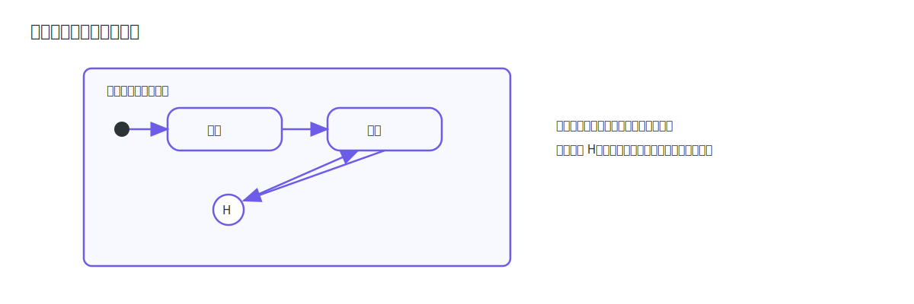
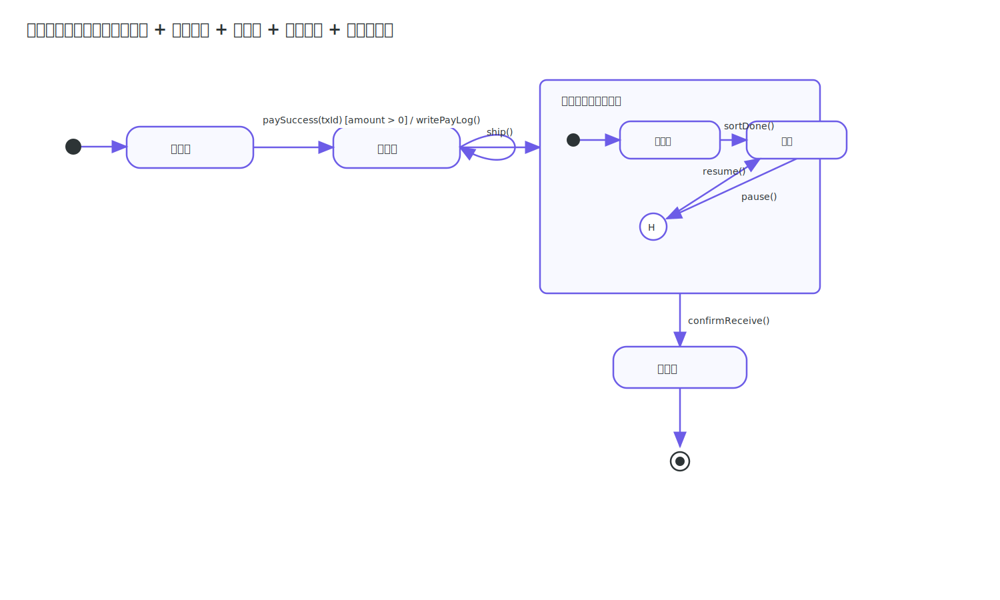

# 状态机图

状态机图（State Machine Diagram）用于描述对象生命周期中的状态变化。学习状态机图的关键是看懂状态节点与迁移标注 `事件 [条件] / 动作`。

## 核心符号

### 状态节点

圆角矩形表示状态；`[*]` 表示初始或终止伪状态（由箭头方向区分）。

> [!TIP]
> 状态名建议使用“业务可观察状态”，而不是实现细节。

### 迁移标注

迁移常用写法：`事件 [守卫条件] / 动作`。

### 自循环迁移

当状态不变但要处理事件时，使用自循环迁移。

### 复合状态与历史状态

复合状态用于表示“状态内再分子状态”；`[H]` 用于恢复上次离开的子状态。

### 示例

> [!TIP]
> 读状态机图建议顺序：先看状态节点，再看迁移箭头，最后看箭头上的事件/条件/动作标注。
