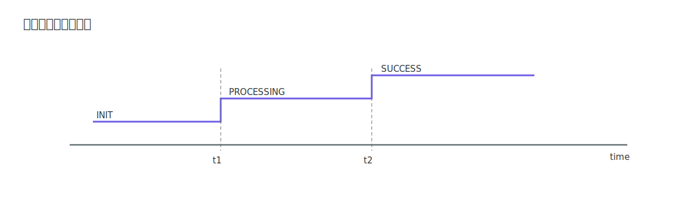
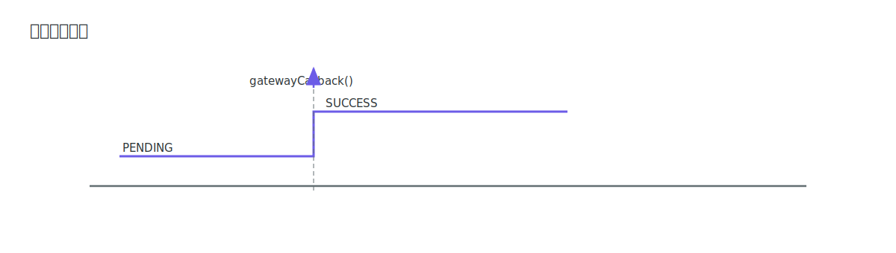

# 定时图

定时图（Timing Diagram）用于描述状态随时间变化的过程。学习定时图的关键是看懂时间轴、状态线和时长约束符号。

## 核心符号

### 时间轴与状态线

横轴是时间，状态线表示对象在不同时间段的状态值。

图中底部水平线是时间轴，沿时间轴向右推进表示时间流逝；上方阶梯线表示对象状态随时间发生离散切换。

### 事件触发

可在状态跳变点标注事件，说明变化原因。

图中在状态跳变位置附加事件标签（如 `gatewayCallback()`），表示该事件触发了状态从一个值切换到另一个值。

### 时钟与超时约束

可用时间区间约束表达超时条件。

图中 `t1` 到 `t2` 之间的区间标注表示持续时间约束，用于声明某段状态变化必须在限定时间内完成。

### 示例

## 与状态机图区别

状态机图强调“因为什么迁移”；定时图强调“什么时候迁移”。

> [!TIP]
> 读定时图建议顺序：先看时间刻度，再看每条状态线变化，最后看跨时间段的约束说明。
