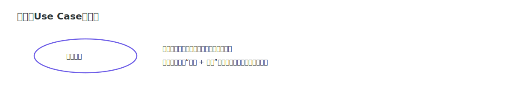
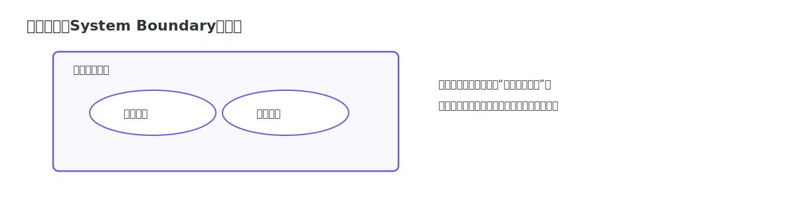
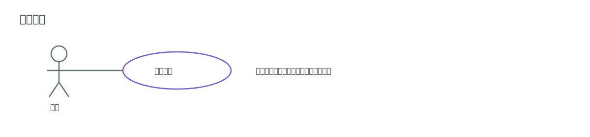
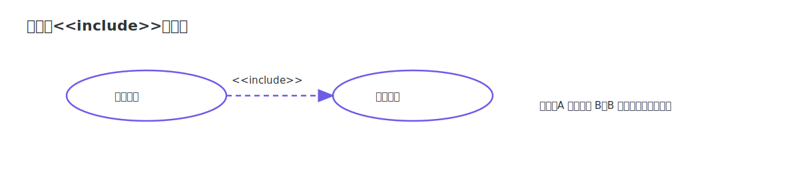
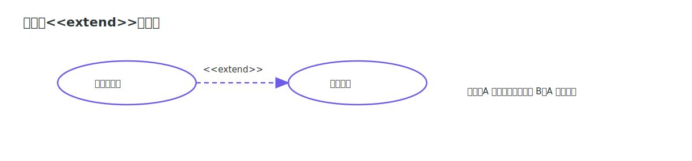
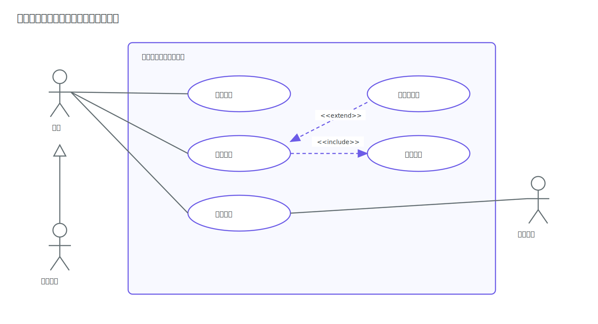

# 用例图

用例图（Use Case Diagram）用于从外部角色视角描述系统能力。学习用例图的关键是看懂参与者、系统边界和用例关系符号。

## 核心符号

### 参与者

参与者表示与系统交互的外部角色，可以是用户、外部系统或设备。

### 用例

用例是系统向外提供的一项可感知功能。

### 系统边界

系统边界用于标识系统职责范围，用例通常放在系统边界矩形内部。

### 关系符号

#### 关联

图中左侧参与者“买家”和右侧用例“提交订单”通过一条实线连接，表示两者存在交互关联；该关系常写作 `Actor -- UseCase`，只表达“有交互”而不表达时序。

#### 包含

图中左侧基础用例 A（提交订单）通过带 `<<include>>` 标签的虚线箭头指向右侧用例 B（校验库存），表示 A 执行时必然复用 B；

#### 扩展

图中左侧扩展用例 A（使用优惠券）通过带 `<<extend>>` 标签的虚线箭头指向右侧基础用例 B（提交订单），表示 A 仅在条件满足时才附加执行；

#### 泛化

图中右侧子参与者“会员用户（子）”的连线指向左侧父参与者“用户（父）”，并在父端使用空心三角箭头，表示泛化继承关系；

### 示例

