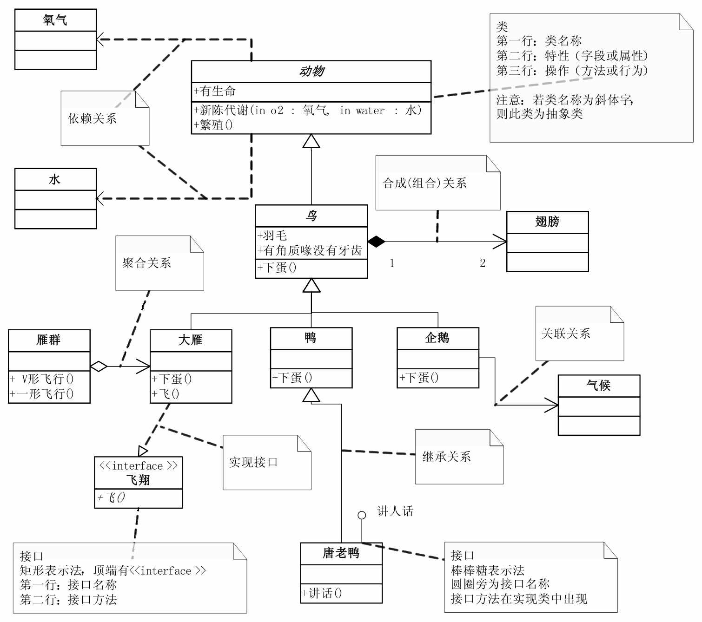
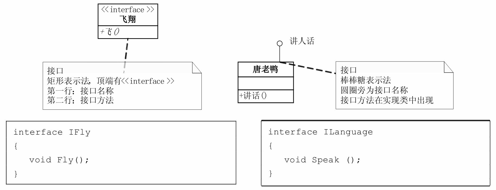
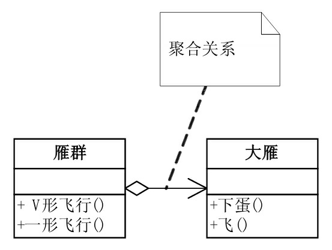
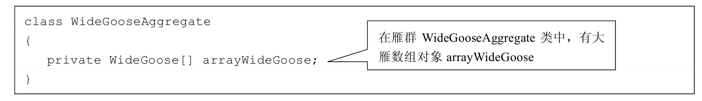
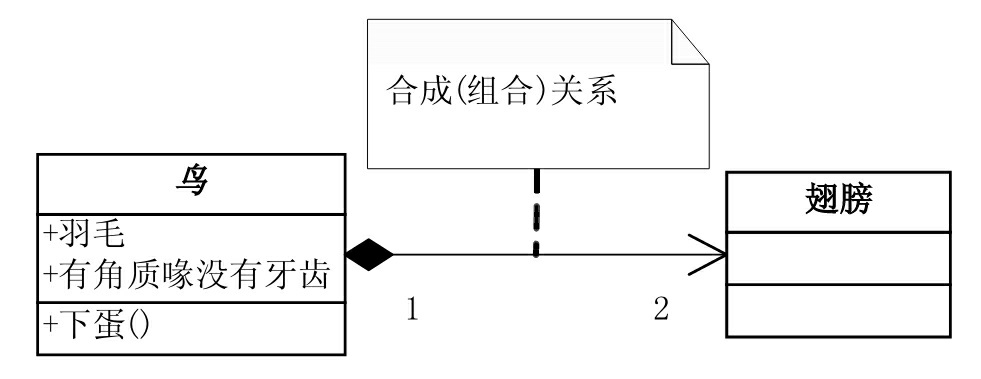
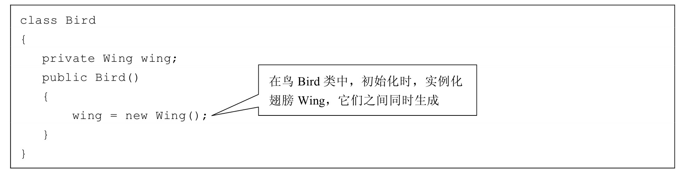
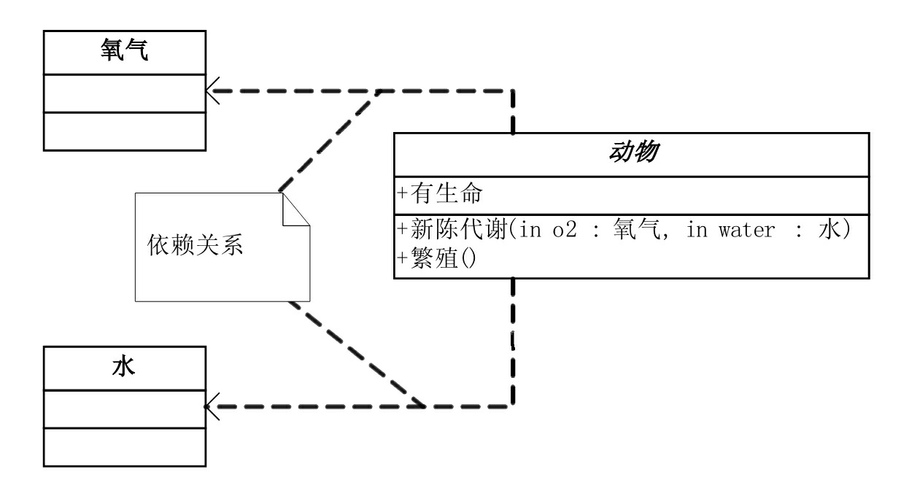
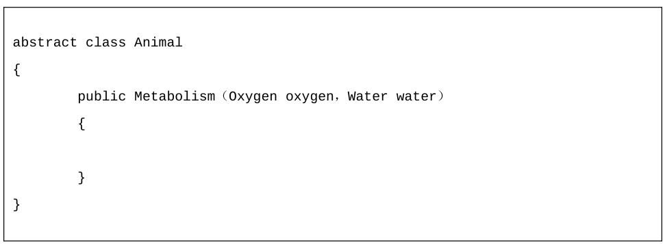

# 类图

类图（Class Diagram）是 UML 中最常用的图之一，用于描述系统的静态结构，包括类、属性、方法以及类之间的关系。

## 访问权限的表示

访问权限是指在 UML 图中对元素的可见性和访问级别进行控制。常见的访问权限包括：

| 修饰符    | 符号 | 说明           |
| --------- | ---- | -------------- |
| public    | +    | 公有           |
| protected | #    | 受保护         |
| private   | -    | 私有           |
| package   | ~    | 包可见（默认） |

## 关系

类与类之间的关系是类图中最重要的部分，主要包括以下几种：

### 接口

接口表示类实现了某个接口，使用虚线和空心三角形箭头表示。

### 聚合

聚合表示一种"整体-部分"的关系，部分可以脱离整体而存在。使用空心菱形箭头表示。

### 组合

组合也是一种"整体-部分"的关系，但部分不能脱离整体而存在。使用实心菱形箭头表示。

### 依赖

依赖表示一个类使用了另一个类，是一种较弱的关系。使用虚线和箭头表示。

