# 类图

类图（Class Diagram）用于描述系统中的类、属性、方法以及它们之间的关系。学习类图的关键是看懂每个符号代表的语义。

## 类本体符号

### 类与成员分区

一个类通常分为三层：类名、属性、方法。

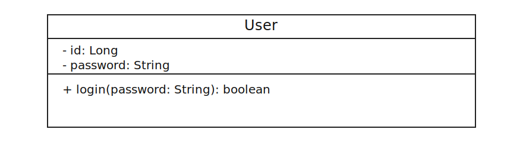

### 可见性符号

成员名前的符号用于表示可见性：

| 修饰符 | 符号 | 说明 |
| --- | --- | --- |
| public | + | 公有 |
| protected | # | 受保护 |
| private | - | 私有 |
| package | ~ | 包可见（默认） |

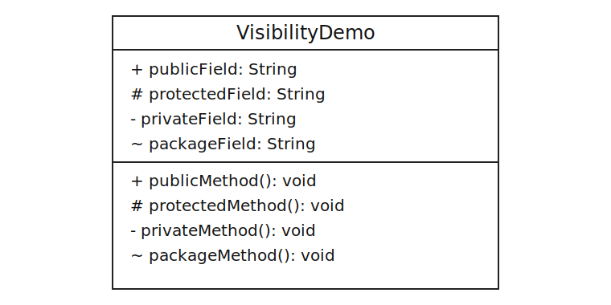

### 类型与方法签名符号

- 属性写法：`可见性 名称: 类型`
- 方法写法：`可见性 名称(参数: 类型): 返回类型`

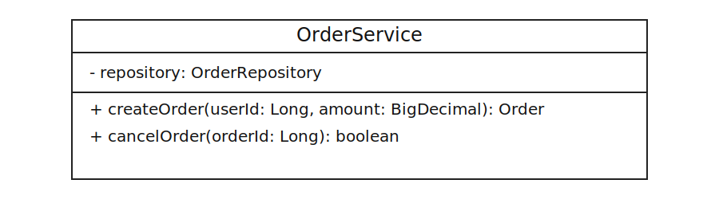

### 抽象与静态符号

- `abstract class`：抽象类
- `{abstract}`：抽象方法
- `{static}`：静态成员

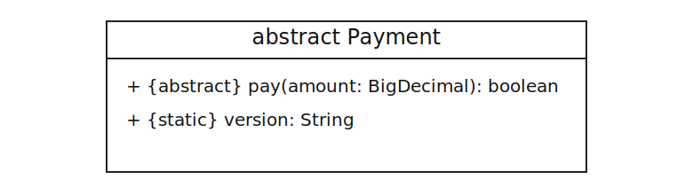

## 关系符号

为避免箭头方向理解不一致，本文统一采用“**使用方/子类型在左，被使用方/父类型在右**”的写法。

| 关系 | 推荐写法 | 含义 |
| --- | --- | --- |
| 关联 | `A -- B` / `A --> B` | 结构性关系（可带导航） |
| 依赖 | `A ..> B` | 临时使用 |
| 泛化 | `Child --|> Parent` | 继承 |
| 实现 | `Impl ..|> Interface` | 实现接口 |
| 聚合 | `Whole o-- Part` | 整体-部分（弱拥有） |
| 组合 | `Whole *-- Part` | 整体-部分（强拥有） |

### 关联

实线表示结构性关联。`--` 表示无方向关联，`-->` 表示可导航关联。

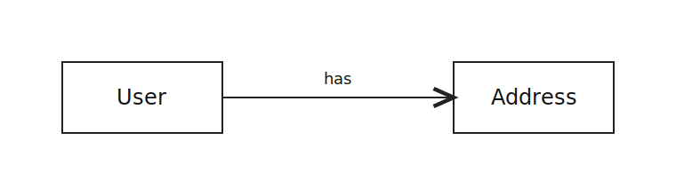

Java 示例：`User` 通过成员变量长期持有 `Address` 引用，体现关联关系。

```java
public class User {
    private Address address; // User 持有 Address 的引用
}

public class Address {
}
```

### 依赖

虚线箭头表示“临时使用”，常见于方法参数、局部变量、调用关系。

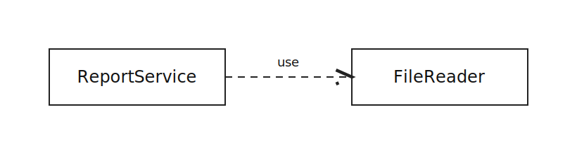

Java 示例：`ReportService` 仅在方法参数中使用 `FileReader`，体现依赖关系。

```java
public class ReportService {
    public void export(FileReader fileReader) { // 仅在方法中临时使用
        fileReader.read();
    }
}

public class FileReader {
    public void read() {
    }
}
```

### 泛化

实线 + 空心三角，表示继承（is-a）。空心三角始终指向父类。

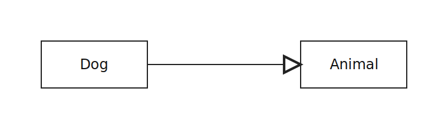

Java 示例：`Dog extends Animal`，体现子类对父类的继承关系。

```java
public class Animal {
    public void eat() {
    }
}

public class Dog extends Animal {
}
```

### 实现

虚线 + 空心三角，表示类实现接口。空心三角始终指向接口。

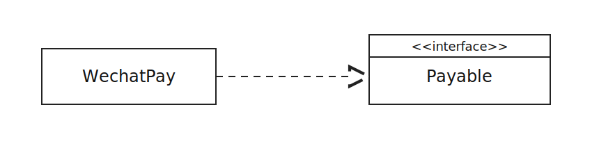

Java 示例：`OrderHandler implements Handler`，体现类对接口的实现关系。

```java
public interface Handler {
    void handle();
}

public class OrderHandler implements Handler {
    @Override
    public void handle() {
    }
}
```

### 聚合

空心菱形在整体一侧，部分可独立存在。

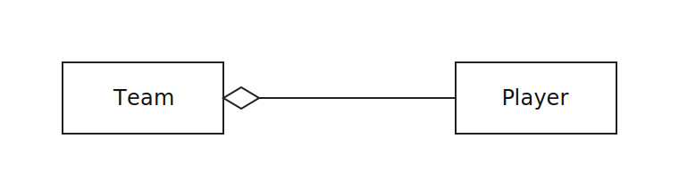

Java 示例：`Team` 聚合多个 `Player`，`Player` 仍可独立存在。

```java
public class Team {
    private List<Player> players; // Player 可独立于 Team 存在
}

public class Player {
}
```

### 组合

实心菱形在整体一侧，部分与整体生命周期一致。

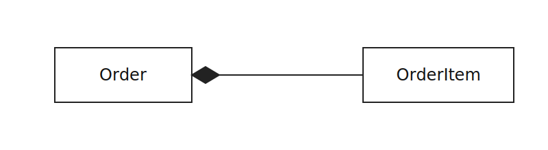

Java 示例：`Order` 内部创建并管理 `OrderItem`，体现生命周期绑定的组合关系。

```java
public class Order {
    private final List<OrderItem> items = new ArrayList<>(); // OrderItem 由 Order 创建并管理生命周期
}

public class OrderItem {
}
```

## 多重性符号

多重性通常写在线两端，表达数量约束。

| 写法 | 含义 |
| --- | --- |
| `1` | 恰好一个 |
| `0..1` | 零个或一个 |
| `*` 或 `0..*` | 零个或多个 |
| `1..*` | 一个或多个 |
| `m..n` | m 到 n 个 |

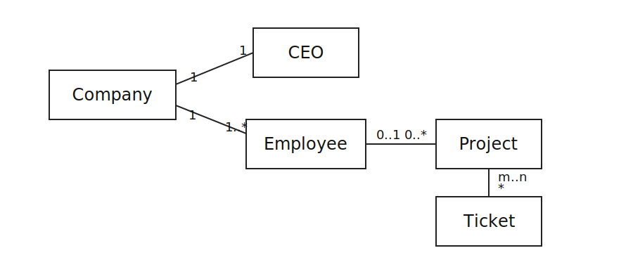

> [!TIP]
> 读类图建议顺序：先看关系符号，再看箭头方向，最后看两端多重性。
