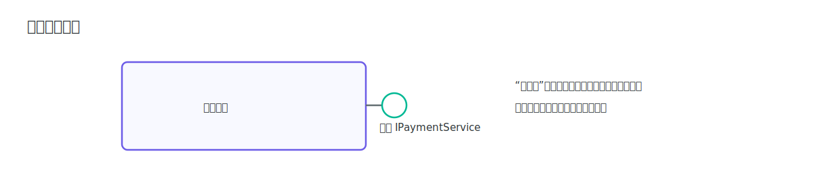
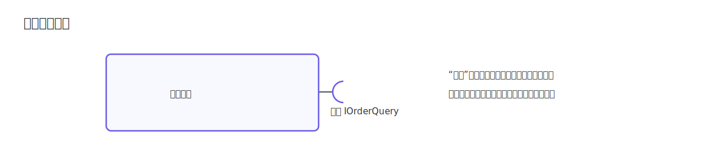
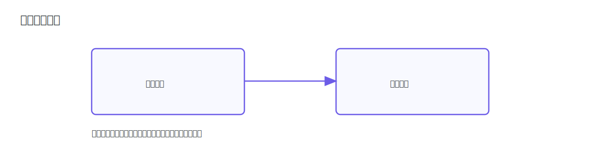
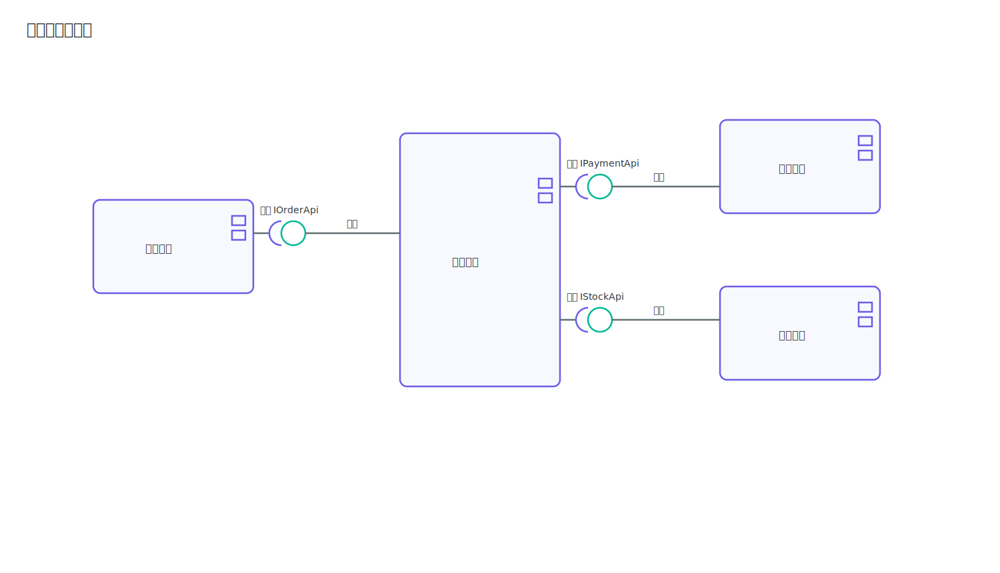

# 组件图

组件图（Component Diagram）用于描述系统的模块边界与接口依赖。学习组件图的关键是看懂组件、接口和依赖方向的符号。

## 核心符号

### 组件

组件表示可替换、职责清晰的模块边界，通常绘制为右上角带“小页签”的矩形。

### 提供接口

图中组件右侧的“棒棒糖”圆形接口表示该组件对外暴露能力，调用方可以通过该接口访问组件功能。

### 需要接口

图中组件右侧的“插槽”半圆接口表示该组件依赖外部能力，需要其他组件提供对应接口才能完成协作。

### 依赖关系

图中左侧组件通过实线箭头指向右侧组件，表示“左侧依赖右侧”，箭头方向即调用或依赖方向。

### 示例

> [!TIP]
> 读组件图建议顺序：先看组件边界，再看提供/依赖接口，最后看依赖方向是否符合分层设计。
