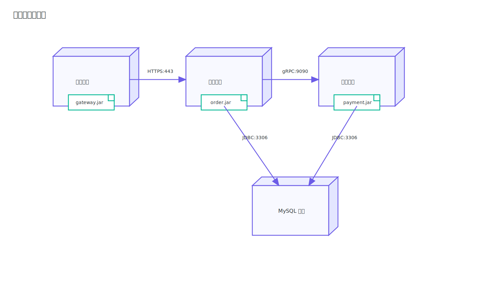

# 部署图

部署图（Deployment Diagram）用于描述系统运行在什么节点上，以及节点之间如何通信。学习部署图的关键是看懂节点、制品和通信路径符号。

## 核心符号

### 节点

节点表示承载运行环境的资源，如物理机、虚拟机、容器、云服务等。

### 制品

制品表示可部署单元，如 `jar`、容器镜像、配置包等。制品通常部署在节点内部。

### 通信路径

节点之间的线表示网络通信路径，可附带协议与端口，例如 `HTTPS:443`。

图中两个节点通过带箭头的连线连接，连线标签（如 `HTTPS:443`、`JDBC:3306`）表示通信协议与端口。

### 示例

## 与组件图配合

组件图回答“系统怎么分模块”；部署图回答“模块部署到哪里、怎么连”。

> [!TIP]
> 读部署图建议顺序：先看节点拓扑，再看制品部署，最后看节点之间的协议与端口信息。
