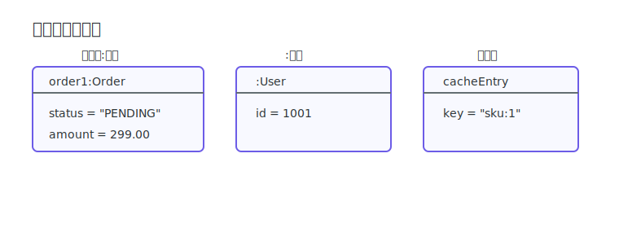
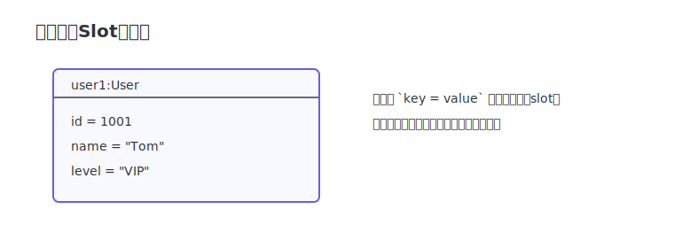
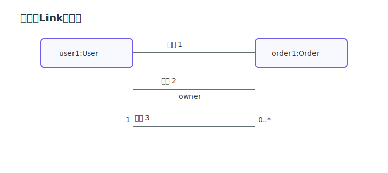

# 对象图

对象图（Object Diagram）用于描述“某一时刻”的实例状态。读对象图的关键是看懂对象写法、属性槽和链接符号。

## 对象本体符号

### 对象表示法

对象通常写为 `对象名:类名`，也可以只写 `:类名`（匿名对象）或只写 `对象名`（类型已知时）。

> [!TIP]
> 常见写法：
> `obj:Class` 表示具名对象实例；
> `:Class` 表示匿名对象实例；
> `obj` 表示类型在上下文已知的对象实例。

### 属性槽

属性槽用于展示对象在当前时刻的字段值，例如 `status = "PENDING_PAY"`。

> [!TIP]
> 槽的典型写法是 `attr = value`，表示对象在该快照时刻的实际字段值。

### 链接

对象之间的线表示“实例级连接”，是类图关联关系在运行时的落地。

> [!TIP]
> 链接常见写法：
> `A -- B` 表示存在实例连接；
> `A -- B : role` 表示连接角色/语义；
> 线端多重性（如 `1`、`0..*`）用于补充数量约束解释。
