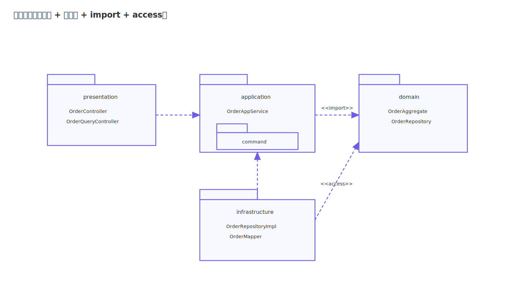

# 包图

包图（Package Diagram）用于展示模型分组与包依赖。学习包图的关键是看懂包符号、依赖方向和 `import/access` 语义。

## 核心符号

### 包

包用于组织类、接口、子包等元素，通常绘制为“带页签的矩形”。

### 包依赖

包之间常用虚线箭头表示依赖，方向为“依赖方 -> 被依赖方”。

图中左侧包通过虚线箭头指向右侧包，表示左侧依赖右侧。

### import 标注

`import` 表示引入命名空间；`access` 表示可访问但不引入命名空间。

图中 `<<import>>` 标注写在依赖线上，表示将目标包的公开成员引入到当前包可见范围。

### access 标注

图中 `<<access>>` 标注写在依赖线上，表示仅可访问目标包，不引入其命名空间。

### 示例

