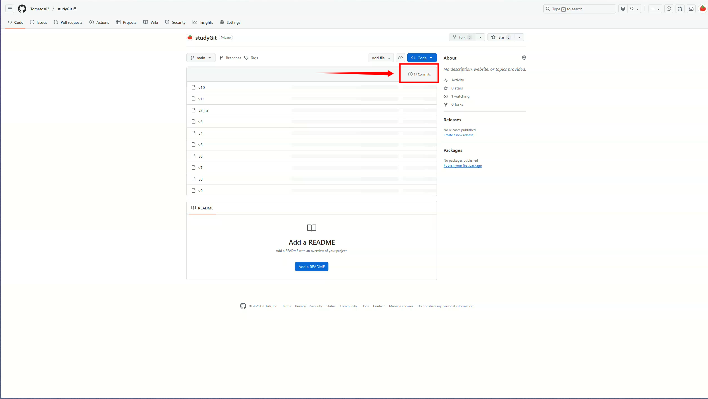
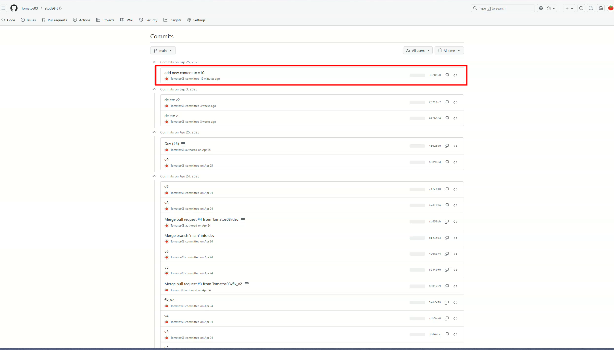
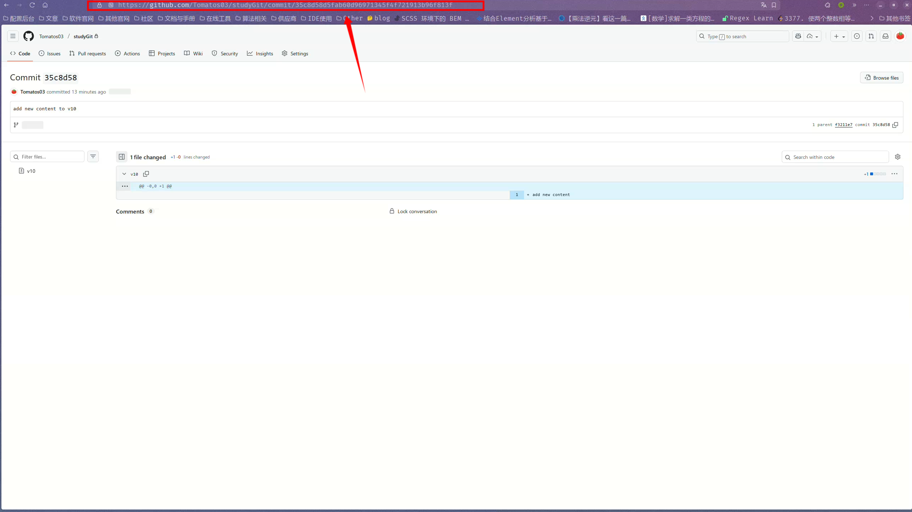
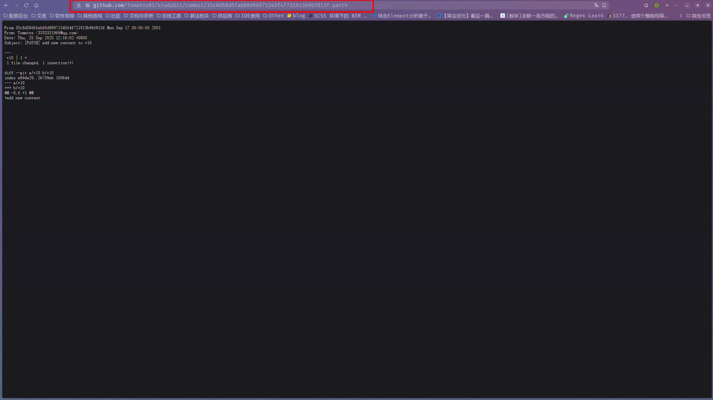
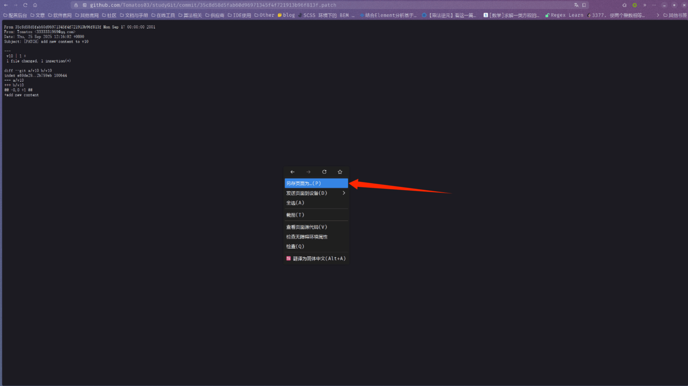
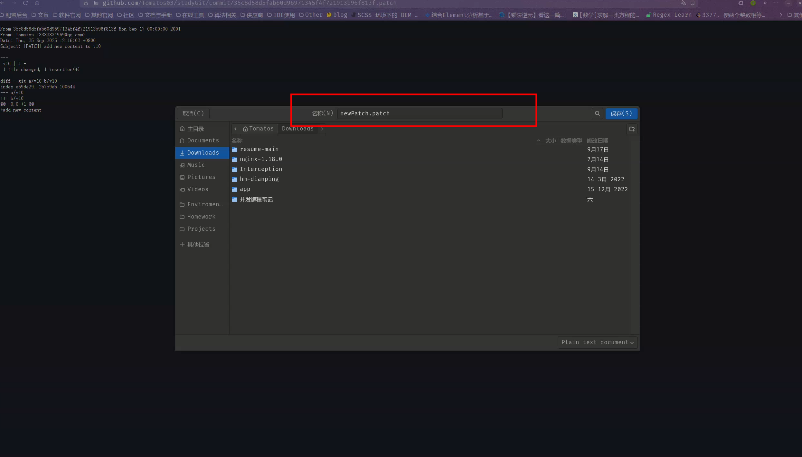

# Git 高级

## 变基

变基操作会将当前分支的提交记录移动到指定分支的最新提交之后

```bash
# 变基前
A --- B --- C (main)
         \
          D --- E (feature)

# 切换到 feature 分支, 进行变基:
git rebase main

# 变基后
A --- B --- C (main)
             \
              D' --- E' (feature)

```

## 挑选

挑选（cherry-pick）操作可以将某个分支上的指定提交应用到当前分支。

```bash
git cherry-pick <hash> # hash 表示某个分支的提交点hash

# 也可以一次性挑选多个提交
git cherry-pick <hash1> <hash2> <hash3>
# 或
git cherry-pick <hash1>^..<hash3> # 挑选[hash1, hash3]的所有提交
# 或
git cherry-pick <hash1>~2..<hash3> # 挑选[hash1前一个提交点, hash3]的所有提交
# 或
git cherry-pick <hash1>~2^..<hash3> # 挑选[hash1前两个提交点, hash3]的所有提交
# 或
git cherry-pick <hash1>..<hash3> # 挑选(hash1, hash3]的所有提交
```
## 策略同步

```bash
# 同步远程分支时对远程分支进行变基
git pull --rebase

# 同步远程分支时不进行变基(默认行为)
git pull --no-rebase
# 等价于
git pull

# 如果本地没有新增提交, 远程有新增提交点, 效果和使用git pull一样
# 如果本地分支有新增提交, 远程分支也有新增提交这个时候, 这个命令会停止拉取, git pull 仍然拉取(拉取后发生冲突)
git pull --ff-only
```

## 增量文件

在 Git 中，增量文件（也称为差异文件）是指两个提交之间的变化部分。Git 使用增量文件来高效地存储和传输代码的变更。

### 生成

生成增量文件的方法有如下两种:

- 通过浏览器生成

1. 打开 GitHub 仓库页面, 并导航到 "Commits" 页面，



2. 找到你想要生成增量文件提交点, 进入提交点详细提交页面



3. 在浏览器导航栏的当前url最后添加.patch, 然后访问





4. 在空白处右键, 另存为本地文件(文件名和文件后缀名可以随意修改, 但通常使用.patch或.diff)





> [!NOTE]
> 这种方式仅适合生成单个提交点的patch文件

- 通过命令行生成

```bash
# 这个命令会包含一些原作者的元数据
# 生成最近n个提交的patch文件(每个提交点会生成一个patch文件)
git format-patch -n HEAD

# 生成某个提交点到最新提交的path文件
git format-patch <commit_hash>..HEAD

# 生成最近的3个提交点的patch文件(仅有一个patch文件)
git diff HEAD~3 HEAD > last_three.patch

# 生成[conmitA, commitB]之间的所有提交点的patch文件, 并命名为all_changes.patch
git diff commitA_hash commitB_hash > all_changes.patch
```
> [!TIP]
> 这里提到的patch文件指的是增量文件

### 应用

Git 中提供了`apply`和`am`命令来应用增量文件中的变动

```bash
# 这个命令仅会将patch文件的变量应用到工作区,会自动生成提交点,
git apply <patch-file-name>

# 自动生成一个提交点保留原作者信息
# 这个命令仅适合 git format-patch 命名生成的patch文件, 
# 因为文件中包含了作者的元数据, diff命名生成的path文件不包含
git am <patch-file-name>
```