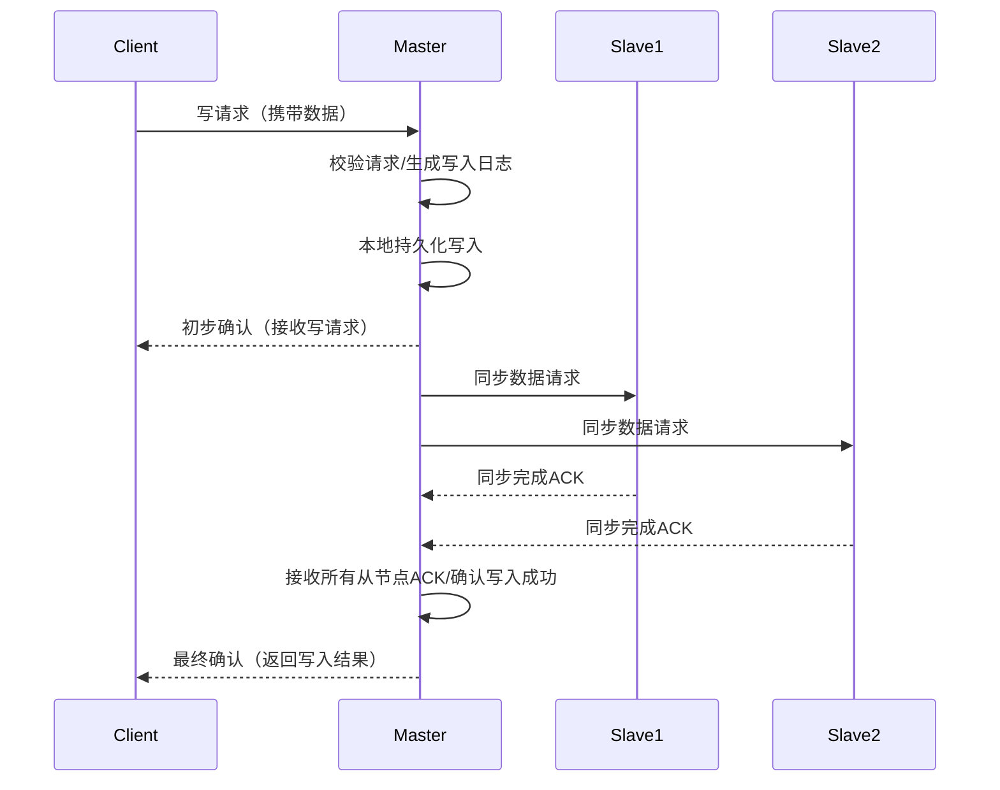
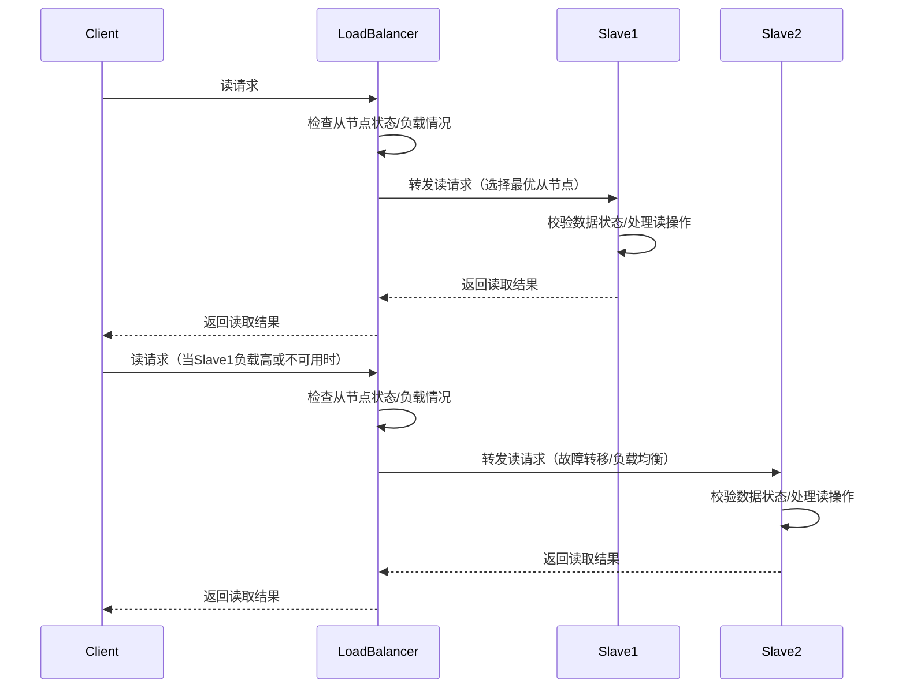
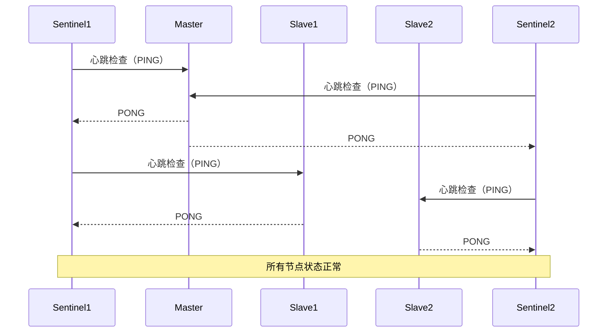
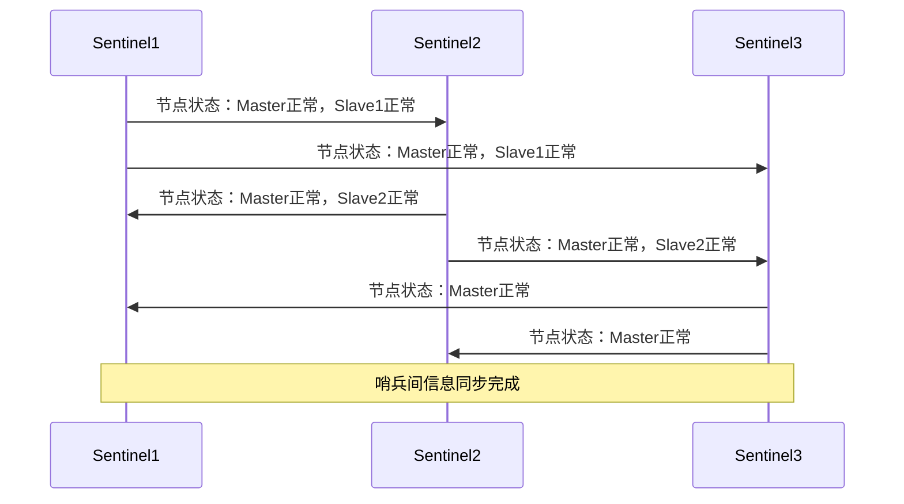
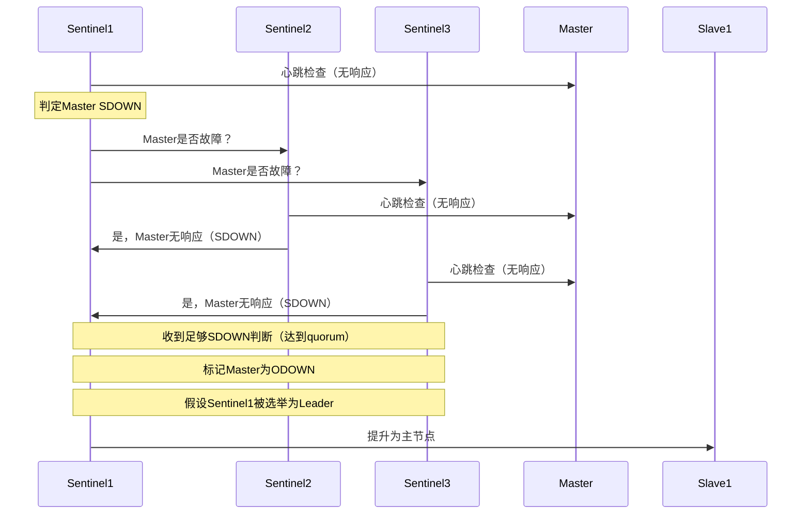
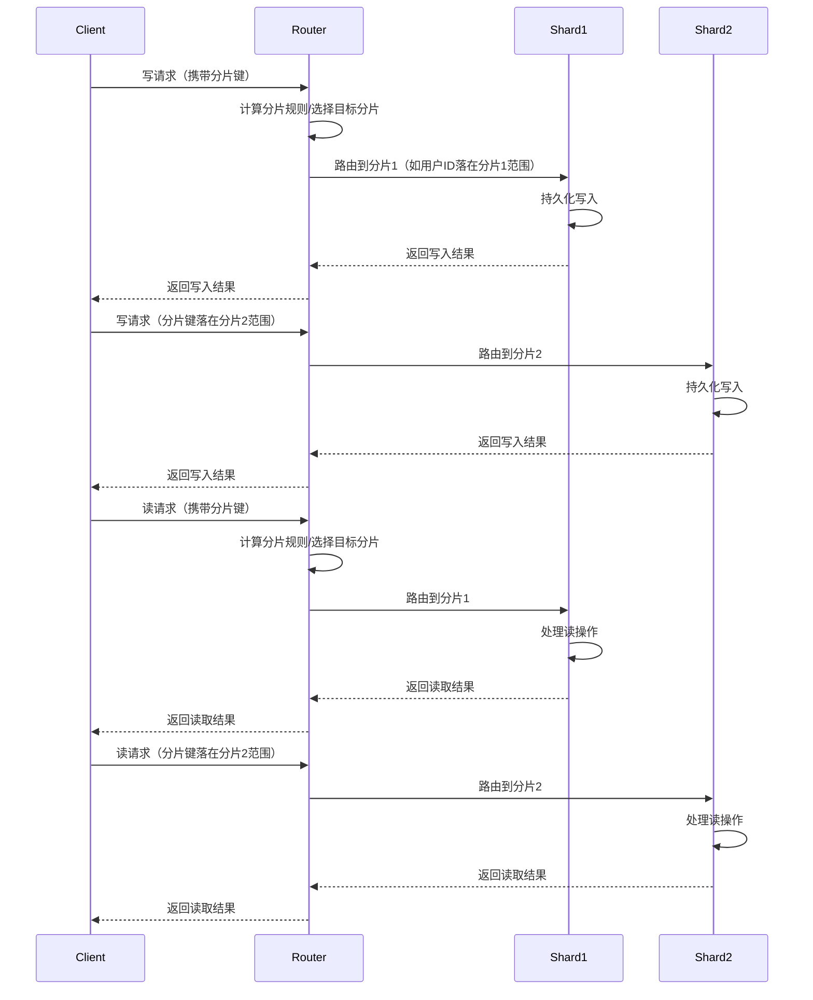

# 分布式系统

分布式系统是一种**将计算资源和数据分散在多个独立节点上，通过网络协同完成任务的架构**。在这种系统中，各节点可以相互通信，共同处理客户端请求，实现资源共享和负载均衡。

**优点**：
- 可扩展性强，能够灵活增加节点以应对更高的并发和数据处理需求。
- 容错性高，单个节点故障不会影响整个系统的正常运行。
- 性能优越，能够分散负载，提高整体处理能力。

**缺点**：
- 系统管理和维护复杂，需要处理节点间的通信、同步和一致性问题。
- 数据一致性难以保证，可能出现分布式事务和数据同步的挑战。
- 部署和运维成本较高，对网络和硬件资源有更高要求。

---

## 集群架构

集群架构是**分布式系统中的一种实现方式**。它通常指将多台服务器（节点）组合在一起，作为一个整体对外提供服务。集群中的各个节点可以相互协作，实现负载均衡和故障转移，从而提升系统的可用性、扩展性和性能。

---

### 主从架构

主从架构是一种常见的分布式系统结构，通常由一个主节点和多个从节点组成。主节点负责数据的写入和管理，从节点则负责数据的读取和备份。

**工作流程**

主节点接收所有写操作（如新增、修改、删除），并将数据同步到各个从节点。从节点主要处理读请求，减轻主节点压力。当主节点发生故障时，可以通过选举机制或手动将某个从节点提升为新的主节点，保证系统的高可用性。

写操作工作流程

读操作工作流程

- 优点：
  - 读写分离，提升系统性能和并发能力。
  - 数据备份，增强系统容错性和可靠性。
  - 易于扩展，通过增加从节点提升读性能。
- 缺点：
  - 主节点成为单点故障，影响系统可用性。
  - 数据同步延迟，可能导致读到旧数据。
  - 主从切换复杂，需保证数据一致性。

---

#### 哨兵模式

哨兵模式是一种用于主从架构高可用的自动化监控与故障恢复机制。通过部署多个独立的监控节点（哨兵），实时监测主从节点的状态，在主节点故障时自动完成主从切换，保障系统的持续可用性。这种思想广泛应用于 Redis、MySQL 等分布式系统中。

**工作流程**

哨兵模式在主从架构的工作流程上引入了如下机制:

**心跳机制**

1. 每个哨兵节点定期向主节点和从节点发送心跳检查（如 PING 命令）。
2. 哨兵记录节点的响应状态，判断节点是否在线和可用(限定时间内收到节点响应为可用)。

**信息同步机制**

Sentinel 之间会定期将自身对于节点判定的结果广播给其他Sentinel

**投票与决策机制**

1. 某个Sentinel判定**主节点为SDOWN**后，会向其他Sentinel发送询问请求
2. 收到其他Sentinel对主节点判定SDOWN数量达到quorum，则标记主节点为ODOWN（客观下线），随后触发Leader选举（Sentinel通过投票选举出其中一个Sentinel为Leader), 为 Leader Sentinel 执行主从切换
3. 如果没有达到 quorum，会继续等待其他 Sentinel 的回复，直到：
  - 收到足够的回复（达到 quorum），进行投票选举, 由 Leader Sentinel 执行主从切换
  - 或者等待超时（超过最大等待时间），本轮判定失败，退出本次主从切换流程。

> [!TIP]
> Sentinel基于心跳机制监测服务状态，每隔1秒向集群的每个实例发送ping命令：
> - SDOWN(主观下线)：如果某sentinel节点发现某实例未在规定时间响应，则认为该实例主观下线。
> - ODOWN(客观下线)：若超过指定数量（quorum）的sentinel都认为该实例主观下线，则该实例客观下线。quorum值最好超过Sentinel实例数量的一半。

**优点**

- 自动故障检测与转移，提升系统高可用性，减少人工干预。
- 多哨兵协作和投票机制，避免单个哨兵的误判导致的脑裂。
- 客户端可自动获取主节点信息，业务无感知地完成切换。
- 故障转移过程对分布式系统中的其他组件透明，易于集成。

**缺点**

- 哨兵自身也需高可用部署（通常需要 3 个或以上），否则可能出现脑裂或误判。
- 切换过程中可能存在短暂的不可用窗口或数据丢失风险（如异步复制场景）。
- 配置和维护复杂度提升，需要合理配置哨兵数量和超时参数。
- 哨兵模式本身不解决数据分片和水平扩展问题，仅针对高可用。

---

### 分片架构

分片架构是一种常见的分布式系统设计方式，通过将数据或服务按照某种规则分割成多个部分（分片），分别存储或处理在不同的节点上，从而提升系统的扩展性和并发能力。

**常见分片规则**

- **范围分片**：根据分片键的范围值分片，如用户ID在1-1000分配到分片1，1001-2000分配到分片2。
- **哈希分片**：通过对分片键进行哈希计算，将结果模以分片数量确定目标分片，如 hash(user_id) % shard_count。

**工作流程**

系统根据分片规则（如用户ID、订单号、主题名称等）将请求或数据路由到对应的分片节点。每个分片节点只负责一部分数据或请求，节点之间可以独立扩展和维护。

- 优点：
  - 高扩展性，可通过增加分片节点横向扩展系统容量和性能。
  - 高并发，不同分片可并行处理请求，提升整体吞吐量。
  - 故障隔离，单个分片故障不会影响其他分片，提升系统可用性。
- 缺点：
  - 分片管理复杂，需要合理设计分片规则和路由机制，避免热点分片。
  - 跨分片操作复杂，涉及多个分片的数据操作（如聚合、事务）实现难度较高。
  - 数据迁移成本高，分片扩容或调整时，数据迁移和重分片可能影响性能。
